# GDD - *Game Design Document* - Módulo 1 - Inteli

## Grupo Tilápia

#### Gabriel Henrique Martins Alves
#### Gabriel Scarpelin Diniz
#### Isabelly Maia Montalvão
#### Leonardo Casal Andriolo
#### Matheus Jorge Rosa
#### Pietra Pasqualini Batista

## Sumário

[1. Introdução](#c1)

[2. Visão Geral do Jogo](#c2)

[3. *Game* Design](#c3)

[4. Desenvolvimento do jogo](#c4)

[5. Casos de Teste](#c5)

[6. Conclusões e trabalhos futuros](#c6)

[7. Referências](#c7)

[Anexos](#c8)


# <a name="c1"></a>1. Introdução

## 1.1. Escopo do Projeto

### 1.1.1. Contexto da indústria

&nbsp;&nbsp;&nbsp;&nbsp;A Faculdade de Medicina da USP é uma referência no campo da educação superior, destacando-se no ensino de Medicina no Brasil e na realização de pesquisas de ponta, além de campanhas de conscientização para a população[¹](#c7). Competindo com outras instituições renomadas, como UNICAMP, PUC-SP e UNIFESP, a FMUSP se destaca por suas iniciativas inovadoras e seu impacto notável no mercado regional e nacional, especialmente através de suas campanhas e atividades clínicas de alto padrão.

&nbsp;&nbsp;&nbsp;&nbsp;Internacionalmente reconhecida, a FMUSP continua a liderar o caminho em pesquisas de vanguarda, abrangendo áreas como cirurgia com células-tronco, desenvolvimento de pele artificial e outras tendências futuras na medicina[²](#c7).

#### 1.1.1.1. Cinco Forças de Porter

&nbsp;&nbsp;&nbsp;&nbsp;O modelo das Cinco Forças de Porter é um framework fundado por Michael Porter, professor da Harvard Business School, em 1970[³](#c7). O modelo é utilizado para realizar uma análise setorial do mercado em que a empresa está inserida, mostrando qual sua posição no setor em comparação com outros empreendimentos atuantes do mesmo setor. Segundo Joan Magretta, editora de estratégia na Harvard Business Review, "a estrutura das cinco forças explica os preços e custos médios do setor e, portanto, a lucratividade média a ser superada."[⁴](#c7), ou seja, compreender com profundidade a rivalidade entre concorrentes (1), a ameaça de novos entrantes (2), o poder de barganha dos fornecedores (3), o poder de barganha dos clientes (4) e a ameaça de produtos substitutos (5), é fundamental para entender a dinâmica da competição e para construir uma estratégia empresarial que objetiva mais lucro. 

&nbsp;&nbsp;&nbsp;&nbsp;A partir do nosso projeto, realizamos uma análise profunda do setor de faculdades de medicina no estado de São Paulo, utilizando o modelo de Porter (figura 01) e explicando como cada uma das 5 forças funcionam nesse setor.

<div align="center">

<sub>Figura 01 - Template 5 Forças de Porter</sub>

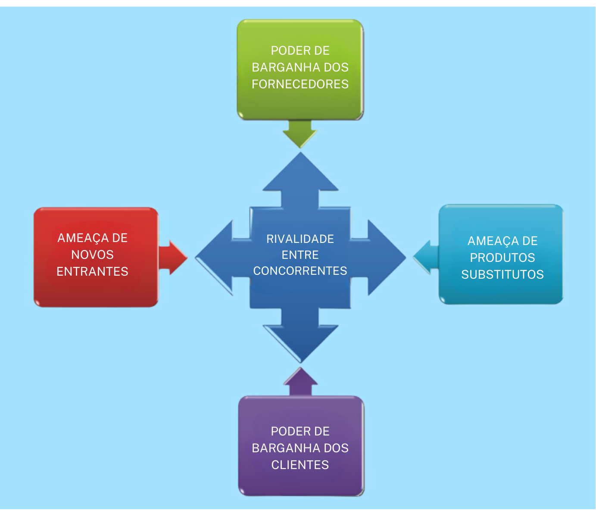

<sup>Fonte: Material adaptado pelos autores (2024)</sup>

</div>

**Rivalidade entre concorrentes**

&nbsp;&nbsp;&nbsp;&nbsp;No cenário das faculdades de medicina em São Paulo, a rivalidade entre as instituições é acirrada e desempenha um grande papel na determinação da excelência e reputação de cada uma. Tanto as faculdades públicas quanto as privadas competem vigorosamente por recursos essenciais, incluindo:

- Atração dos melhores professores, pesquisadores e recursos, necessários para desenvolver programas educacionais focados em pesquisa de alta qualidade. A principal reputação das instituições públicas está ligada à qualidade do ensino e à produção científica de seus professores e de seus alunos;

- Acesso a hospitais de ensino afiliados, onde os alunos têm a oportunidade de participar de estágios e residências. Hospitais de renome, como o Hospital das Clínicas, são disputados pelas faculdades públicas, que buscam estabelecer parcerias estratégicas para oferecer uma educação clínica de alta qualidade aos estudantes;

- Reputação e prestígio entre as faculdades de medicina públicas em São Paulo. Instituições como a FMUSP têm uma longa história de excelência acadêmica e pesquisa de ponta. Observando isso, outras faculdades públicas buscam elevar seu status por meio de avanços em pesquisa, publicações científicas e reconhecimento nacional e internacional;

- Faculdades públicas, como a Faculdade de Medicina da Universidade de São Paulo (FMUSP), a Faculdade de Medicina da Universidade Estadual de Campinas (UNICAMP) e a Faculdade de Medicina de São José do Rio Preto (FAMERP) competem pela alocação de recursos governamentais limitados. Essas instituições dependem do financiamento público para manter suas operações e infraestrutura, o que pode gerar uma competição acirrada entre elas por uma fatia maior do orçamento estatal;

- As faculdades de medicina privadas competem pela captação de recursos financeiros por meio de mensalidades, doações e parcerias corporativas. Elas dependem da mensalidade paga pelos alunos para financiar suas operações, o que as leva a competir por estudantes e oferecer programas educacionais atrativos;

- Oferta de programas educacionais mais atualizados e inovadores. Por exemplo, o Hospital Israelita Albert Einstein em São Paulo se destaca pelo uso de maquetes 3D no ensino médico. Essas maquetes permitem uma compreensão detalhada da anatomia humana, proporcionando uma experiência de aprendizado tátil e interativa. Essa abordagem inovadora evidencia o compromisso do Einstein com a excelência educacional e atrai alunos interessados em uma educação médica moderna.

**Ameaça de Novos Entrantes**

&nbsp;&nbsp;&nbsp;&nbsp;A ameaça de novos entrantes no setor de faculdades de medicina no estado de São Paulo é relativamente baixa, devido a fatores como:

- Complexidade na certificação e regulamento feito pelo governo, que exigem autorização e conformidade de requisitos legais e administrativos. Isso inclui a necessidade de avaliação e aprovação por parte do Ministério da Educação (MEC) e do Conselho Estadual de Educação. Tal impecilho torna o processo de entrada no mercado bastante restritivo. Além das regulamentações governamentais, as faculdades de medicina também estão sujeitas a processos de acreditação e certificação por organizações profissionais e acadêmicas;

- Requer um investimento significativo em infraestrutura, recursos humanos qualificados, equipamentos médicos, laboratórios e instalações clínicas. O alto custo dos itens supracitados, pode representar, inicialmente, uma barreira substancial para potenciais novos entrantes;

- Requer experiência e conhecimento específico no campo da educação médica. Novos entrantes podem enfrentar dificuldades se não tiverem uma equipe acadêmica e administrativa experiente e capacitada para lidar com os desafios complexos do ambiente educacional e da prática clínica;

- O mercado de faculdades de medicina em São Paulo já é dominado por instituições tradicionais e bem estabelecidas, tanto públicas quanto privadas, que possuem reputação consolidada, recursos robustos e redes de parcerias com instituições de saúde. Competir com essas instituições seria um desafio significativo para novos entrantes;

- Os estudantes e profissionais de saúde geralmente preferem faculdades com reputação reconhecida e programas de alta qualidade. Estabelecer uma nova instituição e construir uma reputação respeitável no mercado exigiria tempo e esforço substanciais. Esse fato representa outra barreira para novos participantes.


**Poder de Barganha dos Fornecedores**

&nbsp;&nbsp;&nbsp;&nbsp;O poder de barganha dos fornecedores pode variar dependendo dos tipos que forem considerados, como pode-se notar:

- Os fornecedores de tecnologia e equipamentos médicos têm um poder alto devido à oferta de recursos essenciais para o ensino médico, como equipamentos de simulação e dispositivos médicos. Com poucos concorrentes especializados, esse tipo pode impor preços elevados e condições contratuais rigorosas. Podemos tomar como exemplo a empresa de dispositivos médicos Stryker Corporation, que fornece uma variedade de equipamentos e tecnologias utilizados em cirurgias ortopédicas, neurocirurgias, entre outras especialidades médicas. Devido à sua reputação estabelecida e à qualidade de seus produtos, a Stryker tem uma posição forte no mercado e pode influenciar os preços e condições contratuais ao fornecer seus dispositivos para faculdades de medicina; 

- Os provedores de materiais didáticos e livros têm um poder de barganha menor em comparação com os fornecedores de tecnologia médica. Isso se deve à maior variedade de opções disponíveis e à flexibilidade das faculdades de medicina para escolher entre diferentes editoras e distribuidores. No entanto, eles ainda podem influenciar os preços e as condições de pagamento, especialmente para materiais específicos ou edições atualizadas;

- Empresas que fornecem serviços de limpeza, manutenção e gestão de instalações para as faculdades de medicina geralmente têm um poder de barganha baixo, pois esses serviços são considerados *commodities*, ou seja, são serviços essenciais, mas não distintos e há várias opções disponíveis no mercado. As faculdades podem, facilmente, substituir ou negociar com diferentes fornecedores para obter condições mais favoráveis;

- Organizações que atuam no fornecimento de equipamentos de laboratório especializados, como microscópios e centrífugas, têm um poder de barganha moderado. Isso se deve à necessidade desses equipamentos para atividades educacionais e de pesquisa das faculdades de medicina. No entanto, a existência de fornecedores alternativos e a capacidade de negociar com base no volume de compra podem afetar esse poder.

**Poder de Barganha dos Clientes**

&nbsp;&nbsp;&nbsp;&nbsp;O poder de barganha dos clientes nesse setor é bastante limitado, pois as faculdades de medicina privadas têm alta demanda e já possuem preços fixos de matrícula e mensalidade, ou seja, os estudantes não têm nenhuma influência direta para ditar o preço. 

&nbsp;&nbsp;&nbsp;&nbsp;No caso das faculdades onde o ensino é público, os clientes não têm nenhum poder de barganha financeira visto que a educação é gratuita e financiada pelo governo estadual ou federal. No entanto, os estudantes das faculdades de medicina públicas têm certo poder de negociação quando realizam greves e exercem pressão sobre o governo para que suas reivindicações sejam atendidas.

**Ameaça de Produtos Substitutos**

&nbsp;&nbsp;&nbsp;&nbsp;A ameaça de produtos substitutos para as faculdades de medicina, tanto particulares quanto públicas, é baixa. Isso acontece pois não há outros serviços ou produtos alternativos que levam alguém a exercer, legalmente, a profissão de médico sem que tenha passado pelo processo tradicional de formação. A prática da medicina envolve muitas responsabilidades para com a saúde de todos, e por isso existem diversas regulamentações rigorosas que dificultam substitutos nesse setor, como por exemplo:

- Para ser reconhecido como médico no Brasil e obter licença médica, é obrigatório ter um diploma que comprove a conclusão do curso de Medicina em uma instituição reconhecida pelo Ministério da Educação.

- O Conselho Federal e Regional de Medicina são órgãos responsáveis por regulamentar e fiscalizar a prática médica no Brasil. É obrigatório que os médicos se inscrevam no Conselho para obter registro profissional e poder exercer a profissão, também necessitando de um diploma no curso superior de medicina.

&nbsp;&nbsp;&nbsp;&nbsp;No entanto, alguns fatores que podem levar a substituição da escolha do curso de medicina, mas não suprir completamente seus benfícios são:

- Pessoas que têm interesse nas áreas de ciências da saúde, mas não exclusivamente querem ou conseguem se tornar médicas. Essas pessoas optam por outros cursos relacionados à saúde, como por exemplo, Enfermagem, Fisioterapia, Psicologia e Biomedicina. 

- Pessoas cuja escolha do curso tenha sido majoritariamente influenciada pela remuneração do emprego. Antigamente, fazer curso de medicina trazia aos estudantes diversos benefícios sociais, como o interesse pela posição socioeconômica, a aprovação de familiares e da sociedade no geral[⁵](#c7). Atualmente, há diversas alternativas para aqueles que buscam segurança financeira e/ou prestígio, como, por exemplo, cursos de Economia e Engenharia[⁶](#c7).

### 1.1.2. Análise *SWOT*

&nbsp;&nbsp;&nbsp;&nbsp;A matriz *SWOT* é uma ferramenta de planejamento estratégico que ajuda as empresas na tomada de decisão. Esta metodologia divide-se em aspectos internos e externos, compreendendo forças (*strengths*) e fraquezas (*weaknesses*) para o ambiente interno, e oportunidades (*opportunities*) e ameaças (*threats*) para o externo, que têm por objetivo identificar os principais pontos de influência que afetam a empresa para uma clareza melhor de quais são os fatores que estão sob seu controle (internos) e os que não estão (externos)[⁷](#c7).

&nbsp;&nbsp;&nbsp;&nbsp;Os aspectos externos se situam na esfera do que é praticamente incontrolável pela empresa, ao dependerem do meio em que ela está inserida e até mesmo, algumas vezes, do ambiente global. Desse modo, oportunidades são transformações que ocorrem no mercado e podem ser aproveitadas pela empresa por meio tomada de um posicionamento mais favorável diante do que está ocorrendo. Em contrapartida, surgem as ameaças, as quais são fatores exógenos que colocam a empresa em uma situação de risco ou proporcionam maiores desafios para um bom desempenho mercantil.

&nbsp;&nbsp;&nbsp;&nbsp;Por outro lado, os fatores internos referem-se à esfera sob controle direto da empresa, ou seja, ela pode, no caso de fraquezas, tomar atitudes a fim de saná-los, ou potencializá-los, no caso de forças. Neste contexto, as forças correspondem a elementos que conferem vantagens competitivas perante os concorrentes, mas que sejam tão distintiva quanto possível em relação aos competidores para que, deste modo, possam representar um grande diferencial da empresa. Enquanto as fraquezas representam limitações ou desvantagens que fragilizam a corporação, prejudicam a dinâmica do negócio e seu posicionamento estratégico no mercado.

&nbsp;&nbsp;&nbsp;&nbsp;Diante desse cenário, a matriz *SWOT* surge como uma ferramenta poderosíssima para uma parte crucial do posicionamento estratégico, a qual é compreender a interdependência desses componentes, uma vez que alterações em um deles impactam diretamente os demais. A estratégia eficaz, portanto, consiste em focalizar os fatores controláveis para permitir que a empresa alcance seus objetivos estratégicos. Por exemplo, enfrentar as ameaças é mais fácil pela mitigação das fraquezas, ao passo que a exploração mais eficiente das oportunidades é viabilizada pela potencialização das forças. Essa relação intrínseca simplifica a tomada de decisões, proporcionando ideias para a alocação mais produtiva de recursos e a determinação de prioridades.  

<div align="center">

<sub>Figura 02 - Análise *SWOT* da FMUSP</sub>

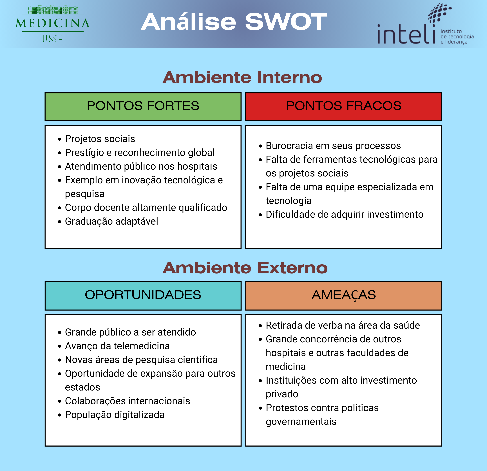

<sup>Fonte: Material produzido pelos autores (2024)</sup></div>

&nbsp;&nbsp;&nbsp;&nbsp;Sob esse prisma, é possível traçar uma gestão mais eficiente dos recursos — que se apresentam como escassos — potencializando suas forças — como a internacionalização e o atendimento público — para aproveitar as oportunidades — como a quantidade de pessoas a serem atendidas — e se proteger das ameaças — como a retirada de verba por parte do governo. Ao examinar esse exemplo, é possível observar a clareza adquirida pelas informações ao serem submetidas a esse método e como em poucos minutos é possível traçar um plano de ação, tendo em vista a interdependência dos fatores endógenos e exógenos.

&nbsp;&nbsp;&nbsp;&nbsp;Com a análise *SWOT*, foi possível observar características importantes, tais como os projetos sociais realizados pela Faculdade de Medicina da USP (FMUSP) e a carência de ferramentas tecnológicas para esses projetos sociais. Associados a esses pontos, destacam-se algumas oportunidades, como o amplo público atendido pela FMUSP e, sobretudo, a crescente digitalização mundial. Nesse contexto, a aplicação *gamificada* foi desenvolvida com o objetivo de atenuar os pontos fracos, potencializar ainda mais os pontos fortes e aproveitar as oportunidades.

### 1.1.3. Descrição da Solução Desenvolvida

&nbsp;&nbsp;&nbsp;&nbsp;A falta de conscientização acerca da prevenção, dos primeiros socorros e das informações inadequadas sobre queimaduras, em especial em populações vulneráveis, influi na alta incidência de queimaduras, que se torna uma das maiores causas de lesões traumáticas no mundo. Foram registrados cerca de 1 milhão de novos casos anualmente no Brasil, conforme dados divulgados pelo Ministério da Saúde do Brasil em 2014, e acredita-se que cerca de 90% das queimaduras poderiam ser evitadas com a devida educação e conscientização da população. Grande parte das queimaduras registradas ocorreram em ambiente residencial e em atividades de lazer, abrangendo, em sua maioria, homens de 20 a 39 anos[⁸](#c7).

&nbsp;&nbsp;&nbsp;&nbsp;Considerando esse cenário, definimos como possível solução a criação de um jogo *mobile* educacional. Ele objetiva a conscientização da população, em especial de suas parcelas mais vulneráveis, sobre queimaduras, à medida em que fornece informações embasadas para estimular a educação acerca da prevenção de queimaduras, além de auxiliar nos primeiros socorros e desmitificar métodos inapropriados de tratamento.<br>

&nbsp;&nbsp;&nbsp;&nbsp;Nossa solução busca criar os seguintes ganhos para nosso parceiro: conscientização de jovens e adultos, educação de maneira simples sobre a prevenção de queimaduras e promoção da Faculdade de Medicina da USP. Ademais, além de criar ganhos, buscamos também potencializá-los atráves da conscientização na prática, da criação de um diferencial tecnológico e da transmissão de conhecimento com diversão e lucidez.<br>

&nbsp;&nbsp;&nbsp;&nbsp;Além de criar ganhos, essa solução busca também sanar alguns problemas que o parceiro possui, como o baixo interesse das pessoas e a baixa disseminação de conhecimentos no que tange ao tema. Para isso, criamos um jogo que possui uma dinâmica capaz de reter a atenção do usuário, proporcionar uma experiência única e divertida e facilitar o acesso ao conhecimento atráves de plataforma *mobile*.<br>

&nbsp;&nbsp;&nbsp;&nbsp;O jogo deverá ser acessado pelos *smartphones* dos estudantes e poderá ser utilizado durante as campanhas de conscientização promovidas pela Faculdade de Medicina da USP ou quando da preferência do usuário. A solução impulsiona os benefícios já fornecidos pelas campanhas de conscientização e agrega um aspecto lúdico e divertido de compartilhar informações e combater desinformações. <br>


### 1.1.4. Proposta de Valor

&nbsp;&nbsp;&nbsp;&nbsp;Um Canvas de Proposta de Valor é uma ferramenta estratégica que  auxilia na compreensão do que torna um produto ou serviço valioso para os clientes[⁹](#c7). Representa um mecanismo estruturado para sintetizar elementos principais sobre o perfil do cliente, suas necessidades e a maneira pela qual a oferta da empresa atende a essas exigências, proporcionando soluções ou benefícios. Este modelo analítico permite às equipes reunirem suas ideias e pensarem de forma criativa sobre como podem oferecer valor aos seus clientes. Esta abordagem foi popularizada por Alexander Osterwalder e Yves Pigneur em seu livro "Business Model Generation", onde o Canvas é uma das nove áreas-chave de um modelo de negócios.

&nbsp;&nbsp;&nbsp;&nbsp;Usar um Canvas de Proposta de Valor é criar uma narrativa sobre como seu produto ou serviço faz a diferença na vida das pessoas. É uma abordagem colaborativa que incentiva todos a contribuírem com suas ideias, garantindo que todos estejam alinhados para oferecer algo que realmente importa para os clientes, ou seja, construir e consolidar sua proposta de valor.

&nbsp;&nbsp;&nbsp;&nbsp;A proposta de valor é a essência do que um produto ou serviço oferece aos clientes, satisfazendo às suas necessidades. Desenvolvida em torno do perfil do cliente e da proposta de valor da empresa, essa metodologia busca alinhar os ganhos desejados, as dores enfrentadas e os trabalhos a serem realizados pelos clientes com os benefícios oferecidos, os problemas resolvidos e os produtos/serviços específicos da empresa, respectivamente. Essa ideia foi apresentada por Alexander Osterwalder e sua equipe em seu livro "Value Proposition Design: How to Create Products and Services Customers Want"[¹⁰](#c7).

<div align="center">

<sub>Figura 03 - Canvas da Proposta de Valor do Projeto</sub>


<sup>Fonte: Material produzido pelos autores (2024)</sup>
</div>

&nbsp;&nbsp;&nbsp;&nbsp;    A partir do nosso Canvas de Proposta de Valor (CPV), determinamos as maneiras pelas quais nosso jogo se conecta com o perfil do cliente, solucionando suas principais necessidades e impulsionando seus atuais ganhos que foram esclarecidos com a elaboração desse Canvas. Por exemplo, a partir dessa análise pudemos perceber que a principal dor de nosso cliente era o baixo engajamento com as apresentações propostas antes de nossa solução (tarefas do cliente) e, para aliviar essa dor, chegamos a solução que é uma aplicação gamificada que objetiva, principalmente, o engajamento dos alunos com a dinâmica apresentada. Assim, uma estratégia para enfrentar o problema do cliente de maneira objetiva foi traçada em conjunto com a análise SWOT e, com base nessas informações, o desenvolvimento inicial foi iniciado. Além disso, foi lhes proporcionado um ambiente divertido que cumpra o principal objetivo do projeto: a conscientização. Destacamos, sobretudo, a necessidade de algo versátil e atrativo para o público-alvo, oferecendo uma experiência única e divertida, a fim de disseminar entre diversas pessoas e conscientizar cada vez mais a população.

### 1.1.5. Matriz de Riscos

&nbsp;&nbsp;&nbsp;&nbsp;A matriz de risco é uma ferramenta amplamente utilizada em diversas indústrias para avaliar e priorizar riscos com base em sua probabilidade e impacto. Ela é composta por uma tabela que categoriza os riscos em diferentes níveis, representados por cores ou valores numéricos[¹¹](#c7). A matriz de risco é iterativa por natureza, essa característica decorre da própria dinâmica do risco e da necessidade de reavaliação e refinamento contínuos visando seu aprimoramento. Ela é extremamente eficiente quando há necessidade de priorizar os riscos, sejam eles negativos (as ameaças) ou positivos (as oportunidades), ou seja, é excelente para analisar e visualizar quais riscos merecem mais atenção no momento, auxiliando na criação de planos de ação para prevenir ou potencializar tal risco[¹²](#c7).

&nbsp;&nbsp;&nbsp;&nbsp;O aspecto iterativo da matriz de risco reconhece que os riscos não são estáticos, mas sim elementos que evoluem ao longo do tempo devido às mudanças no ambiente interno e externo de uma organização. Novos riscos podem surgir, riscos existentes podem mudar em probabilidade ou impacto, e medidas de mitigação podem se mostrar ineficazes ou requerer ajustes. Portanto, revisar e atualizar regularmente a matriz de risco garante sua relevância e reflexão precisa da paisagem de riscos atual.

&nbsp;&nbsp;&nbsp;&nbsp;Ademais, uma abordagem iterativa permite que as organizações melhorem continuamente seus processos de gestão de riscos. Ao revisar regularmente a matriz de risco, as instituições podem identificar áreas onde seus métodos de avaliação de risco podem ser aprimorados, como refinar critérios de risco, melhorar técnicas de coleta e análise de dados, ou aprimorar a comunicação e colaboração entre as partes interessadas. Esse ciclo iterativo de melhoria as auxilia a se adaptarem às circunstâncias voláteis, a anteciparem e responderem melhor a riscos emergentes.

&nbsp;&nbsp;&nbsp;&nbsp;A fim de gerenciar os riscos do nosso produto, a equipe construiu os gráficos que representam potenciais ameaças e oportunidades no projeto (figura 04 e figura 05, respectivamente), contribuindo efetivamente para a tomada de decisões estratégicas e planejamento de planos de ação. 

&nbsp;&nbsp;&nbsp;&nbsp;Dada a iteratividade do gerenciamento de risco citada acima, as figuras a seguir foram adaptadas para a fase atual do projeto com a revisão do impacto e da probabilidade dos riscos e das oportunidades. 

<div align="center">

<sub>Figura 04 - Matriz de Riscos</sub>

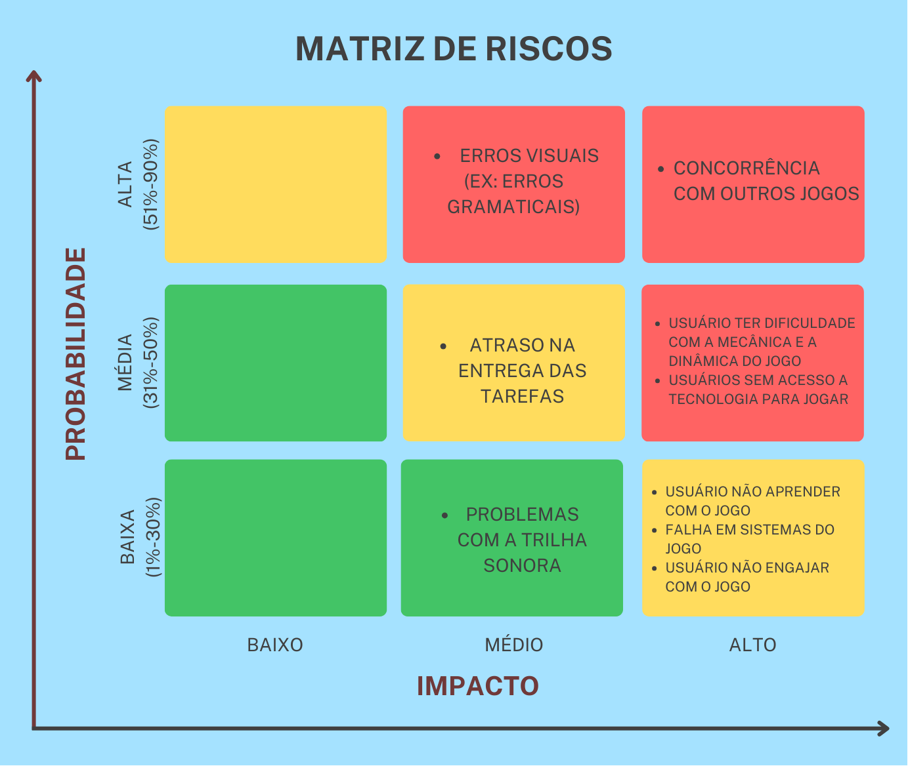

<sup>Fonte: Material produzido pelos autores (2024)</sup>
</div>

&nbsp;&nbsp;&nbsp;&nbsp;Algumas mudanças notáveis foram: a extinção do risco "Falta de Comprometimento do Grupo", pois todos os membros mostraram proatividade e responsabilidade para com o projeto, e o aumento da oportunidade "Credibilidade do Projeto", após receber um _feedback_ positivo ao final da apresentação do *MVP* para o parceiro com o fim da _sprint_ 4.

<div align="center">

<sub>Figura 05 - Matriz de Oportunidades</sub>


<sup>Fonte: Material produzido pelos autores (2024)</sup>
</div>

&nbsp;&nbsp;&nbsp;&nbsp;Deste modo, pode-se concluir que a matriz de risco pode ser aplicada em diversas áreas, inclusive em situações cotidianas. A análise de riscos pode ser útil para a tomada de decisão, ponderando seus riscos, ou seja, suas probabilidades e seus impactos; visando uma maior assertividade nesse processo decisório. A natureza iterativa da matriz de risco, portanto, não apenas a torna uma ferramenta valiosa para organizações em diferentes setores, mas também destaca sua utilidade potencial em contextos mais amplos, oferecendo uma estrutura sistemática para a gestão de riscos.

&nbsp;&nbsp;&nbsp;&nbsp;A análise dos riscos no projeto foi realizada com o objetivo de auxiliar o grupo a entender e lidar com possíveis ameaças e oportunidades. Sendo assim, conseguimos prever de forma mais eficaz certos eventos como, por exemplo, a possibilidade do usuário não entender a mecânica do jogo e criar, a partir dessa ameaça, um tutorial simples e esclarecedor. Além disso, foi possível visualizar que a parceria com a FMUSP gera um impacto social significante, indo de acordo com o que o projeto visa. Deste modo, chegamos nos seguintes planos de ação:

<div align="center">
<sub>Tabela 1: Requisitos do cliente</sub>
</div>


\# | Plano de ações:
--- | ---
1 | Atraso nas entregas dos afazeres: Apesar da equipe ser bem organizada com prazos e datas, o atraso nas entregas do backlog tem probabilidade de ocorrência média e impacto também médio. A solução ideal é realizar encontros breves diariamente (daily), para que todos os membros do grupo estejam cientes do andamento das funções individuais e coletivas, evitando sobrecargas e obstáculos desnecessários no desenvolvimento do projeto.
2 | Falha no sistema do jogo: Para evitar falhas no sistema, a equipe realizará diversos testes para assegurar que tudo ocorrerá como o planejado. Caso aconteça algum imprevisto ou equívoco da nossa parte, realizaremos uma análise profunda para encontrar a raiz do problema e consertá-la.
3 | O usuário não aprender com o jogo: Como um dos objetivos é a conscientização através do jogo, algumas soluções que a equipe entende como necessária e irá implementar para evitar o risco do usuário não aprender com o jogo são, garantir que o conteúdo educacional seja apresentado de maneira clara e concisa, aplicar o conhecimento adquirido em *minigames* durante o jogo e, utilizar de efeitos sonoros para indicar que uma ação foi satisfatória ou não.
4 | Usuário sem acesso às tecnologias necessárias para jogar: Um dos principais motivos para a criação desse jogo é com o intuito de levar o conhecimento a todos, mas principalmente para aqueles que não tem fácil acesso à educação. Por esse motivo, a acessibilidade é uma prioridade e preocupação para a equipe. Para atingir  o máximo de usuário possível, a equipe tentará de tudo para oferecer o jogo além de *mobile*, mas que também funcione em uma versão web. Além disso, o jogo poderá ser executado em dispositivos mais antigos e que tenham menos capacidade de processamento.  
5 | Problemas com a trilha sonora: Uma ameaça de probabilidade e impacto baixos, pois se houver qualquer imprevisto com a trilha sonora, isso não irá impactar a mensagem ou a jogabilidade do jogo. O plano de ação é analisar e entender a raiz do problema e efetuar as alterações necessárias, além de realizar diversos testes em dispositivos diferentes.  
6 | Erros/Alterações visuais (ex: erros gramaticais): Ainda que a equipe Tilápia seja cuidadosa, é normal que aconteçam erros e alterações visuais durante o desenvolvimento do jogo. Por se tratar de falhas relativamente simples de serem resolvidas, o impacto acaba sendo baixo. A solução mais eficiente para ambos é a atenção redobrada para evitar erros e, no caso das alterações puramente estéticas, para não tirar o foco do que realmente importa. 
7 | O usuário não se engaja com o jogo: Por ser um jogo com o intuito educativo, é possível que haja problemas no engajamento do usuário. Para evitar ao máximo essa problemática, a equipe desenvolverá no jogo elementos de recompensa para motivar o usuário, como por exemplo, método de pontuação e vida, quiz e tempos limitados para a realização dos objetivos. Além disso, o jogo fica cada vez mais desafiador à medida que o jogador ganha experiência e familiaridade.  
8 | O usuário tem dificuldade em entender a dinâmica e mecânica do jogo: Entender como se joga um jogo é essencial para o sucesso do mesmo e a falha na compreensão pode gerar estresse e desinteresse. Para que isso não aconteça, a jogabilidade deve estar alinhada com nível do usuário e o tutorial deve ser bem informativo e esclarecedor, para que o jogo siga um fluxo divertido e intuitivo. 
9 | Concorrência com outros jogos: A concorrência com outros jogos é um risco de probabilidade alta e impacto também alto, visto que poderíamos perder clientes, dito isso, uma solução viável seria desenvolver novas estratégias de *marketing* para o jogo e garantir atualizações que inovem o produto.

## 1.2. Requisitos do Projeto

&nbsp;&nbsp;&nbsp;&nbsp;Esta seção tem por finalidade apresentar de maneira abrangente e minuciosa os requisitos essenciais que irão direcionar o desenvolvimento do projeto. Aqui serão delineadas as funcionalidades, características e restrições fundamentais, a fim de assegurar uma compreensão unificada entre a equipe de desenvolvimento e o cliente.

<div align="center">
<sub>Tabela 2: Requisitos do cliente</sub>
</div>

<div align="center">

\# | Requisito do cliente 
--- | ---
1|Ensinar quais são as três camadas da pele;
2|Falar sobre a espessura das camadas da pele e qual a relação delas com os tipos de queimadura;
3|Definir os diferentes tipos de queimadura;
4|Dizer por que uma queimadura profunda não dói;
5|O jogo deve ser compatível com *mobile*;
6|A paleta de cores deve ser vibrante e atraente para o público do jovem;
7|Tempo limitado apenas com a intenção de capacitação, sendo uma experiência única de aprendizado;
8|Jogo tem de atrair o interesse dos alunos;
9|Deve ter recompensas, pontuação, recordes;
10|Pode ser expandido para fora das escolas;
11|O jogo não aborda formas de tratamento;
12|Focar na prevenção e no que NÃO fazer;
13|Desmistificação de mitos.

</div>

<div align="center">
<sub>Tabela 3: Requisitos do cliente</sub>
</div>

\# | Requisito do grupo 
--- | ---
1 | No jogo deve ser implementado um menu inicial com um botão “inciar”;
2 |O jogo deve conter o pátio da faculdade como cenário, uma interação com *NPC* para acessar um *case*, uma tenda com questionário e uma tenda com livros para se adquirir conhecimento;
3 |Deve ser adicionado ao jogo um sistema de recompensa tendo como base o tempo de resolução do *case* e os acertos no questionário;
4 |Adicionar efeitos sonoros, música de fundo por meio do framework phaser; 
5 |Deve ter animações que serão feitas com *spritesheet*;
6 |Irá conter uma arte gráfica pixelada, feita com auxílio do piskel;
7 |Inputs de movimentação com o touch screen de dispositivos *mobile*
8 |Implementação de movimento vetorial para normalização de velocidade;
9 |Programar mudança de cenas para ter um código funcional do menu;
10 |Adicionar animações ao personagem com *spritesheet*;
11 |Adicionar tecla de input para interação com outros objetos ou personagens;
12 |Fazer quiz na Tenda de Livros com mudança de cenas;
13 |O jogo deve ser rápido, com um tempo de duração de em média 15 minutos;
14 |Terá possibilidade de rejogabilidade;
15 |Adquirir pontos em forma de conhecimento;
16 |Ter elemenos da Faculdade de Medicina da USP, entre outras referências;
17 |Ter uma grande sala com foco no personagem, utilizando dinâmica de câmeras;
18 |Caixa de diálogo com *NPC* para instruir o personagem principal sobre quais serão seus próximos passos.

&nbsp;&nbsp;&nbsp;&nbsp;Listar esses pontos em uma tabela auxiliou o grupo a se organizar melhor para a produção de requisitos alinhados com os do cliente e a ter um maior entendimento do projeto, visando sempre o atenditmento dos pedidos do cliente. E, ao mesmo tempo, ajudou o grupo a organizar as tarefas de forma eficiente, ou seja, abrangendo todos os pontos listados e proporcionando uma divisão igualitária dessas tarefas.

## 1.3. Público-alvo do Projeto

&nbsp;&nbsp;&nbsp;&nbsp;De acordo com Kotler (2000)[¹³](#c7), também conhecido como o “pai do *marketing*”, o público alvo é o grupo de consumidores que possui necessidades semelhantes àquelas que a empresa atende. O público alvo pode ser dividido em diversos fatores tais quais: geografia, demografia, psicografia e comportamento[¹⁴](#c7). 

&nbsp;&nbsp;&nbsp;&nbsp;O nosso jogo é pensado e destinado aos adolescentes e aos jovens adultos que fazem parte de comunidades e regiões carentes com acesso limitado à educação, visto que o objetivo principal do projeto é a conscientização e 90% dos incidentes envolvendo queimaduras são reportados em locais onde a população é leiga[⁷](#c7).


&nbsp;&nbsp;&nbsp;&nbsp;Portanto, para que a magnitude da influência e impacto gerado do nosso produto seja positiva, definimos o público alvo levando em consideração os aspectos demográficos, mais especificamente a idade, renda e educação. 
Posto isso, foi entendido que a definição adequada do público alvo aumenta a magnitude da influência e impacto gerado, o que vai de acordo com o nosso objetivo principal.

# <a name="c2"></a>2. Visão Geral do Jogo

## 2.1. Objetivos do Jogo

&nbsp;&nbsp;&nbsp;&nbsp;Os jogos têm como principal função proporcionar entretenimento, lazer e diversão aos participantes[¹⁵](#c7). Pode envolver completar tarefas específicas, resolver quebra-cabeças, derrotar inimigos, acumular pontos, entre outros desafios.

&nbsp;&nbsp;&nbsp;&nbsp;Para o nosso jogo, o objetivo é resolver o máximo de *cases* propostos pela dra. Tina em um tempo determinado, passando por um ciclo de teoria (representado pelos livros da Tenda de Livros) e de prática (representada pelo quiz da Tenda de Quiz), obtendo assim uma pontuação final que pode ser superada a cada novo ciclo. Isso incentiva que os jogadores equilibrem eficiência na resolução e aprimoramento de habilidades através da aprendizagem.

## 2.2. Características do Jogo

### 2.2.1. Gênero do Jogo

&nbsp;&nbsp;&nbsp;&nbsp;O gênero se refere à classificação ou categoria que descreve o estilo e a mecânica de jogo predominantes. Cada gênero tem características específicas que definem como os jogadores interagem com o jogo e o que podem esperar dele em termos de jogabilidade, narrativa e objetivos[¹⁶](#c7).

&nbsp;&nbsp;&nbsp;&nbsp;O nosso jogo simula a atuação de um estudante de ensino médio durante uma gincana promovida por uma faculdade, portanto seu gênero é simulação. Como tal, o jogo oferece uma experiência imersiva e educativa, em que o jogador pode aprender sobre prevenção de queimaduras e sobre o que se deve ou não fazer logo após se queimar.

### 2.2.2. Plataforma do Jogo

&nbsp;&nbsp;&nbsp;&nbsp;A plataforma de um jogo refere-se ao ambiente ou sistema no qual o jogo é executado[¹⁷](#c7). Isso inclui dispositivos como computadores, consoles de videogame, *smartphones*, *tablets*, entre outros; e também o sistema operacional ou plataforma *online* que suporta a execução do jogo.

&nbsp;&nbsp;&nbsp;&nbsp;O jogo será desenvolvido para dispositivos móveis, como *smartphones* e *tablets*, e oferecerá uma experiência acessível e portátil. A interface será otimizada para telas sensíveis ao toque, permitindo aos jogadores interagirem intuitivamente com os elementos do jogo. Além disso, a natureza móvel desses dispositivos permitirá que os jogadores acessem o jogo em qualquer lugar, tornando-o conveniente para ser usado na educação.

&nbsp;&nbsp;&nbsp;&nbsp;A aplicação também poderá ser acessada via web, oferecendo flexibilidade adicional aos jogadores, que poderão jogar diretamente de seus navegadores sem a necessidade de *downloads* adicionais. Isso tornará o jogo acessível a uma ampla gama de dispositivos, garantindo que mais pessoas possam participar e aprender sobre a importância da prevenção de queimaduras.

### 2.2.3. Número de Jogadores

&nbsp;&nbsp;&nbsp;&nbsp;O número de jogadores de um jogo refere-se à quantidade de participantes que podem o jogar simultaneamente ou de forma sequencial. Esse aspecto é fundamental na definição da dinâmica do jogo, determinando se é um jogo para um único jogador, para dois jogadores, ou para múltiplos jogadores. O número de jogadores pode influenciar elementos como competição, colaboração, estratégia e interação social dentro do jogo.

&nbsp;&nbsp;&nbsp;&nbsp;No contexto do nosso jogo sobre prevenção de queimaduras, a opção de um jogador oferecerá uma experiência individualizada e centrada no aprendizado. Isso possibilitará um foco maior na absorção de informações e na prática de habilidades específicas, como identificar riscos de queimaduras e tomar decisões preventivas adequadas. Além disso, jogar sozinho pode facilitar a personalização da experiência de acordo com o ritmo e as necessidades individuais do jogador.

### 2.2.4. Títulos Semelhantes e Inspirações 

&nbsp;&nbsp;&nbsp;&nbsp;Títulos semelhantes e inspirações de um jogo referem-se a outros jogos que compartilham características, temas, mecânicas ou atmosfera semelhantes com o jogo que está sendo desenvolvido. Ao analisar títulos semelhantes, podemos identificar elementos que foram bem-sucedidos em outros jogos e incorporá-los ao nosso próprio projeto. Já as inspirações nos forneceram uma fonte de criatividade e direção para o desenvolvimento do jogo.

&nbsp;&nbsp;&nbsp;&nbsp;Para a concepção do jogo, foram utilizados os seguites jogos como referência de jogabilidade e design:

* [Overcooked](https://www.team17.com/games/overcooked/)<br>
* [Hospital Questiona](https://metodoquestiona.com.br/)<br>
* [Stardew Valley](https://www.stardewvalley.net/)<br>

### 2.2.5. Tempo Estimado de Jogo

&nbsp;&nbsp;&nbsp;&nbsp;No âmbito dos jogos, o conceito de tempo estimado de jogo adquire relevância como uma métrica significativa para compreender as diferentes abordagens e estratégias adotadas pelos jogadores. Partindo do princípio de que cada usuário tem objetivos e conhecimentos singulares [¹⁸](#c7), essa estimativa temporal fornece apenas uma base para determinar o tempo de jogo que consideramos ideal para o jogador passar por todos os ensinamentos que buscamos transmitir.

&nbsp;&nbsp;&nbsp;&nbsp;Assim, com o *MVP* pronto, fizemos alguns testes considerando perfis de jogador diferentes para determinar um tempo que balanceasse diversão e aprendizado. O primeiro teste buscou terminar o jogo com o menor tempo possível, ignorando a pontuação, e foi concluído em 3 minutos e 10 segundos. O segundo teste buscou verificar o tempo de uma jogatina normal, lendo os textos e tentando resolver os casos, e foi concluído em 6 minutos e 36 segundos. Por fim, o terceiro teste buscou completar o maior número de *cases* e auferir a maior pontuação possível, e foi concluído em 5 minutos e 02 segundos.

&nbsp;&nbsp;&nbsp;&nbsp;Por fim, considerando os testes acima e os testes que realizamos com os testadores descritos na seção 5.2.1, chegamos à conclusão de que o tempo ideal para uma jogatina é de 6 minutos e seria necessário de 3 a 4 jogatinas para adquirir o conhecimento de todos os *cases*.


# <a name="c3"></a>3. *Game Design*

## 3.1. Enredo do Jogo

&nbsp;&nbsp;&nbsp;&nbsp;No jogo "Turma da Prevenção", os jogadores entram em uma aventura imersiva da vida de Lipe, um estudante de ensino médio em uma escola pública muito dedicado e competitivo. O sonho de Lipe é se tornar um médico e por isso participa da dinâmica proposta pela Dra. Tina, uma renomada médica do Hospital das Clínicas. 

&nbsp;&nbsp;&nbsp;&nbsp;No Dia da Prevenção, a Faculdade de Medicina da USP abriu as portas para receber alunos de todas as escolas, com o objetivo de conscientizá-los acerca do tema das queimaduras. Durante a dinâmica, Lipe vai entrar em contato com casos reais de pessoas que sofreram lesões de queimadura e vai estudar cada um deles minuciosamente, desbravando a literatura acerca do tema. A dinâmica irá testar seus conhecimentos adquiridos por meio de um jogo desafiador de perguntas e respostas. À medida em que o jogo avança, Lipe vai compreendendo os perigos e cuidados relacionados às queimaduras, desmitificando crenças populares e absorvendo conhecimento, além de entender a importância da prevenção para evitar acidentes.


## 3.2. Personagens

### 3.2.1. Controláveis

&nbsp;&nbsp;&nbsp;&nbsp;O termo "personagem controlável" refere-se àqueles avatares que são comandados pelo jogador através de comandos de movimento, ações, combate, dentre outros[¹⁹](#c7).

&nbsp;&nbsp;&nbsp;&nbsp;O jogo referido neste documento terá somente um único personagem controlável, o Lipe. Ele é um aluno muito dedicado que está no ensino médio de uma escola pública e participará de uma dinâmica proposta pela Dra. Tina dentro do campus da Faculdade de Medicina da USP. O personagem sonha em um dia ser médico, então está animado para os desafios que lhe serão apresentados. Lipe irá estudar os *cases* que serão fornecidos pela Dra. Tina e terá como objetivo concluir o maior número de *cases* em um tempo estabelecido. 

### 3.2.2. *Non-Playable Characters* (*NPCs*)


&nbsp;&nbsp;&nbsp;&nbsp;*Non-Playable Characters* (*NPCs*) são avatares os quais o jogador não possui controle sobre, portanto não comanda seus movimentos nem ações[¹⁹](#c7). Porém, é possível interagir com eles se forem programados para isso, como é o caso da Dra. Tina. Em nosso projeto utilizaremos nove *NPCs*, dos quais oito serão estudantes e, como o Lipe, participarão da dinâmica. Desde modo, poderão ser obstáculos para o trajeto do jogador durante o jogo. Já a  Dra. Tina é uma *NPC* que fica situada somente em um lugar, no entanto ela é a única com a qual se pode interagir, visto que é a responsável por entregar os *cases* aos alunos.


<div align="center">
<sub>Tabela 4: Descrição dos *NPCs* do jogo</sub>
</div>

\# | *NPC* | Função | Imagem
--- | --- | --- | --- 
1 | Dra. Tina | Instruir os alunos e entregar os *cases* | 
2 | *NPC* 02 | Preencher o mapa e atrapalhar o jogador ao participar da dinâmica | 
3 | *NPC* 03 | Preencher o mapa e atrapalhar o jogador ao participar da dinâmica | 
4 | *NPC* 04 | Preencher o mapa e atrapalhar o jogador ao participar da dinâmica | 
5 | *NPC* 05 | Preencher o mapa e atrapalhar o jogador ao participar da dinâmica | 
6 | *NPC* 06 | Preencher o mapa e atrapalhar o jogador ao participar da dinâmica | 
7 | *NPC* 07 | Preencher o mapa e atrapalhar o jogador ao participar da dinâmica | 
8 | *NPC* 08 | Preencher o mapa e atrapalhar o jogador ao participar da dinâmica | 
9 | *NPC* 09 | Preencher o mapa e atrapalhar o jogador ao participar da dinâmica | 
<div align="center">
<sup>Fonte: Material produzido pelos autores (2024)</sup>
</div>


### 3.2.3. Diversidade e Representatividade dos Personagens

&nbsp;&nbsp;&nbsp;&nbsp; De acordo com o nosso público-alvo, o jogo em questão não apenas oferecerá uma variedade de personagens, mas também buscará causar um impacto social por meio da inclusão e diversidade. A personagem Dra. Tina foi criada para representar uma parcela significativa da população brasileira: pessoas pardas/pretas, conforme indicado pelo Censo de 2022. Nossa abordagem objetiva não apenas incluir personagens pretos como secundários, mas também posicioná-los como protagonistas da história. Assim, a Dra. Tina desempenha o papel principal ao guiar o personagem principal durante toda a jornada, fornecendo instruções e sendo a figura central por trás de todos os eventos que ocorrem dentro do jogo. Além disso, o projeto procura abordar outras raças e diferentes culturas nos personagens.

## 3.3. Mundo do jogo

### 3.3.1. Locações Principais e/ou Mapas

&nbsp;&nbsp;&nbsp;&nbsp;O jogo se passa em uma fase única e cíclica composta pelos seguintes ambientes:

&nbsp;&nbsp;&nbsp;&nbsp;Faculdade de Medicina da USP: localização onde o jogo se passa, inspirada no prédio real da Universidade de São Paulo, e sedia o Dia de Prevenção acerca do tema das queimaduras.

&nbsp;&nbsp;&nbsp;&nbsp;Dra. Tina: onde os *cases* são visualizados e atribuídos ao jogador, que, no papel de estudante, irá investigar sobre a situação.

&nbsp;&nbsp;&nbsp;&nbsp;Tenda de Livros: um ambiente onde o jogador pode acessar informações sobre prevenção de queimaduras e procedimentos de primeiros socorros de acordo com o *case* investigado.

&nbsp;&nbsp;&nbsp;&nbsp;Tenda de Quiz: lugar em que o jogador aplica os conhecimentos adquiridos para que conclua a investigação do *case* atribuído a ele.

<div align="center">

<sub>Figura 06 - Mapa do Jogo</sub>

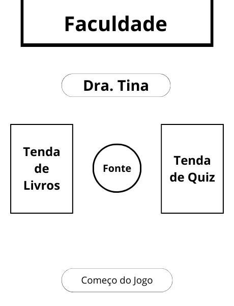

<sup>Fonte: Material produzido pelos autores (2024)</sup>
</div>

### 3.3.2. Navegação pelo Mundo

&nbsp;&nbsp;&nbsp;&nbsp;O jogador controla um estudante do ensino médio utilizando um controle direcional na tela de seu dispositivo móvel. Tocando no controle e arrastando o dedo na direção desejada, a movimentação do personagem é ativada e é possível navegar livremente dentro dos limites do cenário, além de interagir com objetos e personagens por meio de colisões. Vale ressaltar que a velocidade do personagem varia de acordo com a distância que o joystick é afastado, ou seja, quanto mais distante do centro o jogador mover o joystick, mais rápido o personagem andará (possuindo um limite de velocidade).

&nbsp;&nbsp;&nbsp;&nbsp;No jogo, não há separação de salas ou níveis e o jogador pode navegar livremente pelo mapa. No entanto, para interagir com alguns objetos e acessar certas funcionalidades, existem condições específicas a serem cumpridas.

&nbsp;&nbsp;&nbsp;&nbsp;Ao encostar na Dra. Tina, um *case* é aberto para visualização e é atribuído ao jogador para ser solucionado. Após análise do *case*, o jogador deve se locomover à Tenda de Livros.

&nbsp;&nbsp;&nbsp;&nbsp;A Tenda de Livros está disponível para o jogador a qualquer momento. Para acessar as informações, basta colidir com a tenda. 

&nbsp;&nbsp;&nbsp;&nbsp;O jogador deve colidir com a Tenda de Quiz para iniciar um jogo de perguntas. As perguntas variam de acordo com o *case* fornecido, tornando essa funcionalidade disponível apenas após a atribuição de um *case* ao estudante. 

&nbsp;&nbsp;&nbsp;&nbsp;O jogador volta ao local onde está a Dra. Tina para lhe entregar o *case* resolvido, dando início a um novo ciclo de jogo após a Dra. atribuir mais um *case* ao estudante.

### 3.3.3. Condições Climáticas e Temporais

&nbsp;&nbsp;&nbsp;&nbsp;No jogo, o tempo é um elemento que adiciona diversão e desafio à experiência do jogador. Segundo Douglas Barbosa, "essa restrição temporal adiciona uma camada de tensão à jogabilidade, forçando o jogador a tomar decisões rápidas e priorizar tarefas para alcançar os objetivos"[²⁰](#c7).
Um cronômetro é utilizado para medir o tempo que o jogador tem para completar cada ciclo de aprendizado e resolução do *case* na gincana. 

&nbsp;&nbsp;&nbsp;&nbsp;O desafio está em cumprir o máximo de ciclos no tempo estipulado, o que cria uma sensação de urgência e de emoção. O jogador é recompensado com pontuações mais altas por sua eficiência e rapidez, incentivando repetições para melhorar o desempenho. No entanto, erros resultam na perda de tempo, tornando essencial tomar decisões cuidadosas e precisas durante o jogo. 

&nbsp;&nbsp;&nbsp;&nbsp;Em resumo, o cronômetro adiciona dinamismo e intensidade à jogabilidade, mantendo os jogadores engajados e focados em suas tarefas.

### 3.3.4. *Concept Art*

&nbsp;&nbsp;&nbsp;&nbsp;As *concept arts* são desenhos desenvolvidos com o objetivo de conceituar elementos do jogo como personagens, itens, cenários, etc[²¹](#c7). Para nosso jogo, as *concept arts* desenvolvidas estão listadas abaixo:
 
<div align="center">

<sub>Figura 07 - *Concept art* do Mapa</sub>

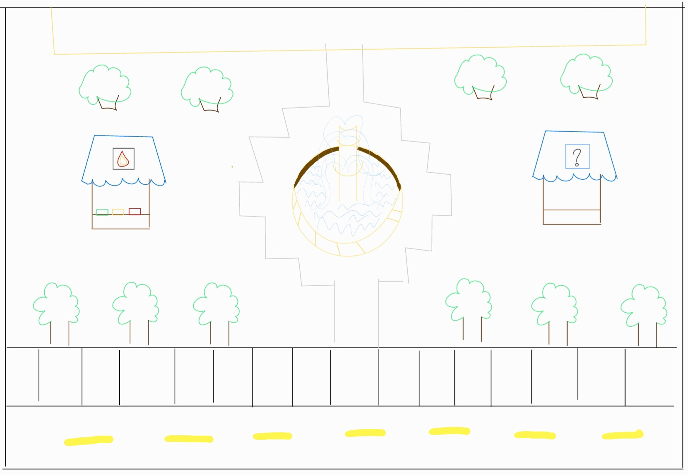

<sup>Fonte: Material produzido pelos autores (2024)</sup>

</div>

&nbsp;&nbsp;&nbsp;&nbsp;Figura 07: O mapa principal do jogo retrata o pátio da Faculdade de Medicina da Universidade de São Paulo. O espaço é arborizado, com duas tendas, uma em cada extremidade, e uma fonte central. Um portão separa o pátio da rua adjacente.

<div align="center">

<sub>Figura 08 - concept art do case</sub>

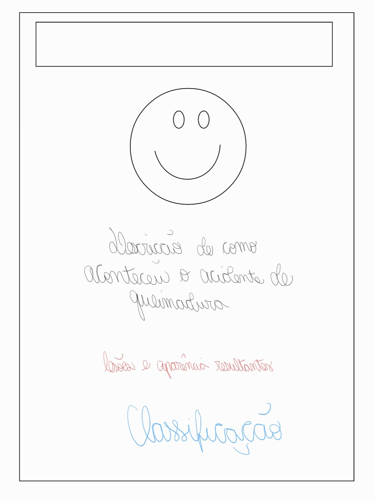

<sup>Fonte: Material produzido pelos autores (2024)</sup>

</div>

&nbsp;&nbsp;&nbsp;&nbsp;Figura 08: Na parte superior do *case* há um quadro e uma foto a serem preenchidos com o nome e imagem da vítima a ser estudada. Logo abaixo, encontra-se uma descrição de como ocorreu o acidente de queimadura seguido das lesões sofridas e a classificação da queimadura.

<div align="center">

<sub>Figura 09 - *Concept art* de Livros</sub>

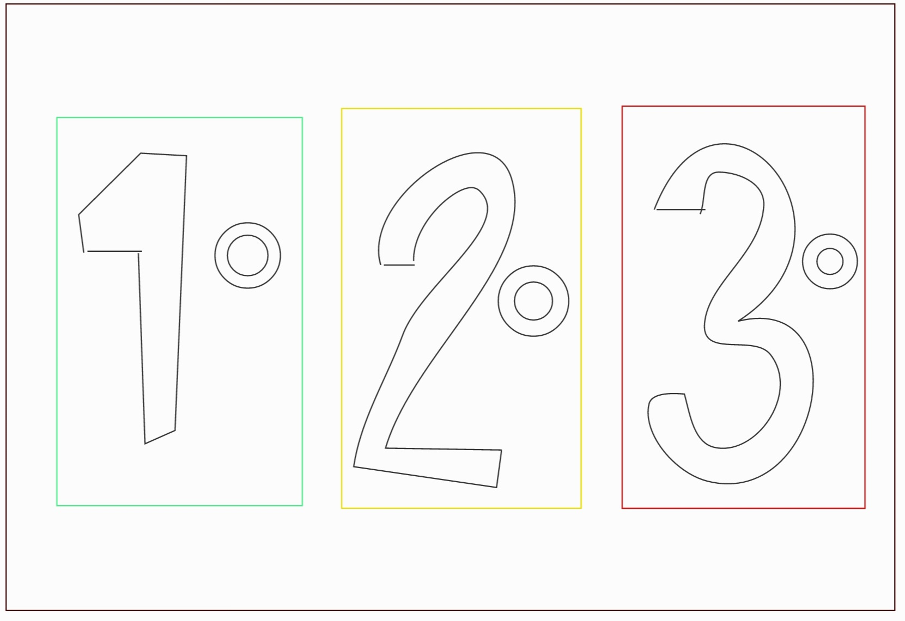

<sup>Fonte: Material produzido pelos autores (2024)</sup>

</div>

&nbsp;&nbsp;&nbsp;&nbsp;Figura 09: Os livros são dispostos em ordem crescente quanto ao seu grau de classificação começando pela esquerda. A capa de cada livro possui uma cor única que indica a qual grau de queimadura se refere.

<div align="center">

<sub>Figura 10 - *Concept art* do Quiz</sub>

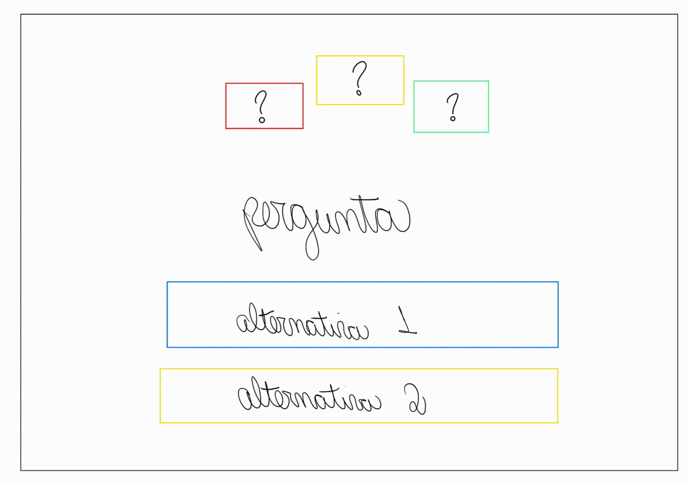

<sup>Fonte: Material produzido pelos autores (2024)</sup>

</div>

&nbsp;&nbsp;&nbsp;&nbsp;Figura 10: O quiz é um quadrado que contém, começando pela parte superior, três figuras em forma de retângulos com um símbolo de interrogação no centro. Em seguida, há uma caixa de pergunta a ser desenvolvida e duas caixas com opções de alternativa.

&nbsp;&nbsp;&nbsp;&nbsp;A avaliação crítica das _concept arts_ possibilitou à equipe analisar a eficácia na transmissão da visão artística e temática do jogo, assim como a consistência na representação dos elementos do jogo, tais como personagens, ambientes e itens. Adicionalmente, ao examinar as _concept arts_ em conjunto com o restante do Game Design Document (GDD), a equipe pôde identificar lacunas ou discrepâncias entre a visão inicial e a atual implementação do jogo, oferecendo _insights_ valiosos para ajustes e refinamentos subsequentes. Reconhecer tanto os pontos fortes quanto as áreas de melhoria nas _concept arts_ permitiu que a equipe desenvolvesse uma compreensão mais profunda das exigências estéticas e expectativas do projeto, facilitando um processo de desenvolvimento mais colaborativo e integrado.

### 3.3.5. Trilha sonora

&nbsp;&nbsp;&nbsp;&nbsp;As trilhas sonoras são meios de envolver o usuário no jogo, segundo o artigo "The Role of Music in Videogames" (O papel da música nos videogames) cujo autor, citado no artigo da BBC[²²](#c7), afirma que as trilhas sonoras nos jogos são multifuncionais, pois significam várias coisas para o jogador. Isso inclui o aumento da imersão, as brechas para mudanças na história, além de contribuírem também para a estética do jogo, tornando-se assim um fator muito importante para o envolvimento do jogador na narrativa.

<div align="center">
<sub>Tabela 5: Lista de músicas e efeitos sonoros</sub>
</div>

\# | Nomeclatura  | Ocorrência   | Autoria
--- | --- | --- | ---
| 1 | temaAbertura.wav           | Após clicar no botão Iniciar da Cena da Faculdade, durante a cutscene inicial e antes de abrir um Case | FoolBoyMedia (CC BY-NC 4.0) |
| 2 | temaPrincipal.mp3          | Cena da Faculdade após fechar o primeiro Case                          | BloodPixelHero (CC BY 4.0)  |
| 3 | efeitoSonoroBotaoIniciar.mp3 | Cena de Menu após a clicar no Botão Iniciar                          | Pixabay (CC0)                |
| 4 | efeitoSonoroBotaoX.mp3        | Cena da Faculdade após abrir um Case e clicar no Botão X              | Pixabay (CC0)                |
| 5 | efeitoSonoroOnibus.mp3     | Cutscene inicial quando o ônibus passa                                 | Pixabay (CC0)                |
| 6 | efeitoSonoroVirarPagina.mp3 | Cena dos Livros após clicar em uma página                             | Autores                      |
| 7 | efeitoSonoroAcertar.mp3    | Cena do Quiz após clicar na alternativa correta                       | Pixabay (CC0)                |
| 8 | efeitoSonoroErrar.mp3      | Cena do Quiz após clicar na alternativa errada                        | Pixabay (CC0)                |
| 9 | efeitoSonoroCriancas.mp3   | Cena da Faculdade após a Cutscene inicial                             | Pixabay (CC0)                |
| 10| efeitoSonoroGameOver.wav   | Cena de *Game Over* após o tempo acabar                                 | Mixkit (CC0)                 |

&nbsp;&nbsp;&nbsp;&nbsp;Tendo como referência o artigo mencionado, as músicas selecionadas foram cuidadosamente escolhidas para transmitir a atmosfera do jogo, com o objetivo de proporcionar uma imersão mais profunda por parte do jogador. No menu e no tutorial, optamos por músicas com ritmo mais lento, oferecendo uma introdução tranquila e acolhedora ao universo do jogo. No entanto, à medida que a dinâmica do jogo se intensifica, marcada pelo início do cronômetro e pelo aumento da velocidade das ações, uma trilha sonora com batidas mais pulsantes é ativada, elevando a energia e a intensidade da experiência de jogo.

&nbsp;&nbsp;&nbsp;&nbsp;Foram adicionados alguns efeitos sonoros também para melhorar a imersão do usuário, assim como fornecer _feedback_ para algumas ações que não possuiam muito impacto antes, como o clique de um botão ou o acerto ou erro do quiz.

&nbsp;&nbsp;&nbsp;&nbsp;Tanto os temas, quanto os efeitos sonoros foram selecionados da internet e adaptados quando necessário, com exceção de um deles: o “efeitoSonoroVirarPagina.mp3”. Para esse efeito sonoro usamos a técnica de criação de áudio denominada _foley_ que, segundo Tony Berchamans[²³](#c7), “[…] é a técnica de se reproduzir em estúdio todo som gerado pela atividade física dos personagens, por meio da “mímica” de seus movimentos. Sejam, passos, ruídos de roupas, manejo de objetos […]”. Dessa forma, utilizamos o manuseio de um livro, de uma folha de papel A4 e de um smartphone para gravar o som de uma página virando, efeito sonoro que utilizamos quando o jogador clica nas páginas dos livros da Tenda de Livros.

## 3.4. Inventário e Bestiário

### 3.4.1. Inventário

&nbsp;&nbsp;&nbsp;&nbsp;Não se aplica.

### 3.4.2. Bestiário

&nbsp;&nbsp;&nbsp;&nbsp;Não se aplica.

## 3.5. *Gameflow* (Diagrama de Cenas)

&nbsp;&nbsp;&nbsp;&nbsp;Um Diagrama de Cenas é uma ferramenta utilizada para auxiliar na organização do desenvolvimento técnico do jogo, apresentando as cenas do projeto e suas relações com outras cenas, exibindo os caminhos possíveis e bloqueios[²⁴](#c7) [²⁵](#c7). Nosso Diagrama de Cenas pode ser visitado <a href="https://miro.com/app/board/uXjVNmuHdDw=/">aqui</a>.

<div align="center">

<sub>Figura 11 - Visão geral do Diagrama de Cenas</sub>

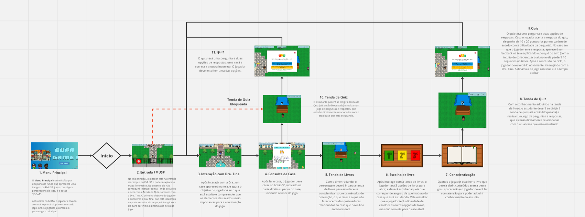

<sup>Fonte: Material produzido pelos autores (2024)</sup>

</div>

&nbsp;&nbsp;&nbsp;&nbsp;1 - Ao abrir o menu e clicar no botão “JOGAR”, o jogo iniciará. A tela inicial do jogo se passa no campus da Faculdade de Medicida da USP (FMUSP), onde chegarão os alunos para participarem da dinâmica do jogo. Após clicar no botão, o jogador é levado ao cenário principal, primeira cena do jogo, onde o jogador já controla o personagem principal.

<div align="center">

<sub>Figura 12 - Menu do Jogo</sub>

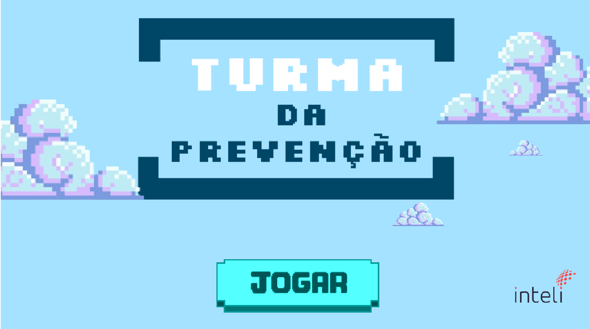

<sup>Fonte: Material produzido pelos autores (2024)</sup>

</div>

&nbsp;&nbsp;&nbsp;&nbsp;2 - Na tela principal, o jogador está na entrada do campus da FMUSP e poderá explorar o mapa livremente. No entanto, ele não conseguirá interagir com a Tenda de Livros e nem com a Tenda de Quiz, somente com a Dra. Tina. O primeiro objetivo do jogador é encontrar a Dra. Tina, que está localizada na parte superior do mapa, e interagir com ela para dar início à dinâmica de ciclos do jogo.

<div align="center">

<sub>Figura 13 - Campus FMUSP</sub>

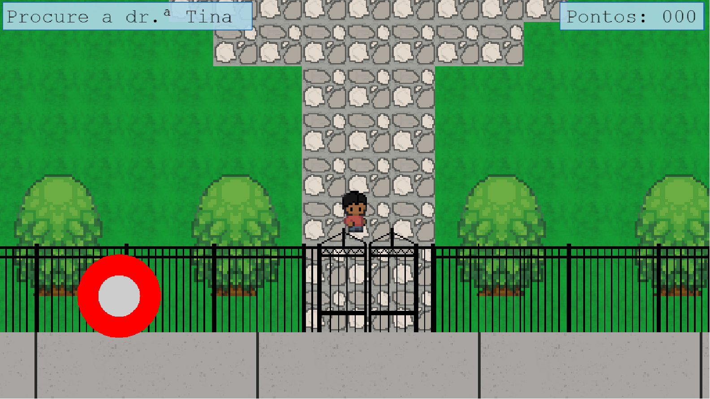

<sup>Fonte: Material produzido pelos autores (2024)</sup>

</div>

&nbsp;&nbsp;&nbsp;&nbsp;3 - Após interagir com a Dra., um case aparecerá na tela, agora o objetivo do jogador é ler o que está escrito e compreender que os elementos destacados serão importantes para a continuação do jogo.

<div align="center">

<sub>Figura 14 - Encontro com Dra. Tina</sub>

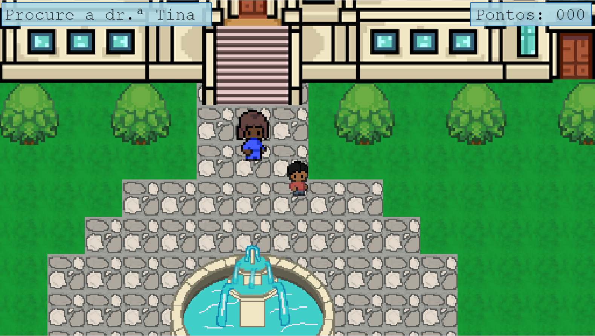

<sup>Fonte: Material produzido pelos autores (2024)</sup>

</div>

&nbsp;&nbsp;&nbsp;&nbsp;4 - Após ler o case, o jogador deve clicar no botão 'X', indicado na parte direita superior do case, iniciando o timer do jogo. 

<div align="center">

<sub>Figura 15 - Case</sub>

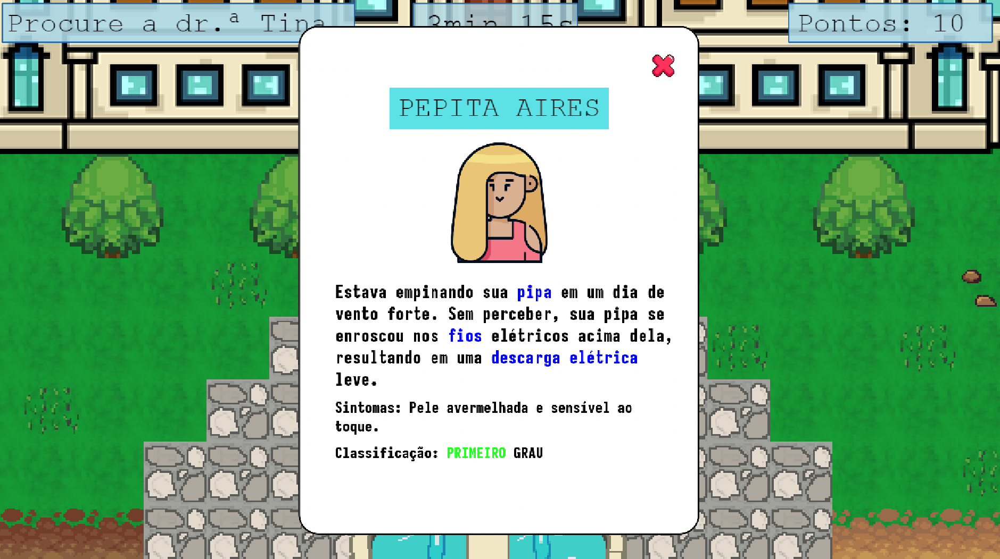

<sup>Fonte: Material produzido pelos autores (2024)</sup>

</div>

&nbsp;&nbsp;&nbsp;&nbsp;5 - Com o timer rodando, o personagem deverá ir para a Tenda de Livros para estudar e se conscientizar sobre os métodos de prevenção, aprendendo o que fazer e o que não fazer acerca das queimaduras relacionadas ao case que havia lido anteriormente.


<div align="center">

<sub>Figura 16 - Tenda de Livros</sub>

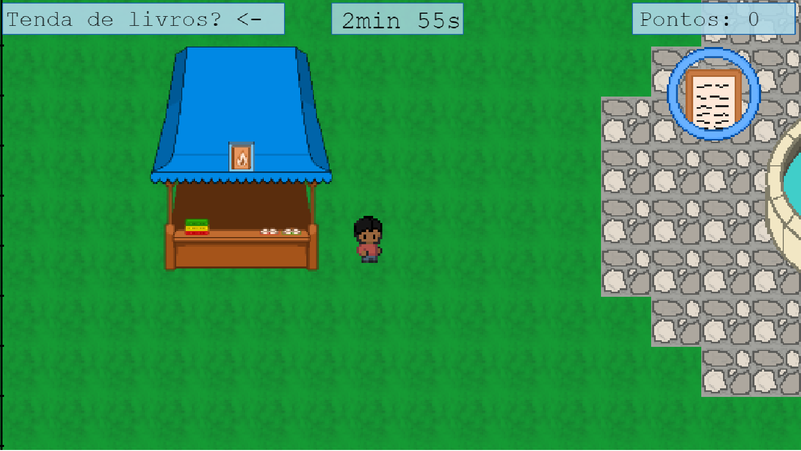

<sup>Fonte: Material produzido pelos autores (2024)</sup>

</div>

&nbsp;&nbsp;&nbsp;&nbsp;6 - Após interagir com a Tenda de Livros, o jogador terá 3 opções de livros para abrir, e deverá escolher àquele que corresponde ao grau de queimadura do case que está estudando. Vale ressaltar que o jogador terá a liberdade de escolher as outras opções de livros, mas não será útil para o case atual.

<div align="center">

<sub>Figura 17 - Livros</sub>

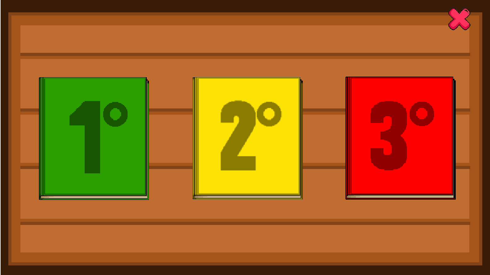

<sup>Fonte: Material produzido pelos autores (2024)</sup>

</div>

&nbsp;&nbsp;&nbsp;&nbsp;7 - Quando o jogador escolher o livro que deseja abrir, conteúdos acerca desse grau aparecerão e o jogador deverá ler com atenção para poder adquirir conhecimento do assunto.

<div align="center">

<sub>Figura 18 - Conteúdo do livro</sub>

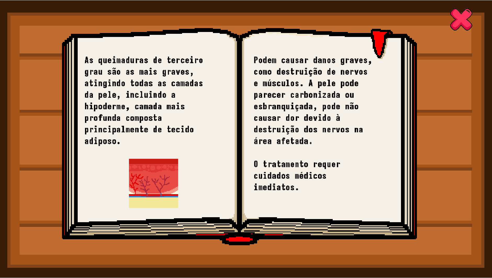

<sup>Fonte: Material produzido pelos autores (2024)</sup>

</div>

&nbsp;&nbsp;&nbsp;&nbsp;8 - Com o conhecimento adquirido na Tenda de Livros, o estudante deverá se dirigir à Tenda de Quiz (até então bloqueada) e realizar um jogo de perguntas e respostas, que estarão diretamente relacionadas com o atual case que está estudando.

<div align="center">

<sub>Figura 19 - Tenda de Quiz</sub>

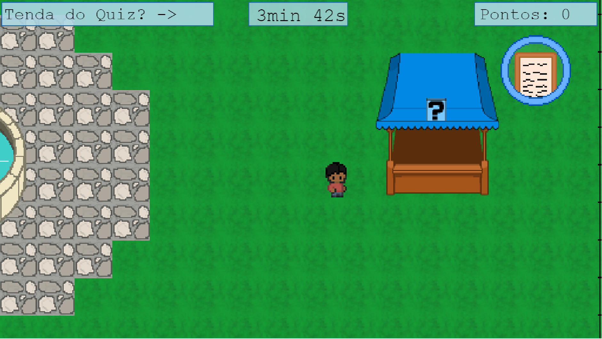

<sup>Fonte: Material produzido pelos autores (2024)</sup>

</div>

&nbsp;&nbsp;&nbsp;&nbsp;9 - O quiz terá uma pergunta e duas opções de respostas. Caso o jogador acerte a resposta do quiz, ele ganha 10 pontos e aparece um feedback explicativo do porquê de aquela resposta estar correta. No caso o jogador erre a resposta, aparecerá um feedback na tela explicando o porquê do erro (com o intuito de conscientizar o aluno) e ele perderá 10 segundos no timer. Após a conclusão do ciclo, o jogador deve iniciá-lo novamente, interagindo com a Dra. Tina. A dinâmica do jogo continua até o tempo acabar.

<div align="center">

<sub>Figura 20 - Quiz</sub>

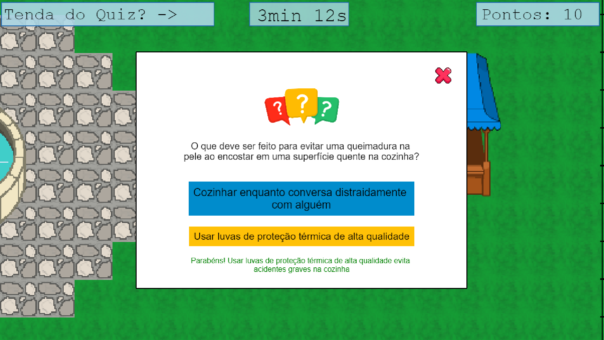

<sup>Fonte: Material produzido pelos autores (2024)</sup>

</div>

## 3.6. Regras do Jogo

&nbsp;&nbsp;&nbsp;&nbsp;As regras de um jogo, segundo o livro “Regras do Jogo: Fundamentos do Design de Jogos (Volume 1)”, moldam a experiência do jogador, fornecem estrutura e significado, e promovem a interatividade ao definirem limites, objetivos e desafios[²⁶](#c7). Com isso o jogador é, de certa forma, guiado a seguir a lógica (*gameflow*) própria daquele jogo.


&nbsp;&nbsp;&nbsp;&nbsp;Em nosso jogo, o personagem principal deve concluir o máximo de ciclos em um determinado tempo, obtendo assim uma pontuação que o jogador deve tentar superar a cada vez que jogar. Esses ciclos seguem uma lógica que consiste na apresentação do problema, auto estudo e teste do conhecimento adquirido, que ocorrerão, respectivamente, no encontro com a doutora Tina, na Tenda de Livros e na barraca do quiz. 


&nbsp;&nbsp;&nbsp;&nbsp;Ao interagir com a doutora, será apresentado ao jogador um caso de uma pessoa que sofreu uma queimadura. Após obter as informações do caso, o jogador deve se dirigir para a Tenda de Livros, onde irá ler sobre aquele caso para adquirir conhecimento e por fim colocará isso em prática no local do quiz, em que será feita uma pergunta e, com base nos acertos e no tempo que o jogador demorar em cada ciclo, obterá uma pontuação.

## 3.7. Mecânicas do Jogo

&nbsp;&nbsp;&nbsp;&nbsp;O MDA, que foi apresentado pela primeira vez na  Conferência *Foundations of Digital Games* no artigo chamado *MDA: A Formal Approach to Game Design and Game Research*, é um *framework* desenvolvido por Robin Hunicke, Marc LeBlanc e Robert Zubek[²⁷](#c7). Ele é muito utilizado no mundo do design de *games* para ajudar os produtores a criarem uma experiência imersiva e de altíssima qualidade para seu usuário. Isso é possível pela fragmentação do jogo em três aspectos: mecânica, dinâmica e estética. 

&nbsp;&nbsp;&nbsp;&nbsp;Segundo os desenvolvedores desse *framework*, as mecânicas são as várias ações, comportamentos e mecanismos de controle oferecidos ao jogador dentro de um contexto de jogo. Juntamente com o conteúdo do jogo (níveis, ativos e assim por diante), a mecânica suporta a dinâmica geral da jogabilidade. Ou seja, as mecânicas compõem a parte mais fundamental do ponto de vista do desenvolvedor, pois são a base para a criação de dinâmicas, que, por sua vez, criam estéticas únicas, o que agrega valor ao produto desenvolvido.


&nbsp;&nbsp;&nbsp;&nbsp;Em nosso jogo as principais mecânicas são: tempo, limitadores de mapa, colisão com objetos, eventos ativados com colisão, resposta a questões objetivas, pontuação de acordo com velocidade e acertos, utilização das teclas WASD para movimentação do personagem no computador e joystick no celular. Essas mecânicas compõem a lógica fundamental de nosso jogo e fazem com que ele tenha uma dinâmica que coage o jogador a ter velocidade em sua ação e o guia a seguí-la.


# <a name="c4"></a>4. Desenvolvimento do Jogo

## 4.1. Desenvolvimento Preliminar do Jogo

&nbsp;&nbsp;&nbsp;&nbsp;A primeira versão do jogo possui duas cenas, uma de início e uma de jogo. Ambas possuem arte gráfica provisória e foram desenvolvidas com o intuito de serem apresentadas na reunião com o parceiro ao final do *sprint* 1.

<div align="center">

<sub>Figura 21 - Cenas de jogo</sub>

<p align="middle">
    
    
</p>
<sup>Fonte: Material produzido pelos autores (2024)</sup>

</div>

&nbsp;&nbsp;&nbsp;&nbsp;A cena de início é uma artimanha de programação e será transformada futuramente em um arquivo JavaScript separado ao adquirirmos o conhecimento para tal. De momento, criamos duas imagens, um layer a frente das outras, e as removemos por um evento acionado pelo clique do mouse no botão “Jogar”.

<div align="center">

<sub>Figura 22 - Cena de início</sub>

<p align="middle">
    
    
</p>
<sup>Fonte: Material produzido pelos autores (2024)</sup>

</div>

&nbsp;&nbsp;&nbsp;&nbsp;A cena de jogo é composta por duas imagens, uma simulando o cenário do jogo e outra, o personagem jogável, uma figura de médico. O personagem possui movimento direcional controlado pelas teclas WASD, como será exposto abaixo. Adaptações para os _inputs_ estão listados abaixo.

<div align="center">

<sub>Figura 23 - Cena de jogo</sub>

<p align="middle">
    
    
</p>
<sup>Fonte: Material produzido pelos autores (2024)</sup>

</div>

&nbsp;&nbsp;&nbsp;&nbsp;Para iniciar a explicação do código, dentro do arquivo `“cena1.js”`, carregamos as imagens na função `preload()` e as criamos na função `create()`, como mostrado a seguir.

```js
function preload() {
    // Carregamento de imagens
    this.load.image('cenaHospital', 'assets/cenaHospital.png'); // Fundo da cena do Hospital
    this.load.image('cenaMainMenu', 'assets/cenaMainMenu.png'); // Fundo da cena do Main Menu
    this.load.image('botaoJogar', 'assets/botaoJogar.png');     // Imagem para botaoJogar
    this.load.image('medico', 'assets/medico.png');             // Imagem para medico
    }
```
```js
function create () {
    // Carrega a cena Main Menu
    mainMenu = this.add.image(667, 362, 'cenaMainMenu').setDepth(2).setScale(1.005);    // setDepth -> Muda profundidade para frente
    botaoJogar = this.add.image(830, 575, 'botaoJogar').setInteractive().setDepth(2);
```
```js
    // Cena Hospital
    this.add.image(667, 362, 'cenaHospital');       // Cria e posiciona o Fundo
    medico = this.add.image(400, 300, 'medico');    // Cria e posiciona o Medico
    medico.setFlip(true, false);                    // Ajusta a orientação do Medico
```
&nbsp;&nbsp;&nbsp;&nbsp;Após o carregamento das imagens da cena do menu, configuramos uma série de eventos que ajustam o comportamento da imagem da setinha ao passar sobre o botão "Jogar" e o que ocorre ao clicá-lo.
```js
// Ajuste visual da imagem do mouse para fornecer feedback que o botão jogar é interativo
    botaoJogar.on("pointerover", () => {        // Evento de passar o mouse sobre o botaoJogar
        this.input.setDefaultCursor("pointer"); // Cursor vira mãozinha
    });
    botaoJogar.on("pointerout", () => {         // Evento de retirar o mouse do botaoJogar
        this.input.setDefaultCursor("default"); // Cursor vira setinha
    });

    // Evento disparado ao clicar no botão (Código temporário apenas para demonstração da funcionalidade na sprint 1)
    botaoJogar.on("pointerdown", () => {        // Evento de click do mouse
        mainMenu.destroy();                     // Remoção da imagem mainMenu da tela
        botaoJogar.destroy();                   // Remoção da imagem botaoJogar da tela
        this.input.setDefaultCursor("default"); // Retorno do cursor do mouse para setinha
    });
```
&nbsp;&nbsp;&nbsp;&nbsp;Após o clique do botão jogar e remoção dos elementos da cena inicial, foram implementados os controles básicos de movimento para o personagem utilizando as teclas WASD do teclado. O código da movimentação começou com a definição de um objeto para cada tecla na função `create()`. Por exemplo, o objeto `keyA` recebeu o _input_ da tecla “A” do teclado, como visto abaixo. 
```js
    // Inicializa as variáveis para movimentação do personagem
    keyA = this.input.keyboard.addKey(Phaser.Input.Keyboard.KeyCodes.A); 
    keyW = this.input.keyboard.addKey(Phaser.Input.Keyboard.KeyCodes.W); // O código de cada tecla e o modo pelo qual devemos "chamá-la"
    keyS = this.input.keyboard.addKey(Phaser.Input.Keyboard.KeyCodes.S); // encontram-se na linha 115000 do arquivo "phaser.js"
    keyD = this.input.keyboard.addKey(Phaser.Input.Keyboard.KeyCodes.D);
```
&nbsp;&nbsp;&nbsp;&nbsp;Posteriormente, na função `update()`, implementamos uma lógica para atualizar a posição do médico um número de _pixels_ ao acionar cada tecla individualmente. Foi criada uma variável chamada `pixelMove` do tipo _const_ para ajustar um número fixo de _pixels_ que a figura do médico deve mover ao receber o _input_ de cada tecla. Um detalhe adicional é a mudança de orientação da figura do personagem ao acionar as teclas de movimentação do eixo horizontal, teclas “A” e “D”. Vale ressaltar que, por conta de utilizarmos apenas o condicional `if` na notação do _“if/else”_, ela torna-se inclusiva, ou seja, é possível clicar em mais de uma tecla ao mesmo tempo, possibilitando o movimento diagonal.
```js
    // Mapeamento de Inputs (Normalizar o movimento diagonal futuramente)
    if (keyA.isDown) {
        medico.x -= pixelMove;
        medico.setFlip(true, false); // Ajusta orientação do personagem
    }
    if (keyD.isDown) {
        medico.x += pixelMove;
        medico.setFlip(false, false); // Ajusta orientação do personagem
    }   
    if (keyS.isDown) {
        medico.y += pixelMove;
    } 
    if (keyW.isDown) {
        medico.y -= pixelMove;
    }
```
&nbsp;&nbsp;&nbsp;&nbsp;Como o personagem não possui física ou colisão, é possível movimentá-lo para fora da cena do hospital. Com o intuito de evitar esse comportamento, foi implementado provisoriamente o código a seguir que reposiciona-o de volta à cena sempre que atingir uma borda.
```js
    // Reposiciona o objeto medico de volta ao mapa (Temporário antes de implementar colisão)
    if (medico.x > config.width) {
        medico.x = 20;
    }
    if (medico.x < 0) {
        medico.x = config.width - 20;
    }
    if (medico.y > config.height) {
        medico.y = 20;
    }
    if (medico.y < 0) {
        medico.y = config.height - 20;
    }
```
&nbsp;&nbsp;&nbsp;&nbsp;O final do código apresenta uma lógica inicial e experimental de tentativa de implementação de _inputs_ *mobile*. Mais estudo e pesquisa são necessários para refinar seu entendimento e comportamento.
Por fim, a variável `config` criada no início do código guarda todas as configurações necessárias para criar o objeto `Phaser.Game`. Dentre elas, podemos destacar que o tamanho da tela foi temporariamente fixado em 1334x725 _pixels_ e a propriedade `scale` foi definido como "FIT" para ajustar o tamanho da tela automaticamente, como podemos ver abaixo.
```js
// Cria as configurações para Phaser.Game
var config = {
    type: Phaser.AUTO,      // Ajusta o renderizador automaticamente (WebGL e Canvas)
    width: 1334,            // Ajusta a largura para 1334 pixels (temporário)
    height: 725,            // Ajusta a altura
    scale: {
        mode: Phaser.Scale.FIT, // Ajusta a tela para mobile
    },
    scene: { // Funções da cena
        preload: preload,   // Carrega os assets
        create: create,     // Cria os objetos e inicializa algumas configurações
        update: update      // Atualiza a lógica do jogo
    }
};
```
**Dificuldades**
- Tentar ajustar o tamanho da tela automaticamente para diferentes dispositivos;
- Definir corretamente os inputs de movimentação( demora para achar a sintaxe correta);
- Adaptação às boas práticas ao escrever código em Javascript.

**Próximos passos**
- Adaptar os inputs de movimentação para funcionarem com as setas do teclado e com o touch screen de dispositivos *mobile*;
- Normalizar a velocidade do deslocamento do objeto médico na direção diagonal;
- Mudar a arte gráfica para a definida pelo grupo de Design;
- Transformar a cena inicial de menu para um arquivo separado;
- Implementar mudança de cenas;
- Adicionar um objeto médico com animação (*spritesheet*);
- Adicionar lógica de colisão ao personagem para interação com outros objetos ou *NPCs*;
- Começar a implementação do quiz ao acessar a Farmácia (vide abaixo).

<div align="center">

<sub>Figura 24 - Protótipo do Quiz</sub>


<sup>Fonte: Material produzido pelos autores (2024)</sup>

</div>

## 4.2. Desenvolvimento básico do jogo

&nbsp;&nbsp;&nbsp;&nbsp;Na primeira *sprint*, o desenvolvimento foi focado em criar apenas um esboço do jogo. Em outras palavras, uma parte significativa do código foi refatorada à medida em que os conteúdos eram apresentados ao longo da *sprint*.

&nbsp;&nbsp;&nbsp;&nbsp;Desse modo, a decisão foi dividir a programação em pequenas etapas, que são: refatorar o jogo para incluir múltiplas cenas, implementar o novo menu em *pixel art*, adicionar físicas e colisões, integrar a câmera ao cenário e criar o novo cenário em *pixel art* usando o Tiled Map Editor.

**Etapa 1 do desenvolvimento - Refatorando o jogo em múltiplas cenas**

&nbsp;&nbsp;&nbsp;&nbsp;Na primeira entrega, o jogo apresentava um menu e a cena do médico no hospital. Ambos estavam incluídos no mesmo arquivo, sem qualquer separação entre as cenas. Como resultado, a imagem do menu era renderizada em primeiro plano, e ao clicar no botão de jogar, essa imagem era destruída.

&nbsp;&nbsp;&nbsp;&nbsp;Para aprimorar a arquitetura do jogo, essa abordagem foi refatorada para utilizar duas cenas distintas. Dessa maneira, o código foi dividido em três arquivos: `"main.js"`, `"menu.js"` e `"hospital.js"`. Cada arquivo é importado dentro da tag `<body>` do HTML, proporcionando uma estrutura mais organizada e modular.
```html
    <script src="scenes/menu.js"></script>
    <script src="scenes/hospital.js"></script>
    <script src="main.js"></script>
```
&nbsp;&nbsp;&nbsp;&nbsp;Vale ressaltar que essa ordem é importante, visto que, as duas classes contidas nos arquivos `"menu.js"` e `"hospital.js"` precisam estar declaradas para que o arquivo `"main.js"` possa ter acesso.

&nbsp;&nbsp;&nbsp;&nbsp;No arquivo `"main.js"`, está contida as configurações do phaser e a instância do objeto do jogo
```js
// Cria as configurações para Phaser.Game
const config = {
    type: Phaser.AUTO, // Ajusta o renderizador automaticamente (WebGL e Canvas)
    width: gameDimensions.width,  // Ajusta a largura para 1334 pixels (temporário)
    height: gameDimensions.height, // Ajusta a altura
    autoCenter: Phaser.Scale.CENTER_BOTH,
    physics: {
        default: 'arcade',
        arcade: {
            gravity: { y: 0 },
            debug: true
        }
    },
    scale: {
        mode: Phaser.Scale.FIT, // Ajusta a tela para mobile
    },
    scene: [
        MenuPrincipal, CenaHospital
    ]
};

// Cria o jogo passando a variável config como construtor para a classe
const game = new Phaser.Game(config);
```
&nbsp;&nbsp;&nbsp;&nbsp;Observe que no atributo `scene`, é passado um array com as classes das duas cenas, as quais serão controladas pelo Phaser.

&nbsp;&nbsp;&nbsp;&nbsp;Nos outros arquivos, `"hospital.js"` e `"menu.js"`, são criadas duas classes que herdam da classe `Phaser.Scene`. Ainda assim, essas classes mantêm a estrutura básica do Phaser, incluindo as funções `preload()`, `create()` e `update()` como métodos agora.
```js
class CenaHospital extends Phaser.Scene {
    preload(){}
    create(){}
    update(){}
}
```
&nbsp;&nbsp;&nbsp;&nbsp;O mesmo exemplo é aplicável ao menu.

&nbsp;&nbsp;&nbsp;&nbsp;Para finalizar, o código das respectivas cenas e funções foram transferidas para os arquivos em classe, colocando o operador `this` antes das variáveis por conta da mudança para classe.

**Etapa 2 do desenvolvimento - Novo menu em *pixel art***

&nbsp;&nbsp;&nbsp;&nbsp;O primeiro passo foi fazer o desenho do novo menu, com uma cara parecida, porém em *pixel art* feita no Piskel.

<div align="center">

<sub>Figura 25 - Novo menu desenvolvido no Piskel</sub>


<sup>Fonte: Material produzido pelos autores (2024)</sup>

</div>

<div align="center">

<sub>Figura 26 - *Spritesheet* do botão para animação</sub>


<sup>Fonte: Material produzido pelos autores (2024)</sup>

</div>

&nbsp;&nbsp;&nbsp;&nbsp;Após o design desenvolvido, o próximo passo foi implementar no Phaser
no método `preload()`: 
```js
preload(){
    this.load.image("background", "assets/background.png") // Fundo da cena do Main Menu
    this.load.spritesheet("botaoJogar", "assets/button.png", { frameWidth: 138, frameHeight: 46 }) // Imagem para botaoJogar
}
``` 
&nbsp;&nbsp;&nbsp;&nbsp;Em seguida, o menu foi implementado da mesma forma que no desenvolvimento preliminar. A única alteração foi no *click* do botão que, ao invés de destruir as imagens, troca a cena da seguinte forma:
````js
this.botaoJogar.on("pointerdown", () => {// Evento de click do mouse
    this.scene.start("hospital")
    this.scene.stop('menu')
    this.input.setDefaultCursor("default") // Retorno do cursor do mouse para setinha
})
````
&nbsp;&nbsp;&nbsp;&nbsp;No `this.scene.start` o Phaser inicia a cena do hospital e na linha seguinte encerra o menu.

**Etapa 3 do desenvolvimento - Implementação da física**

&nbsp;&nbsp;&nbsp;&nbsp;O primeiro passo foi habilitar a física na configuração do jogo:
```js
// Cria as configurações para Phaser.Game
const config = {
    physics: {
        default: 'arcade',
        arcade: {
            gravity: { y: 0 },
            debug: true
        }
    }
};
```
&nbsp;&nbsp;&nbsp;&nbsp;Colocando esse trecho de código, habilitamos a física no jogo, sem gravidade pois o nosso jogo é no estilo *top down*: vista de cima para baixo.

**Etapa 4 do desenvolvimento - Câmeras e cenário do Tiled Map Editor**

&nbsp;&nbsp;&nbsp;&nbsp;Nesta etapa, foi realizado a implementação do Mapa através de um arquivo JSON, localizado em `"src/assets/tilemaps/main_map.json"`. Este arquivo é exportado do Tiled Map Editor, que é um editor de mapas em blocos e por camadas.

<div align="center">

<sub>Figura 27 - Mapa no Tiled Map Editor</sub>


<sup>Fonte: Material produzido pelos autores (2024)</sup>

</div>

&nbsp;&nbsp;&nbsp;&nbsp;Após isso, foi preciso importar o JSON para a classe `CenaHospital` e definir as camadas presentes nele que, nessa figura, são as paredes e o chão.

```js
preload(){
    this.load.image("medico", "assets/medico.png"); // Imagem para medico

    this.load.image('parede', 'assets/tilemaps/parede.png'); // Paredes do Mapa
    this.load.image('piso-atendimento', 'assets/tilemaps/piso-atendimento.png'); // Piso do mapa
    this.load.image('piso-corredor', 'assets/tilemaps/piso-corredor.png'); // Piso do corredor do Mapa
    this.load.image('piso-madeira', 'assets/tilemaps/piso-madeira.png'); // Piso da biblioteca do Mapa

    this.load.tilemapTiledJSON('mapa', 'assets/tilemaps/main_map.json'); //Carrega o tiled do mapa
}
create(){
    this.map = this.make.tilemap({ key: "mapa", tileWidth: 32, tileHeight: 32}); //Cria o mapa colocando o tamanho de cada "azulejo", que no nosso tiled foi 32x32
    this.tileset1 = this.map.addTilesetImage('parede'); //Adiciona no map um tileset e armazena ela
    this.tileset2 = this.map.addTilesetImage('piso-atendimento'); //Adiciona no map um tileset e armazena ela
    this.tileset3 = this.map.addTilesetImage('piso-corredor'); //Adiciona no map um tileset e armazena ela
    this.tileset4 = this.map.addTilesetImage('piso-madeira'); //Adiciona no map um tileset e armazena ela

    this.groundLayer = this.map.createLayer("Ground", [this.tileset2,this.tileset3,this.tileset4]); //Cria a camada do chão, passando o tileset e o nome que definimos no tiled map editor
    this.wallsLayer = this.map.createLayer("Walls", [this.tileset1], 0 , 0); //Cria a camada de paredes, passando o tileset e o nome que definimos no tiled map editor
}
```
&nbsp;&nbsp;&nbsp;&nbsp;Dessa forma, o mapa é carregado e aparece corretamente na tela. No entanto, o mapa é muito grande e para melhorar a jogabilidade foi preciso implementar a câmera. Dentro da função `create()`, foram atribuídos duas coisas na câmera: o *zoom* e a perseguição dela ao jogador.
````js
this.cameras.main.startFollow(this.medico, true); //camera inicia o follow no personagem principal
this.cameras.main.setZoom(2);
````
<div align="center">

<sub>Figura 28 - Mapa implementado no phaser com câmera</sub>


<sup>Fonte: Material produzido pelos autores (2024)</sup>

</div>

**Etapa 5 do desenvolvimento - Colisões com as paredes**

&nbsp;&nbsp;&nbsp;&nbsp;De início, foi preciso fazer algumas alterações no Tiled Map Editor, precisamos atribuir a todos os blocos que têm colisão, uma propriedade personalizada que chamamos de `Collider`. Essa propriedade precisa ser do tipo `boolean` (verdadeiro ou falso). Com essa propriedade definida nos blocos, foi o momento de implementar a colisão. E com apenas duas linhas, graças ao Tiled Map Editor e às suas facilidades, foi possível definir colisão entre as paredes e o jogador.

````js
this.wallsLayer.setCollisionByProperty({ collider: true }) //Seta as colisões onde tem a propriedade collider: true no tiled map
this.physics.add.collider(this.medico, this.wallsLayer, () => console.log("Colidiu")) //Adiciona colisão entre o médico e a camada de parede
````
&nbsp;&nbsp;&nbsp;&nbsp;A primeira linha indica que a camada da parede terá colisão com os blocos que foram definidos com a propriedade `Collider` como verdadeira. Na segunda linha, adicionamos a colisão entre o médico e a parede, retornando um `console.log()` para indicar que houve a colisão.

&nbsp;&nbsp;&nbsp;&nbsp;Para que a colisão funcione como deveria, foi necessário alterar o modo de movimentação do personagem. Ao invés de movimentar o X e Y do personagem diretamente, foi preciso configurar uma velocidade para o personagem. Dessa forma, o Phaser consegue ter controle sobre todas as colisões. Essa modificação foi implementada utilizando o seguinte método dentro do bloco `update()` (considerando que a verificação WASD já foi implementada no desenvolvimento básico do jogo):
````js
this.medico.setVelocityX(velocidadeEmX)
this.medico.setVelocityY(velocidadeEmY)
````
<div align="center">

<sub>Figura 29 - Colisão entre o personagem e a parede</sub>


<sup>Fonte: Material produzido pelos autores (2024)</sup>

</div>

**Etapa 6 do desenvolvimento - Implementação do joystick e tela cheia**

&nbsp;&nbsp;&nbsp;&nbsp;No projeto foi utilizada uma biblioteca chamada *Rex Virtual Joystick*, que está localizada em `src/plugins/rexvirtualjoystickplugin.min.js` sendo importada na cena do hospital na função `preload()`.
````js
this.load.plugin("rexvirtualjoystickplugin","/src/plugins/rexvirtualjoystickplugin.min.js",true); //Carrega a biblioteca do joystick
````
&nbsp;&nbsp;&nbsp;&nbsp;O joystick também tem um objeto `config`, em que são definidos certos parâmetos, como as posições x e y, o raio do objeto e os objetos dentro do phaser que representarão os joysticks. Além disso, define qual a cena que está sendo utilizada, no nosso caso a `CenaHospital`. Ademais, uma função no joystick é chamada `scrollFactor(0)` que define que o joystick mova junto com a câmera
````js
this.joystick = this.plugins.get("rexvirtualjoystickplugin").add(
      this,
      {
        x: 490,
        y: this.medico.y + 125,
        radius: 30,
        base: this.add.circle(0, 0, 30, 0xff0000),
        thumb: this.add.circle(0, 0, 15, 0xcccccc),
        minForce: 2,
      }
);
this.joystick.setScrollFactor(0); // Faz com que o joystick não se mova com a câmera
````
&nbsp;&nbsp;&nbsp;&nbsp;Na biblioteca do joystick, dois atributos são retornados: o `angle` e o `force`. Esse atributos estão sendo utilizados para a movimentação vetorial. O cálculo foi feito usando a decomposição vetorial, da seguinte forma:

<div align="center">

<sub>Figura 30 - Cálculo da velocidade em X e Y</sub>


<sup>Fonte: Material produzido pelos autores (2024)</sup>

</div>

&nbsp;&nbsp;&nbsp;&nbsp;Os vetores da velocidade do personagem são decompostos, o que faz com que ele, além de não andar mais rápido na diagonal, siga o ângulo que o usuário coloca no joystick virtual.

&nbsp;&nbsp;&nbsp;&nbsp;A biblioteca, no atributo `angle` retorna um ângulo entre 0 e -180 graus no primeiro e no segundo quadrante do círculo trigonométrico e de 180 até 0 graus no terceiro e no quarto quadrante do círculo, tudo isso foi verificado com `console.log()`. Para resolver esse problema a função `fixAngle()` é chamada, ela faz com que o ângulo do joystick vá de 0 a 360 graus no sentido anti-horário.
````js
fixAngle(angle) {
    if (angle < 0) {
      return -angle
    }
    else if (angle > 0) {
      return 360 - angle
    }
}
````
&nbsp;&nbsp;&nbsp;&nbsp;Após isso, um tratamento é feito para converter o ângulo, que antes estava graus, para radianos, pois o cálculo de seno e cosseno no javascript precisa ser feito em radianos. `this.radiansAngleJoystick = this.fixAngle(this.joystick.angle)*Math.PI/180 || 0;`.

&nbsp;&nbsp;&nbsp;&nbsp;Por fim, define-se uma força máxima para o jogador não ficar muito rápido, visto que a força do joystick não define limite para ela, ou seja, a força seria equivalente ao quanto o dedo é arrastado na tela e poderia ser muito grande se a tela fosse grande. Ficando da seguinte forma: `this.joystickForce = this.joystick.force < 75 ? this.joystick.force : 75;`

&nbsp;&nbsp;&nbsp;&nbsp;Passando para as contas para o javascript:
````js
const velocityDoctorX = (this.defaultVelocity * Math.cos(this.radiansAngleJoystick) * this.joystickForce)
velocityDoctorX < 0 ? this.medico.setFlip(false, false) : this.medico.setFlip(true, false)
const velocityDoctorY = -(this.defaultVelocity * Math.sin(this.radiansAngleJoystick) * this.joystickForce)
````
&nbsp;&nbsp;&nbsp;&nbsp;Após isso, basta implementar a velocidade do personagem para que a movimentação vetorial funcione.

<div align="center">

<sub>Figura 31 - Movimentação vetorial com o controle joystick</sub>


<sup>Fonte: Material produzido pelos autores (2024)</sup>

</div>

&nbsp;&nbsp;&nbsp;&nbsp;Para a tela cheia, quando o jogador clica no botão 'jogar' uma função que acessa o elemento principal do HTML e deixa ele em tela cheia.
````js
openFullScreen() {
    const page = document.documentElement //Pega o documento inteiro
    if (page.requestFullscreen){ //Se o navegador suportar o Fullscreen
        page.requestFullscreen() //Ativa o Fullscreen
    } else if (page.mozRequestFullScreen){ //Se o navegador suportar o Fullscreen do Mozila
        page.mozRequestFullScreen() //Ativa o Fullscreen
    } else if (page.webkitRequestFullscreen){ //Se o navegador suportar o Fullscreen do Webkit
        page.webkitRequestFullscreen() //Ativa o Fullscreen
    } else if (page.msRequestFullscreen){ //Se o navegador suportar o Fullscreen do Microsoft
        page.msRequestFullscreen() //Ativa o Fullscreen
    }
}
````
&nbsp;&nbsp;&nbsp;&nbsp;Esse método deixa a página em tela cheia, assim que o botão de jogar é clicado.

<div align="center">

<sub>Figura 32 - Joystick no jogo e tela cheia</sub>


<sup>Fonte: Material produzido pelos autores (2024)</sup>

</div>

**Dificuldades**
- Implementação da colisão;
- Dificuldade em ajustar o Tile Map;
- Implementar as entradas *mobile* - O jogo já tem uma biblioteca para um joystick e teve dificuldade quanto a responsividade.

**Próximos passos**
- Terminar toda a decoração do mapa;
- Implementar o quiz e a lógica da biblioteca;
- Implementar a movimentação através de vetores;
- *Spritesheet* do personagem animada e finalizada;
- *Spritesheet* dos *NPCs* para animar no jogo.

## 4.3. Desenvolvimento Intermediário do Jogo

&nbsp;&nbsp;&nbsp;&nbsp;Na terceira *sprint*, o foco da codificação foi reformular a dinâmica do jogo para se adaptar ao novo design de cenário requisitado pelo cliente. Além disso, aprofundamos o desenvolvimento para o nível intermediário do projeto, ou seja, foram implementados estruturas lógicas para a demonstração de, pelo menos, um ciclo do jogo.

&nbsp;&nbsp;&nbsp;&nbsp;A organização dessa *sprint*, assim como a da *sprint* passada, foi dividir as tarefas de programação em pequenas etapas, fragmentando o que era necessário e distribuindo para diferentes pessoas. Isso foi feito com o intuito de evitar sobrecarga dos membros da equipe e impulsionar o aprendizado, pois aqueles que não têm afinidade com programação foram os responsáveis pelo desenvolvimento nessas duas semanas.  

&nbsp;&nbsp;&nbsp;&nbsp;As estruturas implementadas no jogo foram os aprimoramentos dos overlaps e colisões, a criação de um novo cenário, a implementação do *HUD*, que inclui elementos como o timer, a pontuação e as missões a serem realizadas pelo personagem. As ferramentas utilizadas nessa *sprint* foram o Tiled Map Editor, para a criação do novo mapa; Piskel, para o design dos livros, quiz e personagens; e PixilArt para a elaboração do edifício da Faculdade de Medicina da USP.


**Etapa 1 do desenvolvimento - Criação do Novo Cenário**

&nbsp;&nbsp;&nbsp;&nbsp;Na *sprint* anterior, o jogo se passava em um ambiente hospitalar, onde o personagem principal era o médico residente. Com a mudança de cenário, o local passou a ser o pátio da FMUSP e os elementos do jogo foram adaptados para o novo espaço, como o menu, os personagens e os espaços de interação. O modo de uso do Tiled Map Editor para a criação do novo mapa foi o mesmo descrito no tópico 4.2.  

<div align="center">

<sub>Figura 33 - Mapa</sub>


<sup>Fonte: Material produzido pelos autores (2024)</sup>

</div>


**Etapa 2 do desenvolvimento - Colisões e Overlaps**

&nbsp;&nbsp;&nbsp;&nbsp;Foram implementadas, inicialmente, as colisões necessárias para a dinâmica do jogo, configuradas no próprio Tiled Map Editor e adicionadas, com o auxílio de um documento .JSON e do framework Phaser, no código. Na implementação das colisões, utilizamos, dentro do `create()`, o método do Phaser `.setCollisionByProperty()`, que adiciona colisão entre objetos por meio das propriedades adicionadas a eles no Tiled Map Editor e, além disso, para objetos circulares ou irregulares foi adicionada uma colisão especial em formato de círculo pela adição de um círculo com o método `this.add.circle()`, como descrito a seguir:

```js
	//configurando um colisor entre o jogador e os limites do mundo do jogo
    this.physics.add.collider(this.jogador, this.worldBounds);

    // Cria colisões com a fonte no mapa
    this.circuloFonte = this.add.circle(560, 570, 70, 0xffffff, 0); //Adiciona círculo sob a fonte
    this.physics.add.existing(this.circuloFonte); //Adiciona física ao círculo adicionado
    this.circuloFonte.body.setCircle(70).setImmovable(); //Define a hitbox do objeto criado como um círculo imóvel
    this.fonte.setCollisionByProperty({
      collider: false
    }) //Seta as colisões onde tem a propriedade collider: true no tiled map
    this.physics.add.collider(this.jogador, this.circuloFonte);


    // Cria colisão com as árvores
    this.arvores.setCollisionByProperty({
      collider: true
    }) //Seta as colisões onde tem a propriedade collider: true no tiled map
    this.physics.add.collider(this.jogador, this.arvores, () => console.log("Colidiu")) //Adiciona colisão entre o jogador e as árvores

    //Cria colisão com a tenda
    this.tendaQuiz.setCollisionByProperty({
      collider: true
    }) //Seta as colisões onde tem a propriedade collider: true no tiled map
    this.tendaLivro.setCollisionByProperty({
      collider: true
    }) //Seta as colisões onde tem a propriedade collider: true no tiled map

    // Cria colisão com a faculdade
    this.faculdade.setCollisionByProperty({
      collider: true
    }) //Seta as colisões onde tem a propriedade collider: true no tiled map
    this.physics.add.collider(this.jogador, this.faculdade, () => console.log("Colidiu"))


    // Cria colisão com a cerca
    this.cerca.setCollisionByProperty({
      collider: true
    }) //Seta as colisões onde tem a propriedade collider: true no tiled map
    this.physics.add.collider(this.jogador, this.cerca, () => console.log("Colidiu"))
```
     
&nbsp;&nbsp;&nbsp;&nbsp;Após a implementação das colisões, o próximo passo foi construir o *overlap* do aluno com a Tina no método `create()` e também desativá-lo assim que o aluno colidir com ela. Isso foi feito por meio dos métodos `this.physics.add.overlap ()` e `this.physics.world.removeCollider()`, respectivamente, como pode ser observado abaixo:

```js
	 this.tinaCollider = this.physics.add.overlap(this.tina, this.jogador, () => { // Cria o overlap entre o jogador principal e a Tina
      console.log('teste'); // Console log para verificar o funcionamento do overlap
      this.physics.pause()
      this.case1.setVisible(true)
      this.botaoX.setVisible(true)

      this.botaoX.on("pointerover", () => {
        // Evento de passar o mouse sobre o botaoJogar
        this.input.setDefaultCursor("pointer") // Cursor vira mãozinha
      });
      this.botaoX.on("pointerout", () => {
        // Evento de retirar o mouse do botaoJogar
        this.input.setDefaultCursor("default") // Cursor vira setinha
      });

      // Evento disparado ao clicar no botão (Código temporário apenas para demonstração da funcionalidade na sprint 1)
      this.botaoX.on("pointerdown", () => {
        this.physics.resume()

        this.case1.setVisible(false);
        this.botaoX.setVisible(false);

        //  Dispatch a Scene event
        this.events.emit('showTimer');
        this.events.emit('botaoCase');
        this.musicaIntroducao.stop(); // Para a música de introdução
        this.musicaJogo.play(); // Inicia a música de jogo

      }, this.physics.world.removeCollider(this.tinaCollider));
    });

```
&nbsp;&nbsp;&nbsp;&nbsp;Dentro dessa função, a física do jogo é pausada e o 'case' - onde contém o caso atual - é mostrado com as informações, que serão necessárias para estudar e responder o quiz. Nessa função de *collider*, alguns eventos são emitidos e eles foram utilizados para implementar o *HUD* posteriormente.

&nbsp;&nbsp;&nbsp;&nbsp;Avançando para o desenvolvimento da dinâmica de nosso jogo, adicionamos colisões entre as tendas de livros e quiz e o personagem principal.

**Tenda de Livros**

&nbsp;&nbsp;&nbsp;&nbsp;Para adicionarmos a colisão entre a Tenda de Livros e o personagem, foram adicionados `this.physics.add.collider` entre o jogador `this.jogador` e a tenda `this.tendaLivro` no método `create()` da `cenaPrincipal.js`. Uma função é definida logo após estabelecermos a colisão entre os elementos através de `() => {}`, retomando a cena dos livros `livros.js` através de `this.scene.wake('livros')` e pausando a física da cena atual com `this.physics.pause()`, como demonstrado abaixo:

``` js
this.physics.add.collider(this.jogador, this.tendaLivro, () => {
    console.log("Colidiu com a tenda do livro") //Adiciona colisão entre o jogador e a Tenda de Livros

    //chama a cena para mostrar os 3 livros
    this.scene.wake('livros');
    // pausa a física do jogo enquanto a cena livros estiver exposta
    this.physics.pause()
});

```

**Tenda de Quiz**

&nbsp;&nbsp;&nbsp;&nbsp;Similarmente, na Tenda de Quiz, a colisão com o personagem foi adicionada como anteriormente. Estabelecemos colisão entre o jogador `this.jogador` e a Tenda de Quiz `this.tendaQuiz`, também definindo uma função após este evento através de `() => {}`, retomando a cena de quiz `quiz.js` por `this.scene.wake('quiz')` e pausando a física da cena atual por `this.physics.pause()`.

&nbsp;&nbsp;&nbsp;&nbsp;O código descrito pode ser conferido abaixo:

``` js
this.physics.add.collider(this.jogador, this.tendaQuiz, () => {
    console.log("Colidiu com a tenda do quiz") //Adiciona colisão entre o jogador e a tenda

    //chama a cena para mostrar o quiz
    this.scene.wake('quiz');
    // pausa a física do jogo enquanto a cena do quiz estiver exposta
    this.physics.pause()
});
```

&nbsp;&nbsp;&nbsp;&nbsp;As cenas `livros.js` e `quiz.js` citadas acima serão abordadas na Etapa 6 do desenvolvimento - Tendas.

**Etapa 3 do desenvolvimento - Implementação do *HUD***

&nbsp;&nbsp;&nbsp;&nbsp;O *HUD* do jogo foi criado em uma nova cena situada na classe CenaHUD, contendo os seguintes elementos: timer, pontuação, botão de reabertura do case e um quadro de orientação das missões. A seguir é possível visualizar o modo como foi implementado:

```js
class CenaHUD extends Phaser.Scene
{
    constructor (){
        super({ key: 'cenaHUD', active: true}); // Define a key da cena e a mantém ativada desde o início do ciclo de jogo

        this.score = 0;
    }
    
    preload () {
        this.load.image('botaoCaseBaixo', 'assets/botaoCase_baixo.png');
        this.load.image('botaoCaseAlto', 'assets/botaoCase_alto.png');
    }

    create ()
    {
        this.tempoInicial = 300; // Define o tempo de um ciclo em segundos
        this.fundo = this.add.rectangle(635, 30, 210, 50, 0xadd8e6).setVisible(false).setAlpha(0.8); 
        this.textoTempo = this.add.text(545, 10,  (this.tempoInicial - this.tempoInicial %60)/60 + 'min ' + this.tempoInicial %60 + 's', { fontSize: '40px', fill: '#000000'}).setVisible(false); // Adiciona o texto do tempo na tela do jogo
        this.botaoCaseBaixo = this.add.image(100, 100, 'botaoCaseBaixo').setScale(3).setVisible(false).setInteractive(); // Adiciona o ícone do case abaixado
        this.botaoCaseAlto = this.add.image(100, 100, 'botaoCaseAlto').setScale(3).setVisible(false).setInteractive(); // Adiciona o ícone do case levantado
        this.botaoCase = this.add.circle(100, 100, 70, 0xffffff, 1).setVisible(false).setInteractive().setAlpha(0.1); // Adiciona um círculo para interação com os ícones

        //  Busca a cenaPrincipal como referência 
        const cenaAtual = this.scene.get('cenaPrincipal');

        //  Monitora eventos da cenaPrincipal
        cenaAtual.events.on('showTimer', function ()
        {
            // setTimeout( () => {
            // }, this.tempoInicial * 1000); // função para chamar tela final após o tempo de jogo (A SER IMPLEMENTADO)

            this.fundo.setVisible(true).setStrokeStyle(2, 0x1a65ac)

            this.textoTempo.setVisible(true)
            this.time.addEvent({ 
                delay: 1000, // delay de 1000 ms = 1 segundo
                callback: () => {
                    //   this.fundoTimer.setVisible(true);
                    this.textoTempo.setVisible(true);
                    if(this.tempoInicial >0) {
                        this.tempoInicial -= 1; // Decrementa o contador
                    }
                    this.textoTempo.setText((this.tempoInicial - this.tempoInicial %60)/60 + 'min ' + this.tempoInicial %60 + 's')
                    // console.log('time: ',time/1000)
                    if (this.tempoInicial == 99) {
                        //this.textoTempo.setPosition(this.player.x, 100);
                    };
                       
                    if ((this.tempoInicial - this.tempoInicial %60)/60 === 0 && this.tempoInicial <= 30) {
                        //this.textoTempo.setPosition(550, 400);
                        this.textoTempo.setColor('#ff0000');
                    };
                },
                loop: true // Atualiza o texto
              });
        }, this);

        cenaAtual.events.on('botaoCase', function () // Define o evento 'botaoCase'
        {
            this.botaoCase.setVisible(true);
            this.botaoCaseBaixo.setVisible(true);
            this.botaoCase.on("pointerover", () => { // Troca o ícone de reabertura do case quando o mouse está em cima
                this.botaoCaseBaixo.setVisible(false);
                this.botaoCaseAlto.setVisible(true);
            });

            this.botaoCaseBaixo.setVisible(true);
            console.log("teste1");
            this.botaoCase.on("pointerout", () => { // Retorna o ícone de reabertura do case quando o mouse está em cima
                this.botaoCaseBaixo.setVisible(true);
                this.botaoCaseAlto.setVisible(false);
            });

            this.botaoCase.on("pointerdown", () => { // Disparo da cena 'abrirCase' quando clicar no botão do case
                cenaAtual.physics.pause();
                this.events.emit('abrirCase');
                console.log("teste2");
            });
        }, this);
    }
}

```
&nbsp;&nbsp;&nbsp;&nbsp;Nessa parte, alguns elementos como retângulos e texto são adicionados. Os elementos são adicionados através de eventos, ou seja, na cena principal, quando o usuário clica no botão de fechar, o evento é emitido pela cena principal e a cena do *HUD* "entende" esse evento e cria/mostra os elementos. Como a cena fica sempre ativa os elementos são exibidos através do método `setVisible(boolean)`.

**Etapa 4 do desenvolvimento - Refatoramento do Código**

&nbsp;&nbsp;&nbsp;&nbsp;Para refatorar o código, alguns padrões foram adotados: nome de classe maiúscula, variáveis em 'camelCase' e procurar comentar o código de forma concisa, mas que seja legível.

**Etapa 5 do desenvolvimento - Implementação da Trilha e Efeitos Sonoros / Tela de loading**

&nbsp;&nbsp;&nbsp;&nbsp;Para implementar o som, primeiramente foi preciso escolher os sons. Para isso, foi baixado sons do *site* "*FreeSound*" com licenças Creative Commons. Os sons Creative Commons são importantes para evitar problemas com direitos autorais.
&nbsp;&nbsp;&nbsp;&nbsp;Após isso, o aúdio foi editado no *software* "*Audacity*", para que o som fique mais rápido nos segundos finais do jogo. Em seguida, os *assets* de som foram carregados no método `preload()`
````js
    this.load.audio('musicaIntroducao', 'assets/sounds/IntroMusic.wav') // Música de introdução
    this.load.audio('musicaJogo', 'assets/sounds/gameMusicLoopWithEndGame.mp3') // Música de jogo quando o 
````
&nbsp;&nbsp;&nbsp;&nbsp;Com essas alterações, o tempo de carregamento do jogo aumentou consideravelmente, por conta das músicas serem mais pesadas que as imagens. Para resolver isso, uma tela de carregamento foi implementada utilizando os eventos `this.load.on('progress', callback(value))` e `this.load.on('complete', callback(loadInfos))`. A função de *'callback'* no progresso recebe como parâmetro um valor de 0 até 1, que, no nosso caso, foi multiplicado pela largura da barra de progresso para montar a animação. Já o evento *'complete'* destrói os elementos da tela de carregamento.
````js
    this.boxBarraDeCarregamento = this.add.rectangle(240, 600, 800, 100, 0x000000, 0.8).setStrokeStyle(4, 0xFFFFFF).setOrigin(0, 0);
    this.barraCarregamento = this.add.rectangle(250, 610, 0, 80, 0xFFFFFF, 0.8).setOrigin(0, 0);
    this.carregandoTexto = this.add.text(240, 550, 'Carregando...', {
      fontSize: '40px',
      fill: '#FFFFFF'
    }).setOrigin(0, 0);
    this.load.on('complete', (params) => {
      this.boxBarraDeCarregamento.destroy();
      this.barraCarregamento.destroy();
      this.carregandoTexto.destroy();
    });
    this.load.on('progress', (value) => {
      this.barraCarregamento.width = 780 * value;
    });
````
&nbsp;&nbsp;&nbsp;&nbsp;Após isso, o jogo inicia com a música de introdução e quando o primeiro ciclo de jogo - após fechar o *case* dado pela Dra. Tina - começa, a música de introdução é pausada e a música com mais batidas é iniciada.
````js
this.musicaIntroducao = this.sound.add('musicaIntroducao', {
    loop: true
}); // Adiciona a música de introdução
this.musicaJogo = this.sound.add('musicaJogo', {
    loop: false,
    volume: 0.5 //Volume ajustado porque essa música é mais alta
}); // Adiciona a música de jogo
this.musicaIntroducao.play(); // Inicia a música de introdução
````
&nbsp;&nbsp;&nbsp;&nbsp;Por fim, quando o caso é fechado a música atual é pausada e a nova música se inicia
````js
this.botaoX.on("pointerdown", () => {
    this.musicaIntroducao.stop(); // Para a música de introdução
    this.musicaJogo.play(); // Inicia a música de jogo

});
````
**Etapa 6 do desenvolvimento - Tendas**

&nbsp;&nbsp;&nbsp;&nbsp;Nesta *sprint*, adicionamos cenas `livros.js` e `quiz.js` para implementarmos as mecânicas necessárias para a dinâmica do jogo. Estas cenas são chamadas na `cenaPrincipal.js` com a interação do jogador com o ambiente.

&nbsp;&nbsp;&nbsp;&nbsp;Vejamos a implementação da cena `livros.js`, chamada quando o jogador entra em contato com a Tenda de Livros, a seguir: 

``` js
class Livros extends Phaser.Scene {
    constructor() {
        super({
            key: 'livros',
        })
    }

    preload() {
        // Carrega as imagens a serem utilizadas
        this.load.image('livroVerde', 'assets/livroVerde.png');
        this.load.image('livroAmarelo', 'assets/livroAmarelo.png');
        this.load.image('livroVermelho', 'assets/livroVermelho.png');
        this.load.image('livroVerdeAberto', 'assets/livroVerdeAberto.png');
        this.load.image('livroAmareloAberto', 'assets/livroAmareloAberto.png');
        this.load.image('livroVermelhoAberto', 'assets/livroVermelhoAberto.png');
        this.load.image('backgroundLivros', 'assets/backgroundLivros.png');
    }

    create() {
        // Adiciona o background e livros a serem apresentados na cena
        this.add.image(0, 0, 'backgroundLivros').setOrigin(0, 0).setScale(2);
        this.livroVerde = this.add.image(100, 200, 'livroVerde').setOrigin(0,0).setScale(1.6).setInteractive();
        this.livroAmarelo = this.add.image(500, 200, 'livroAmarelo').setOrigin(0,0).setScale(1.6).setInteractive();
        this.livroVermelho = this.add.image(900, 200, 'livroVermelho').setOrigin(0,0).setScale(1.6).setInteractive();

        this.livroVerde.on("pointerdown", () => { // Define função que chama o livro verde aberto quando clicar no livro verde fechado
            this.livroVerde.setVisible(false);
            this.livroAmarelo.setVisible(false);
            this.livroVermelho.setVisible(false);
            this.livroVerdeAberto = this.add.image(640, 350, 'livroVerdeAberto').setScale(2.6);
        });

        this.livroAmarelo.on("pointerdown", () => { // Define função que chama o livro amarelo aberto quando clicar no livro amarelo fechado
            this.livroVerde.setVisible(false);
            this.livroAmarelo.setVisible(false);
            this.livroVermelho.setVisible(false);
            this.livroAmareloAberto = this.add.image(640, 350, 'livroAmareloAberto').setScale(2.6);
        });

        this.livroVermelho.on("pointerdown", () => { // Define função que chama o livro vermelho aberto quando clicar no livro vermelho fechado
            this.livroVerde.setVisible(false);
            this.livroAmarelo.setVisible(false);
            this.livroVermelho.setVisible(false);
            this.livroVermelhoAberto = this.add.image(640, 350, 'livroVermelhoAberto').setScale(2.6);
        });
    }        
}
```
&nbsp;&nbsp;&nbsp;&nbsp;O código de cena se inicia com a criação de uma classe Livros e definição de sua *key* para referenciação:

``` js
class Livros extends Phaser.Scene {
    constructor() {
        super({
            key: 'livros',
        })
    }
}
```

&nbsp;&nbsp;&nbsp;&nbsp;Nesta cena, algumas imagens são utilizadas. Na função `preload()`, partimos para o carregamento das imagens de plano de fundo, livros fechados e livros abertos a serem utilizadas posteriormente. Na cena, 3 livros fechados são apresentados, um verde, um amarelo e um vermelho, carregados através de `this.load.image()` nas referências `livroVerde`, `livroAmarelo` e `livroVermelho`, respectivamente. Portanto, 3 imagens de livros abertos também são carregados, `livroVerdeAberto`, `livroAmareloAberto` e `livroVermelhoAberto` respeitando as cores dos livros incluídos até então. Segue o código de carregamento destes *assets*:

``` js
preload() {
        // Carrega as imagens a serem utilizadas
        this.load.image('livroVerde', 'assets/livroVerde.png');
        this.load.image('livroAmarelo', 'assets/livroAmarelo.png');
        this.load.image('livroVermelho', 'assets/livroVermelho.png');
        this.load.image('livroVerdeAberto', 'assets/livroVerdeAberto.png');
        this.load.image('livroAmareloAberto', 'assets/livroAmareloAberto.png');
        this.load.image('livroVermelhoAberto', 'assets/livroVermelhoAberto.png');
        this.load.image('backgroundLivros', 'assets/backgroundLivros.png');
    }
```

&nbsp;&nbsp;&nbsp;&nbsp;Com as imagens carregadas, seguimos para a implementação dessas imagens dentro do jogo através do método `this.add.image()` e os atribuindo às variáveis `livroVerde`, `livroAmarelo`, `livroVermelho`, responsáveis por segurar suas informações. Vemos como isso é feito abaixo:

``` js
create() {
            // Adiciona o background e livros a serem apresentados na cena
            this.add.image(0, 0, 'backgroundLivros').setOrigin(0, 0).setScale(2);
            this.livroVerde = this.add.image(100, 200, 'livroVerde').setOrigin(0,0).setScale(1.6).setInteractive();
            this.livroAmarelo = this.add.image(500, 200, 'livroAmarelo').setOrigin(0,0).setScale(1.6).setInteractive();
            this.livroVermelho = this.add.image(900, 200, 'livroVermelho').setOrigin(0,0).setScale(1.6).setInteractive();
```

&nbsp;&nbsp;&nbsp;&nbsp;Ainda no método `create()` da classe `Livros`, recebemos a interação de clique entre o jogador com os livros através de `this.livro.on("pointerdown")` e atribuímos funções para tais interações. Nestas funções, definidas em `() => {}`, uma imagem do respectivo livro selecionado é adicionada, mas desta vez com o livro aberto. Por exemplo, caso o livro amarelo `livroAmarelo` seja selecionado, `livroAmareloAberto` é adicionado e os livros fechados visíveis se tornam invisíveis. Segue a implementação da lógica:

``` js
this.livroVerde.on("pointerdown", () => { // Define função que chama o livro verde aberto quando clicar no livro verde fechado
                this.livroVerde.setVisible(false);
                this.livroAmarelo.setVisible(false);
                this.livroVermelho.setVisible(false);
                this.livroVerdeAberto = this.add.image(640, 350, 'livroVerdeAberto').setScale(2.6);
            });

            this.livroAmarelo.on("pointerdown", () => { // Define função que chama o livro amarelo aberto quando clicar no livro amarelo fechado
                this.livroVerde.setVisible(false);
                this.livroAmarelo.setVisible(false);
                this.livroVermelho.setVisible(false);
                this.livroAmareloAberto = this.add.image(640, 350, 'livroAmareloAberto').setScale(2.6);
            });

            this.livroVermelho.on("pointerdown", () => { // Define função que chama o livro vermelho aberto quando clicar no livro vermelho fechado
                this.livroVerde.setVisible(false);
                this.livroAmarelo.setVisible(false);
                this.livroVermelho.setVisible(false);
                this.livroVermelhoAberto = this.add.image(640, 350, 'livroVermelhoAberto').setScale(2.6);
            });
```
&nbsp;&nbsp;&nbsp;&nbsp;Agora, analisaremos a implementação da cena `quiz.js`, exposta quando o jogador entra em contato com a Tenda de Quiz, a seguir: 

``` js
class Quiz extends Phaser.Scene {
    constructor() {
        super({
            key: 'quiz', // Chave da cena
            active: true // Define a cena como ativa
        })
    }

    preload() {
        // Pré-carregamento de imagens
        this.load.image('x', 'assets/botaoX.png'); // Carrega a imagem do botão "X"
        this.load.image('simbolo', 'assets/simboloquiz.png'); // Carrega a imagem do símbolo do quiz
    }

    create() {
        this.primeiraCena = this.scene.get('cenaPrincipal'); // Obtém a referência para a cena 'cenaPrincipal'
        this.scene.sleep('quiz'); // Pausa a execução da cena atual ('quiz')

        // Adicionando o fundo branco e a borda retangulas
        const bgWhite = this.add.rectangle(gameDimensions.width / 2, gameDimensions.height / 2, 700, 500, 0xffffff).setStrokeStyle(2, 0x000000);

        // Centralizando a imagem do símbolo
        this.add.image(bgWhite.x, bgWhite.y - 130, 'simbolo').setScale(0.5);

        // Adicionando a pergunta à cena
        this.add.text(bgWhite.x, bgWhite.y - 40, 'O que deve ser feito para evitar uma queimadura na pele ao encostar em uma superfície quente na cozinha?', {
            fontSize: '20px',
            color: '#000',
            fontFamily: 'Arial',
            align: 'center',
            wordWrap: {
                width: 500
            }
        }).setOrigin(0.5);

        // Adicionando as alternativas à cena e suas aparências na interface
        const alternativa1 = this.add.text(bgWhite.x, bgWhite.y + 60, 'Cozinhar enquanto conversa distraidamente com alguém', {
            fontSize: '23px',
            color: '#000',
            fontFamily: 'Arial',
            backgroundColor: '#008CCC',
            padding: {
                x: 10,
                y: 10
            },
            wordWrap: {
                width: 500
            },
            align: 'center'
        }).setOrigin(0.5).setInteractive().on('pointerdown', () => this.verificarResposta('Cozinhar enquanto conversa distraidamente com alguém'));

        const alternativa2 = this.add.text(bgWhite.x, bgWhite.y + 140, 'Usar luvas de proteção térmica de alta qualidade', {
            fontSize: '21px',
            color: '#000',
            fontFamily: 'Arial',
            backgroundColor: '#FFC107',
            padding: {
                x: 10,
                y: 10
            },
            wordWrap: {
                width: 500
            },
            align: 'center'
        }).setOrigin(0.5).setInteractive().on('pointerdown', () => this.verificarResposta('Usar luvas de proteção térmica de alta qualidade'));

        // Adicionando a explicação à cena e configurações estéticas
        this.explicacaoText = this.add.text(bgWhite.x, bgWhite.y + 200, '', {
            fontSize: '16px',
            color: '#000',
            fontFamily: 'Arial',
            align: 'center',
            wordWrap: {
                width: 500
            }
        }).setOrigin(0.5);

        // Adicionando o botão "X" para voltar à cena principal
        const botaoX = this.add.image(bgWhite.x + 300, bgWhite.y - 200, 'x').setScale(0.3).setInteractive();
        botaoX.on('pointerdown', () => {
            // Pausa a cena atual ('quiz')
            this.scene.sleep('quiz');
            // Reinicia a cena para cada vez que ocorre o overlap com a tenda o quiz voltar a sua forma padrão para que o jogador possa jogar de novo
            this.scene.restart();
            // Resume a física na cena 'cenaPrincipal', é útil se a cena principal contiver objetos físicos em movimento ou interações físicas que precisem ser retomadas após o término do quiz
            this.primeiraCena.physics.resume();
        });
    }

    verificarResposta(resposta) {
        // Verifica se a resposta está correta
        if (resposta === 'Usar luvas de proteção térmica de alta qualidade') {
            // Define a mensagem de explicação para resposta correta
            this.explicacaoText.setText('Parabéns! Usar luvas de proteção térmica de alta qualidade evita acidentes graves na cozinha');
            // Define a cor do texto como verde
            this.explicacaoText.setColor('#008000');
        } else {
            // Define a mensagem de explicação para resposta incorreta
            this.explicacaoText.setText('Ops! Essa resposta está incorreta. Estar distraído enquanto cozinha pode gerar acidentes graves.');
            // Define a cor do texto como vermelho
            this.explicacaoText.setColor('#FF0000');
        }
    }
}
```

&nbsp;&nbsp;&nbsp;&nbsp;Nesta parte, uma nova classe `Quiz` é definida, estendendo a classe `Phaser.Scene`. O construtor é utilizado para configurar a cena do jogo, onde a chave da cena é definida como 'quiz' e a cena é configurada como ativa:


``` js
class Quiz extends Phaser.Scene {
    constructor() {
        super({
            key: 'quiz', // Chave da cena
            active: true // Define a cena como ativa
        })
    }
}
```

&nbsp;&nbsp;&nbsp;&nbsp;Na próxima seção, os recursos necessários para a cena do quiz são pré-carregados. Aqui, duas imagens são carregadas: uma para o botão "X" e outra para o símbolo do quiz.

``` js
    preload() {
        // Pré-carregamento de imagens
        this.load.image('x', 'assets/botaoX.png'); // Carrega a imagem do botão "X"
        this.load.image('simbolo', 'assets/simboloquiz.png'); // Carrega a imagem do símbolo do quiz
    }
```

&nbsp;&nbsp;&nbsp;&nbsp;Nesta parte, a cena do quiz é criada. Isso inclui a definição da estética visual, como cores e detalhes de aparência, a exibição da pergunta, as opções de resposta e a interatividade para verificar as respostas dos jogadores.

&nbsp;&nbsp;&nbsp;&nbsp;No método `create()`, primeiro, é obtida uma referência para a cena chamada `'cenaPrincipal'` utilizando o método `this.scene.get()`. Em seguida, a execução da cena atual, identificada como `'quiz'`, é pausada usando `this.scene.sleep('quiz')`. Essa pausa interrompe temporariamente a renderização e a lógica associada à cena do quiz.

``` js
    create() {
        this.primeiraCena = this.scene.get('cenaPrincipal'); // Obtém a referência para a cena 'cenaPrincipal'
        this.scene.sleep('quiz'); // Pausa a execução da cena atual ('quiz')
```

&nbsp;&nbsp;&nbsp;&nbsp;Neste código, é criado um fundo branco retangular com uma borda preta no centro da tela, com dimensões de 700 por 500 pixels. Em seguida, uma imagem do símbolo é adicionada à cena, centralizada verticalmente acima do fundo branco. Por fim, um texto contendo a pergunta é exibido verticalmente centralizado acima do fundo branco, com formatação de fonte apropriada e quebra de linha configurada para 500 pixels.

``` js
        // Adicionando o fundo branco e a borda retangulas
        const bgWhite = this.add.rectangle(gameDimensions.width / 2, gameDimensions.height / 2, 700, 500, 0xffffff).setStrokeStyle(2, 0x000000);

        // Centralizando a imagem do símbolo
        this.add.image(bgWhite.x, bgWhite.y - 130, 'simbolo').setScale(0.5);

        // Adicionando a pergunta à cena
        this.add.text(bgWhite.x, bgWhite.y - 40, 'O que deve ser feito para evitar uma queimadura na pele ao encostar em uma superfície quente na cozinha?', {
            fontSize: '20px',
            color: '#000',
            fontFamily: 'Arial',
            align: 'center',
            wordWrap: {
                width: 500
            }
        }).setOrigin(0.5);
```
&nbsp;&nbsp;&nbsp;&nbsp;São adicionadas duas opções de resposta à cena do quiz. Cada opção é representada por um texto exibido na interface. As opções são estilizadas com diferentes tamanhos de fonte, cores de texto e de fundo, além de um espaçamento interno. O texto é centralizado na tela e possui quebra de linha configurada para 500 pixels. Além disso, as opções são configuradas como interativas, permitindo que o jogador clique nelas. Quando uma opção é clicada, a função `verificarResposta()` é chamada, passando o texto da opção como argumento para determinar se a resposta é correta ou não.
``` js
        // Adicionando as alternativas à cena e suas aparências na interface
        const alternativa1 = this.add.text(bgWhite.x, bgWhite.y + 60, 'Cozinhar enquanto conversa distraidamente com alguém', {
            fontSize: '23px',
            color: '#000',
            fontFamily: 'Arial',
            backgroundColor: '#008CCC',
            padding: {
                x: 10,
                y: 10
            },
            wordWrap: {
                width: 500
            },
            align: 'center'
        }).setOrigin(0.5).setInteractive().on('pointerdown', () => this.verificarResposta('Cozinhar enquanto conversa distraidamente com alguém'));

        const alternativa2 = this.add.text(bgWhite.x, bgWhite.y + 140, 'Usar luvas de proteção térmica de alta qualidade', {
            fontSize: '21px',
            color: '#000',
            fontFamily: 'Arial',
            backgroundColor: '#FFC107',
            padding: {
                x: 10,
                y: 10
            },
            wordWrap: {
                width: 500
            },
            align: 'center'
        }).setOrigin(0.5).setInteractive().on('pointerdown', () => this.verificarResposta('Usar luvas de proteção térmica de alta qualidade'));
    }
```

&nbsp;&nbsp;&nbsp;&nbsp;Por fim, a função `verificarResposta` é chamada quando uma resposta é selecionada pelo jogador. Ela verifica se a resposta está correta e exibe uma mensagem correspondente na tela, indicando se a resposta está correta ou incorreta.


``` js
    verificarResposta(resposta) {
        // Verifica se a resposta está correta
        if (resposta === 'Usar luvas de proteção térmica de alta qualidade') {
            // Define a mensagem de explicação para resposta correta
            this.explicacaoText.setText('Parabéns! Usar luvas de proteção térmica de alta qualidade evita acidentes graves na cozinha');
            // Define a cor do texto como verde
            this.explicacaoText.setColor('#008000');
        } else {
            // Define a mensagem de explicação para resposta incorreta
            this.explicacaoText.setText('Ops! Essa resposta está incorreta. Estar distraído enquanto cozinha pode gerar acidentes graves.');
            // Define a cor do texto como vermelho
            this.explicacaoText.setColor('#FF0000');
        }
    }
```

**Dificuldades**
- Implementação da colisão;
- Dificuldade em ajustar a animação do personagem principal;
- Realizar a transição de cenas;
- Inclusão de um quiz em HTML no jogo.

**Próximos Passos**
- Incluir o restante dos *cases* no jogo;
- Incluir os conteúdos dos livros;
- Incluir o restante das perguntas do quiz;
- Finalização do mapa;
- Incluir os *NPCs* no mapa;
- Implementar elementos que visam mais diversidade.

  
## 4.4. Desenvolvimento Final do *MVP*

**Etapa 1 do desenvolvimento - Case Dinâmico**

&nbsp;&nbsp;&nbsp;&nbsp; Nessa fase de desenvolvimento do jogo, precisávamos que os casos fossem importados de forma dinâmica e não mais fixos nos textos. Isso foi necessário para começar a adicionar rotatividade aos casos. A forma encontrada para fazer isso foi através de arquivos JSON (JavaScript Object Notation). A formatação de dados no JSON é a seguinte:
````json
[
    {
        "nome": "RONALD MEQUI DONALD",
        "fotoKey": "ronald",
        "desc": "O cozinheiro de uma hamburgueria, durante a preparação de uma receita, teve contato com a frigideira quente , queimando a palma da mão.",
        "colored": ["cozinheiro", "contato", "quente"],
        "sintomas": "Apresenta vermelhidão na região, inchaço e dor local suportável.",
        "classificacao": "PRIMEIRO GRAU",
        "classificacaoCor": "0x21FF21",
        "quiz": {
            "pergunta": "O que deve ser feito para evitar uma queimadura na pele ao encostar em uma superfície quente na cozinha?",
            "alternativas": [
                "Cozinhar enquanto conversa distraidamente com alguém",
                "Usar luvas de proteção térmica de alta qualidade"
            ],
            "alternativaCorreta": 1
        }
    }
]
````
&nbsp;&nbsp;&nbsp;&nbsp;No *array* contém um objeto com as informações que serão relevantes para importar.
Para importar e atribuir o JSON a uma variável, foi feito da seguinte forma:
````js
preload(){
    //... toda lógica
    this.load.json('casesData', 'assets/cases/cases.json');
}
create(){
    //...toda lógica
    this.caseData = this.cache.json.get('casesData');
}
````
&nbsp;&nbsp;&nbsp;&nbsp;Agora, foi o momento de criar uma função que sorteia os casos dentro desse *array* de casos. Essa função tem alguns requisitos: sempre sortear um caso novo e ter uma verificação para quando não houver mais casos.
````js
sortearNumero(min, max) {
    if (this.sorteados.length === this.caseData.length) {
      return 0
    }
    const numeroSorteado = Phaser.Math.Between(min, max);
    console.log(this.sorteados, numeroSorteado)
    if (this.sorteados.includes(numeroSorteado)){
      return this.sortearNumero(min, max);
    }
    this.sorteados.push(numeroSorteado);
    return numeroSorteado
}
````
&nbsp;&nbsp;&nbsp;&nbsp;Para guardar os casos que já foram sorteados, o índice do caso sorteado foi guardado em um *array*. Dessa forma é possível verificar se todos os casos foram verificados através do tamanho do *array*, e se o *array* já inclui, ele chama a função novamente para sortear um novo número.

&nbsp;&nbsp;&nbsp;&nbsp;Após isso, ele guarda o caso sorteado em um objeto chamado `casoObjeto`, que contém o objeto do caso atual e indica se um caso está ativo no momento. Depois disso, é possível acessar esses dados em outras cenas, que foi a abordagem escolhida; então, na cena `cases.js`, o caso do objeto é acessado através da variável da cena principal e os inputs pegam os respectivos textos de forma dinâmica.
````js
create(){
    this.primeiraCena = this.scene.get('cenaPrincipal');
    const abrirCase = () => {
        const caso = this.primeiraCena.objetoCaso.caso;
        this.nomeTexto = this.add.text(this.centroX, this.centroY - 220, caso.nome, { fontSize: '36px', fill: '#000000', ...})
    }
}
````
**Etapa 2 do desenvolvimento - Movimentação dos *NPCs***

&nbsp;&nbsp;&nbsp;&nbsp;Para a movimentação dos *NPCs*, foi criada uma nova classe chamada `NPC`. Essa classe no construtor recebe três parâmtros: o *GameObject* da *sprite*, a cena atual que a *sprite* está inserida e a chave da *sprite* para a animação.
````js
constructor(aluno, scene, keySprite) {
    this.aluno = aluno; // Recebe o aluno no construtor
    this.scene = scene; // Recebe a cena para setar as fisicas
    this.keySprite = keySprite; // Recebe a key do sprite para setar a animação
    this.scene.anims.create({
      // Cria a animação de andar de cada npc
      key: `${this.keySprite}Walk`,
      frames: this.scene.anims.generateFrameNumbers(this.keySprite, {
        start: 0,
        end: 7
      }),
      frameRate: 10,
      repeat: -1
    })
}
````
&nbsp;&nbsp;&nbsp;&nbsp;O método `update()` de cada *NPC* é chamado no update da função principal, tendo duas responsabilidades: fazer os *NPCs* andarem aleatoriamente e executar a animação dos *NPCs*.
````js
update(){
    // Adiciona a velocidade ao aluno
    this.scene.physics.velocityFromAngle(this.aluno.direction, this.aluno.speed, this.aluno.body.velocity);

    // Alterar a direção e a velocidade em intervalos aleatórios
    if (Phaser.Math.Between(0, 100) > 95) {
      // Altera a direção e a velocidade com numeros aleatórios
      this.aluno.direction = Phaser.Math.Between(0, 360);
      this.aluno.speed = Phaser.Math.Between(30, 70);
    }
    if (this.aluno.body.velocity.x > 0) {
      // Adiciona a animação de andar para a direita
      this.aluno.anims.play(`${this.keySprite}Walk`, true);
      this.aluno.flipX = false;
    }
    else if (this.aluno.body.velocity.x < 0) {
      // Adiciona a animação de andar para a esquerda
      this.aluno.anims.play(`${this.keySprite}Walk`, true)
      this.aluno.flipX = true;
    }
}
````
&nbsp;&nbsp;&nbsp;&nbsp;Primeiro, ele gera uma direção entre 0 e 360 graus e, em seguida, define uma velocidade aleatória. Caso ele esteja voltado para a esquerda ou para a direita, a animação rotaciona espelhando ou não a _sprite_. O último método da classe é o `setCollisionBetweenItens()`, esse método foi criado para evitar muita repetição de código. Então, através do operador '_spread_' do JavaScript, ele recebe todos os parâmetros e os organiza em um *array* e um *loop* é criado para percorrer esse *array* e coloca colisão entre o *NPC* e todos os objetos com colisão do mapa.
````js
setCollisionBetweenItens(...phaserPhysics){
    // Adiciona a colisão entre o aluno e os itens passados como argumento desse método. Esse metodo aceita um número variável de argumentos e foi feito para evitar a repetição de código
    for (let i = 0; i < phaserPhysics.length; i++) this.scene.physics.add.collider(this.aluno, phaserPhysics[i])
}
````
&nbsp;&nbsp;&nbsp;&nbsp;Instânciando a classe e colocando colisão:
````js
create()
//... toda lógica
this.npc01 = new NPCsAlunos(this.physics.add.sprite(300, 645, 'npc01').setSize(16, 18, 9, 10).setScale(1.5).refreshBody(), this, "npc01")
this.npc01.setCollisionBetweenItens(this.worldBounds, this.cerca, this.arvores, this.faculdade, this.tendaLivro, this.tendaQuiz, this.circuloFonte, this.jogador, this.npc02.aluno, this.npc03.aluno, this.npc04.aluno, this.npc05.aluno, this.npc06.aluno, this.npc07.aluno, this.npc08.aluno, this.npc09.aluno);
````

**Etapa 3 do desenvolvimento - Conteúdo dos Livros**

&nbsp;&nbsp;&nbsp;&nbsp;Para a implementação dos conteúdos dos livros dinâmicos, a ideia foi a mesma dos casos.
Primeiramente, foi criado um arquivo JSON com a seguinte estrutura de dados:
````json
[
  {
    "0": "conteúdo",
    "1": "conteúdo",
    "quantidadePaginas": 2
  }
]
````
&nbsp;&nbsp;&nbsp;&nbsp;Dessa forma, os dados poderiam ser mostrados de forma dinâmica. A página sempre é passada em pares, então foi utilizada a página 0 com a 1, a 2 com a 3 e assim por diante.

&nbsp;&nbsp;&nbsp;&nbsp; Para passar a página, dois retângulos foram criados, um à esquerda e outro à direita, ocupando metade da tela. Ao clicar no retângulo da direita, avança uma página, ao clicar no retângulo da esquerda, volta uma página. Ainda, ao clicar no retângulo da esquerda e estar na página 0 - primeira página - a cena volta para os livros. Abaixo, encontra-se a função que mostra o conteúdo dos livros e cria o retângulo com interatividade (os comentários do código serão adicionados posteriormente):
````js
mostrarConteudo(grau){
    console.log(this.texto[grau - 1], grau - 1, this.texto[grau - 1].quantidadePaginas, this.texto[grau - 1][0])
    grau === 1 ? this.primeiroGrau.setVisible(true) : grau === 2 ? this.segundoGrau.setVisible(true) : this.terceiroGrau.setVisible(true);
    this.primeiraPagina ? this.primeiraPagina.destroy() : null
    this.segundaPagina ? this.segundaPagina.destroy() : null
    this.paginaAtual = 0;
    this.primeiraPagina = this.add.bitmapText(220, 110, 'iosevka', this.texto[grau - 1][this.paginaAtual], 30).setVisible(true).setMaxWidth(320);
    this.segundaPagina = this.add.bitmapText(660 , 110, 'iosevka', this.texto[grau - 1][this.paginaAtual + 1], 30).setVisible(true).setMaxWidth(320);
    this.proximaPaginaInterativo = this.add.rectangle(640, 100, 640, 640, 0x000000, 0).setOrigin(0, 0).setInteractive();
    if (grau === 1) {
        this.primeiroGrau.setVisible(true)
    }
    else if (grau === 2) {
        this.segundoGrau.setVisible(true)
    }
    else if (grau === 3) {
        this.terceiroGrau.setVisible(true)
    }
    this.proximaPaginaInterativo.on("pointerdown", () => {
        this.efeitoSonoroVirarPagina.play();
        if (this.paginaAtual < this.texto[0].quantidadePaginas - 2) {
            this.primeiroGrau.setVisible(false)
            this.segundoGrau.setVisible(false)
            this.terceiroGrau.setVisible(false)
            this.paginaAtual += 2;
            this.primeiraPagina.setText(this.texto[grau - 1][this.paginaAtual]);
            this.segundaPagina.setText(this.texto[grau - 1][this.paginaAtual + 1]);
        }
    })
    this.voltarPaginaInterativo = this.add.rectangle(0, 100, 640, 640, 0x000000, 0).setOrigin(0, 0).setInteractive();
    this.voltarPaginaInterativo.on("pointerdown", () => {
        this.efeitoSonoroVirarPagina.play();
        if (this.paginaAtual == 0) {    
            this.primeiraPagina.destroy();
            this.segundaPagina.destroy();
            this.proximaPaginaInterativo.destroy();
            this.voltarPaginaInterativo.destroy();
            this.primeiroGrau.setVisible(false)
            this.segundoGrau.setVisible(false)
            this.terceiroGrau.setVisible(false)
            this.livroVerde.setVisible(true);
            this.livroAmarelo.setVisible(true);
            this.livroVermelho.setVisible(true);
            this.livroVermelhoAberto.setVisible(false);
            this.livroAmareloAberto.setVisible(false);
            this.livroVerdeAberto.setVisible(false);
        }
        else if (this.paginaAtual >= 2) {
            this.paginaAtual -= 2;
            this.primeiraPagina.setText(this.texto[grau - 1][this.paginaAtual]);
            this.segundaPagina.setText(this.texto[grau - 1][this.paginaAtual + 1]);
            this.paginaAtual === 0 ? grau === 1 ? this.primeiroGrau.setVisible(true) : grau === 2 ? this.segundoGrau.setVisible(true) : this.terceiroGrau.setVisible(true) : null;
        }
    })
}
````
&nbsp;&nbsp;&nbsp;&nbsp;Na página zero existe uma imagem que representa as diferentes camadas da pele e qual o grau de queimadura que afeta cada.

**Etapa 4 do desenvolvimento - Adição de Efeitos Sonoros**

&nbsp;&nbsp;&nbsp;&nbsp;A adição das músicas na trilha sonora do jogo foi muito bem recebida e demonstrou que indicações sonoras poderiam enriquecer ainda mais a experiência do usuário. Com isso em mente, foi necessário buscar efeitos sonoros que representassem diversos momentos em nosso jogo.

&nbsp;&nbsp;&nbsp;&nbsp;Citaremos abaixo um exemplo de implementação no código que foi aplicada na adição de todos os efeitos sonoros. A seguir, será listado as cenas e a lógica de implementação de cada efeito sonoro específico.

&nbsp;&nbsp;&nbsp;&nbsp;Primeiro, é necessário carregar o arquivo no método `preload()`. Segundo, o efeito sonoro é atribuído a um objeto no método `create()`. Por fim, o efeito sonoro é chamado, através do método `play()`, em partes específicas do código para criar o resultado esperado, nesse caso, sinalizar para o jogador que o botão Iniciar foi clicado.

```js
preload(){
(...)
    // SFX do botão iniciar
    this.load.audio('efeitoSonoroBotaoIniciar', 'assets/sounds/efeitoSonoroBotaoIniciar.mp3')
}
```
```js
create(){
    (...)
    // Adiciona efeito sonoro do botão iniciar
    this.efeitoSonoroBotaoIniciar = this.sound.add('efeitoSonoroBotaoIniciar',{volume: 0.5});
    (...)
    this.botaoJogar.on("pointerdown", () => {
      // Evento de click do mouse
      this.efeitoSonoroBotaoIniciar.play();
      (...)
    }
}
```

&nbsp;&nbsp;&nbsp;&nbsp;Como dito anteriormente, outros efeitos sonoros foram adicionados seguindo a mesma lógica de implementação do código acima e pode-se verificar uma lista extensiva deles na tabela 5 da seção 3.3.5, que inclui também a cena que está o efeito e o evento que ocasiona sua ocorrência.

**Etapa 5 do desenvolvimento - Animações de Câmera e Diálogo Animado**

&nbsp;&nbsp;&nbsp;&nbsp;O primeiro passo foi criar uma máquina de diálogo. A lógica da máquina é simples, ela estende o BitMap Text do phaser recebendo dois parâmetros a mais: velocidade e uma função que é executada ao terminar a animação do diálogo. Um timer é criado com a velocidade passada no parâmetro e uma função é chamada, essa função adiciona um carácter de cada vez ao texto original verificando se o carácter existe.

&nbsp;&nbsp;&nbsp;&nbsp;A classe ficou da seguinte forma:
````js
class TypeWritter extends Phaser.GameObjects.BitmapText {
    constructor(scene, x, y, font, text, size, velocidade, onComplete, onStart, align) {
      // Cria um objeto BitmapText com dois argumentos adicionais: velocidade e onComplete
      super(scene, x, y, font, text, size, align); // Chama o construtor da classe pai
      scene.add.existing(this); // Adiciona o objeto ao display list da cena
      this.speed = velocidade; // Define a velocidade de digitação
      this.textOriginal = text; // Armazena o texto original
      this.index = 0; // Inicializa o índice
      this.typedText = ""; // Inicializa o texto digitado
      this.timer = scene.time.addEvent({
        delay: this.speed,
        callback: this.addChar,
        callbackScope: this,
        loop: true
      }); // Cria um evento de tempo para adicionar caracteres
      this.onComplete = onComplete; // Armazena a função onComplete
    }
    
    addChar() {
      if (this.textOriginal[this.index] === undefined) return; // Verifica se o texto acabou
      this.typedText += this.textOriginal[this.index]; // Adiciona um caractere ao texto digitado
      this.setText(this.typedText); // Define o texto do objeto
      this.index++; // Incrementa o índice
      if (this.index === this.textOriginal.length) {
          // Se o índice for igual ao tamanho do texto original, então remove o evento de tempo e chama a função onComplete
          this.timer.remove();
          if (this.onComplete) this.onComplete();
      }
    }
}
```` 
&nbsp;&nbsp;&nbsp;&nbsp;Após isso, três novos métodos foram criados: `skip()`, `proximoTexto()` e uma sobreescrita do método `destroy()`.
&nbsp;&nbsp;&nbsp;&nbsp;A função `skip()` pula toda a animação de fala, colocando o texto diretamente. Já a função `próximoTexto()` reseta a classe e permite que um novo diálogo seja colocado com toda a animação novamente. Por fim, o método `destroy()` remove o timer, pois caso contrário ele continuava rodando, dando inúmeros erros no console.
````js
skip(){
    // Função para pular a digitação
    this.timer.remove();
    this.setText(this.textOriginal);
    if (this.onComplete) this.onComplete();
}
destroy() {
    // Função para destruir o objeto, removendo o evento de tempo e chamando o método destroy da classe pai
    this.timer.remove();
    super.destroy();
}
proximoTexto(texto, onComplete){
    // Função para adicionar um novo texto ao objeto e reiniciar a digitação
    console.log(texto)
    this.textOriginal = texto;
    this.index = 0;
    this.typedText = "";
    this.timer = this.scene.time.addEvent({
        delay: this.speed,
        callback: this.addChar,
        callbackScope: this,
        loop: true
    });
    this.onComplete = onComplete;
}
````
&nbsp;&nbsp;&nbsp;&nbsp;Além disso, para a animação de câmera, uma máquina de estados foi criada. De modo simples, ela salva o estado em que o jogo está e toda vez que uma movimentação de câmera acaba ela vê o que precisa fazer.
````js
this.maquinaEstado = new StateMachine("cameraPanParaDialogo"); // Instância da máquina de estado passando o estado inicial
this.cameras.main.on("camerapancomplete", () => {
      // Nessa função, toda vez que uma animação de cena acaba, ela verifica qual estado em que está para executar a próxima ação
      if (this.maquinaEstado.currentState() === "cameraPanParaDialogo") {
        // Se o estado for de pan para o diálogo, inicia o diálogo
        // ... toda lógica
      }
      else if (this.maquinaEstado.currentState() === "cameraPanOnibus"){
        // Se o estado for de pan para o ônibus, inicia o ônibus andando e som de ônibus
        // ... toda lógica
      }
      else if (this.maquinaEstado.currentState() === "entradaDosPersonagens") {
        // Se o estado for de entrada dos personagens, inicia a entrada dos personagens
        // ... toda lógica
      }
      else if (this.maquinaEstado.currentState() === "prontoParaJogar") {
        // Se o estado for de pronto para jogar, inicia o jogo, voltando a física e mostrando o joystick
        // ... toda lógica
      }
    });
````
&nbsp;&nbsp;&nbsp;&nbsp;Os métodos de transição de estado estão separados dependendo do uso. Um exemplo disso é quando o ônibus chega em frente ao portão e uma animação de câmera é chamada e o estado é trocado para outro.
````js
if (this.onibus.x >= 575 && this.maquinaEstado.currentState() === "cameraPanOnibus") {
    // Se o ônibus chegar na posição 575, ele para e a câmera pan para a entrada dos personagens
    this.maquinaEstado.transitionTo("entradaDosPersonagens");
    this.onibus.setVelocityX(0);
    this.cameras.main.pan(575, 900, 1000)
    this.cameras.main.stopFollow()
}
````
&nbsp;&nbsp;&nbsp;&nbsp;Voltando aos diálogos, outra função muito importante é a `dialogoCompleto()`, que verifica se tem mais diálogos da personagem em um *array* e, se tiver, passa para o próximo diálogo. Caso contrário, troca o estado da máquina de estado.
````js
const dialogoCompleto = () => {
    // Função que avança o diálogo se tiver mais texto, ou finaliza o diálogo se não tiver mais texto
    this.dialogBox.off("pointerdown", dialogoCompleto)
    this.atualDialogoIndice++
    console.log(this.atualDialogoIndice, this.dialogo.length)
    if (this.atualDialogoIndice === this.dialogo.length){
    // Se o diálogo acabar, destrói os elementos de diálogo e inicia a câmera de pan para o ônibus
    this.dialogBox.destroy();
    this.dialogText.destroy();
    this.botaoCheck.destroy();
    this.cameras.main.setBounds(0, 0, 1120, 1120);
    this.cameras.main.pan(50, 1120, 2000);
    
    this.maquinaEstado.transitionTo("cameraPanOnibus");
    return;
    }
    this.dialogText.on("pointerdown", () => { this.dialogText.skip()}) // Adiciona a função de pular o texto ao clicar no texto
    this.dialogText.proximoTexto(this.dialogo[this.atualDialogoIndice], () => this.dialogBox.on("pointerdown", dialogoCompleto)) // Adiciona o próximo texto ao diálogo
}
````
&nbsp;&nbsp;&nbsp;&nbsp;Por fim, abaixo está a máquina de estado, que tem somente dois métodos, que pega o estado atual e que troca de estado. A máquina de estados funciona simplesmente trocando um atributo da máquina que é uma string.
````js
class StateMachine {
    constructor(initialState) {
        // Inicializa a máquina de estados com um estado inicial
        this.state = initialState;
    }
    
    transitionTo(state) {
        // Função para transicionar entre estados
        if (this.state === state) {
            return;
        }
        this.state = state;
    }
    currentState() {
        // Retorna o estado atual
        return this.state;
    }
}
````

**Etapa 6 - Novo Menu do Jogo**

&nbsp;&nbsp;&nbsp;&nbsp;Seguindo para a finalização de nosso jogo, pensamos em um novo Menu tendo como base o cenário de nosso jogo, representando o céu de nosso mapa. Para darmos forma ao nosso novo menu, portanto, primeiro desenvolvemos nossas *pixel arts*. 

<div align="center">

<sub>Figura 34 - Menu atualizado desenvolvido no Piskel</sub>


<sup>Fonte: Material produzido pelos autores (2024)</sup>

</div>

&nbsp;&nbsp;&nbsp;&nbsp;*Assets* para confecção do Menu atualizado:

<div align="center">

<sub>Figura 35 - *spritesheet* do botão para animação</sub>

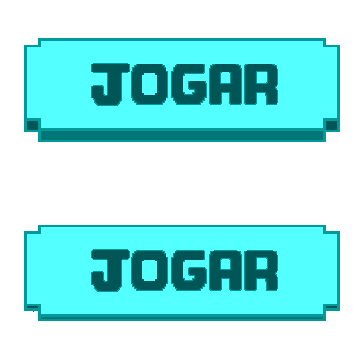

<sup>Fonte: Material produzido pelos autores (2024)</sup>

</div>

<div align="center">

<sub>Figura 36 - Imagem das nuvens que se movem no menu</sub>

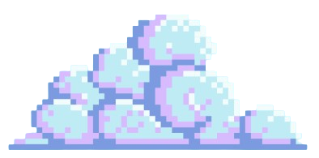

<sup>Fonte: Material produzido pelos autores (2024)</sup>

</div>

&nbsp;&nbsp;&nbsp;&nbsp;Os *assets* foram implementados no método `preload()` da cena `menu.js`: 
```js
preload() {
    this.load.image("background", "assets/backgroundMenu.png") // Fundo da cena do Main Menu
    this.load.image("inteliLogo", "assets/logointeli.png") // Fundo da cena do Main Menu
    this.load.image("nuvem", "assets/nuvem.png") // Imagem das nuvens do menu
    this.load.spritesheet("botaoJogar", "assets/botaoJogarNovo.png", {
      frameWidth: 400,
      frameHeight: 200
    }) // Imagem para botaoJogar
    this.load.audio('efeitoSonoroBotaoMenu', 'assets/sounds/iniciaJogo.mp3') // SFX do botão iniciar
  }
``` 
&nbsp;&nbsp;&nbsp;&nbsp;Em seguida, no método `create()`, adicionamos as imagens e *spritesheets* à cena `menu.js` e adicionamos algumas lógicas de funcionamento da cena.

&nbsp;&nbsp;&nbsp;&nbsp;Primeiramente, adicionamos as imagens de plano de fundo, logo do Inteli, nuvem e *spritesheet* do botão `Jogar` nas coordenadas, tamanho e direção desejadas.

&nbsp;&nbsp;&nbsp;&nbsp;É interessante destacar que as nuvens são adicionadas através do método `this.physics.add.image()`, já que futuramente seus parâmetros de velocidade são alterados.

````js
create() {

    // Carrega a cena Main Menu
    this.mainMenu = this.add.image(640, 360, "background").setScale(1)
    this.logoInteli = this.add.image(1180, 630, "inteliLogo").setScale(1)
    this.nuvem1 = this.physics.add.image(532, 320, "nuvem").setScale(1.3);
    this.nuvem2 = this.physics.add.image(680, 165, "nuvem").setScale(1.2).setFlip(true);
    this.nuvem3 = this.physics.add.image(700, 465, "nuvem").setScale(0.3);
    this.nuvem4 = this.physics.add.image(130, 170, "nuvem").setScale(0.4).setFlip(true);
    this.nuvem5 = this.physics.add.image(980, 320, "nuvem").setScale(0.2).setFlip(true);
    this.botaoJogar = this.add.sprite(640, 620, "botaoJogar").setInteractive().setScale(1)

````

&nbsp;&nbsp;&nbsp;&nbsp; Após adicionarmos os *assets* em nosso jogo, adicionamos o efeito sonoro e animação do botão de `Jogar` através dos métodos `this.sound.add()` e `this.anims.create()`, além da movimentação das imagens de nuvens por `this.nuvem.setVelocityX()`:

```js
    // Adiciona efeito sonoro do botão iniciar
    this.efeitoSonoroBotaoMenu = this.sound.add('efeitoSonoroBotaoMenu',{volume: 0.5});

    // Cria a animação de botaoJogar
    this.anims.create({
      key: 'animar',
      frames: this.anims.generateFrameNumbers('botaoJogar', {
        start: 0,
        end: 1
      }),
      frameRate: 2,
      repeat: -1
    });

    // Ativa a animação de botaoJogar
    this.botaoJogar.anims.play('animar', true);

    // Move as nuvens no eixo X
    this.nuvem1.setVelocityX(-190);
    this.nuvem2.setVelocityX(200);
    this.nuvem3.setVelocityX(85);
    this.nuvem4.setVelocityX(-90);
    this.nuvem5.setVelocityX(65);

```
&nbsp;&nbsp;&nbsp;&nbsp;Pensando na performance dos dispositivos a executarem nosso jogo, aplicamos uma lógica para destruição das nuvens após elas ultrapassarem os limites da tela:

```js
    // Lógica para destruir nuvens caso ultrapassem os limites de tela
    if (this.nuvem1.x < 100) {
      this.nuvem1.destroy();
    }

    if (this.nuvem2.x > 1200) {
      this.nuvem2.destroy();
    }

    if (this.nuvem3.x > 1200) {
      this.nuvem3.destroy();
    }

    if (this.nuvem4.x < 100) {
      this.nuvem4.destroy();
    }
    
    if (this.nuvem5.x > 1200) {
      this.nuvem5.destroy();
    }
```
&nbsp;&nbsp;&nbsp;&nbsp;Após as implementações criadas, adicionamos uma animação ao mouse para que, quando o jogador o passar sob o botão de jogar, o cursor se torne uma mão e, caso o mouse não esteja sobre o botão, mantenha seu estado original:

```js

    // Ajuste visual da imagem do mouse para fornecer feedback que o botão jogar é interativo
    this.botaoJogar.on("pointerover", () => {
      // Evento de passar o mouse sobre o botaoJogar
      this.input.setDefaultCursor("pointer") // Cursor vira mãozinha
    })
    this.botaoJogar.on("pointerout", () => {
      // Evento de retirar o mouse do botaoJogar
      this.input.setDefaultCursor("default") // Cursor vira setinha
    })

```

&nbsp;&nbsp;&nbsp;&nbsp;No seguinte código, adicionamos a lógica ao botão de jogar. Com o evento de *click* do mouse, o efeito sonoro do botão de jogar é ativado e é um *fade out* de 1000 milisegundos é realizado para transição entre cenas. Através do método `this.cameras.main.once(Phaser.Cameras.Scene2D.Events.FADE_OUT_COMPLETE, => {})`, garantimos que as chamadas das cenas `cenaPrincipal.js` e `HUD.js` sejam realizadas apenas após o evento de *Fade Out* ser finalizado. O mouse volta a seu estado original e as cenas `livros.js` e `quiz.js` são temporariamente desativadas.

```js
    // Evento disparado ao clicar no botão
    this.botaoJogar.on("pointerdown", () => {
      // Evento de click do mouse
      this.efeitoSonoroBotaoMenu.play();
      this.cameras.main.fadeOut(1000, 0, 0, 0)
      // Realiza FadeOut antes de passar para próxima cena
      this.cameras.main.once(Phaser.Cameras.Scene2D.Events.FADE_OUT_COMPLETE, (cam, effect) => {
        this.time.delayedCall(1000, () => {
          this.scene.start("cenaPrincipal")
          this.scene.start("HUD")
          this.scene.stop("menu")
          this.input.setDefaultCursor("default") // Retorno do cursor do mouse para setinha
        })
      })
      // this.openFullScreen()
    })

    this.scene.sleep('livros');
    this.scene.sleep('quiz');

  }
```

**Etapa 7 do desenvolvimento - Implementação de Mais Quizes e *Feedbacks* ao Responder às Questões**

&nbsp;&nbsp;&nbsp;&nbsp;Para a implementação de mais quizes, assim como na implementação de *cases*, foi utilizado um _JSON_ para armazenar as informações que seriam atreladas a cada quiz e, simultaneamente, a cada *case* que o usuário estivesse naquele momento, segue o modelo desse _JSON_:

```json
{
        "nome": "APOLO SOLEMAR",
        "fotoKey": "apolo",
        "desc": "Sofreu queimaduras solares depois de passar muito tempo exposto ao sol sem proteção adequada.",
        "colored": ["solares", "exposto"],
        "sintomas": "Apresenta pele vermelha, quente ao toque, dor local suportável.",
        "classificacao": "PRIMEIRO GRAU",
        "classificacaoCor": "0x21FF21",
        "quiz": {
            "pergunta": "De que maneira Apolo poderia ter evitado sua lesão?",
            "alternativas": [
                "Evitar exposição solar durante momentos quentes do dia",
                "Passar creme hidratante na pele antes de se expor ao Sol"
            ],
            "alternativaCorreta": 0
        },
        "feedbackRespostaErrada": "Ops! Essa resposta está incorreta. Expor-se ao sol durante momentos quentes do dia sem proteção adequada pode resultar em queimaduras solares.",
        "feedbackRespostaCerta": "Parabéns! Evitar exposição solar durante momentos quentes do dia é uma medida importante para prevenir queimaduras solares."
    }
```
&nbsp;&nbsp;&nbsp;&nbsp;Desse modo, é possível gerar de maneira dinâmica as perguntas que serão feitas, atrelando cada uma a um caso e depois chamar seu texto por meio de uma variável que recebe o objeto `this.primeiraCena.objetoCaso.caso` cujos atributos são os dados do caso guardados no _JSON_. Assim, é simples acessar os textos, pois se tornam propriedades de um objeto, como pode ser exemplificado em `caso.quiz.pergunta`, que é utilizado para setar o texto da pergunta do caso em específico que foi sorteado para o jogador. Junto a tudo isso, também foi adicionado um texto de feedback para as respostas, explicando o porquê de ela estar certa ou errada, que aparece no lugar onde estava o logo do quiz. Isso pode ser observado abaixo:

```js

this.primeiraCena.events.on('abrirQuiz', () => {
    const caso = this.primeiraCena.objetoCaso.caso;
    this.add.text(bgWhite.x, bgWhite.y - 40, caso.quiz.pergunta, {
        fontSize: '20px',
        color: '#000',
        fontFamily: 'Arial',
        align: 'center',
        wordWrap: {
            width: 500
        }
    }).setOrigin(0.5);

    // Adicionando as alternativas à cena e suas aparências na interface
    const alternativa1 = this.add.text(bgWhite.x, bgWhite.y + 60, caso.quiz.alternativas[0], {
        fontSize: '23px',
        color: '#000',
        fontFamily: 'Arial',
        backgroundColor: '#008CCC',
        padding: {
            x: 10,
            y: 10
        },
        wordWrap: {
            width: 500
        },
        align: 'center'
    }).setOrigin(0.5).setInteractive().on('pointerdown', () => {
        if (!this.alternativaRespondida){
            this.verificarResposta(0, caso.quiz.alternativaCorreta);
            this.primeiraCena.objetoCaso.status = false;
            this.primeiraCena.objetoCaso.caso = null;
            this.alternativaRespondida = true;
            this.cenaHUD.events.emit('quiz-respondido')
        }
    });

    const alternativa2 = this.add.text(bgWhite.x, bgWhite.y + 140, caso.quiz.alternativas[1], {
        fontSize: '21px',
        color: '#000',
        fontFamily: 'Arial',
        backgroundColor: '#FFC107',
        padding: {
            x: 10,
            y: 10
        },
        wordWrap: {
            width: 500
        },
        align: 'center'
    }).setOrigin(0.5).setInteractive().on('pointerdown', () => {
        if (!this.alternativaRespondida){
            this.verificarResposta(1, caso.quiz.alternativaCorreta);
            this.primeiraCena.objetoCaso.status = false;
            this.primeiraCena.objetoCaso.caso = null;
            this.alternativaRespondida = true;
            this.cenaHUD.events.emit('quiz-respondido')
        }
    });
    
        // Adicionando texto da explicação do porque está certa ou errada a alternativa à cena e também configurações estéticas
        this.textoExplicacaoAlternativaErrada = this.add.text(bgWhite.x, bgWhite.y - 130, caso.feedbackRespostaErrada, {
            fontSize: '22px',
            color: '#ff0000',
            fontFamily: 'Arial',
            align: 'center',
            wordWrap: {
                width: 500
            }
        }).setOrigin(0.5).setVisible(false);
        this.textoExplicacaoAlternativaCerta = this.add.text(bgWhite.x, bgWhite.y - 130, caso.feedbackRespostaCerta, {
            fontSize: '22px',
            color: '#008000',
            fontFamily: 'Arial',
            align: 'center',
            wordWrap: {
                width: 500
            }
        }).setOrigin(0.5).setVisible(false);
})

```

&nbsp;&nbsp;&nbsp;&nbsp;Por fim, foi adicionado um método que verifica se a resposta está correta ou incorreta e, com base nisso, exibe um dos *feedbacks* e um dos sons possíveis para demonstrar se a alternativa está correta ou incorreta, como pode ser visto a seguir:

```js
verificarResposta(resposta, alternativaCorreta) {
        // Verifica se a resposta está correta
        this.simboloQuiz.setVisible(false)
        if (resposta === alternativaCorreta) {
            this.efeitoSonoroAcertar.play();
            this.cenaHUD.atualizarPontuacao(10);
            // Define a mensagem de explicação para resposta correta
            this.textoExplicacaoAlternativaCerta.setVisible(true);
            this.fundoFeedback.setVisible(true);
            this.fundoFeedback.setStrokeStyle(2, 0x008000).setVisible(true);
        } else {
            this.efeitoSonoroErrar.play();
            this.cenaHUD.atualizarTempo(10);
            // Define a mensagem de explicação para resposta incorreta
            this.textoExplicacaoAlternativaErrada.setVisible(true);
            this.fundoFeedback.setVisible(true);
            this.fundoFeedback.setStrokeStyle(2, 0xff0000).setVisible(true);
        }
    }
```

**Etapa 8 do desenvolvimento - Lógica de Pontuação e Perda de Tempo**

&nbsp;&nbsp;&nbsp;&nbsp;Nessa etapa, foi adicionada ao jogo a lógica de pontuação, que é atualizada a cada pergunta nova que é respondida corretamente. Por outro lado, se ela for respondida incorretamente, o jogador perderá 10 segundos, implicando que ele faça menos casos, portanto poderá obter menos pontos de forma indireta. Tal adição foi feita por meio dos métodos `atualizarPontuacao()` e `atualizarTempo()` da seguinte maneira:

```js
    atualizarPontuacao(pontuacao){
        this.pontuacao += pontuacao;
        this.textoPontos.setText(`Pontos: ${this.pontuacao}`);
    }
    atualizarTempo(tempo){
        this.tempoInicial -= tempo;
        this.textoTempo.setText((this.tempoInicial - this.tempoInicial %60)/60 + 'min ' + this.tempoInicial %60 + 's');
        this.textoTempoDescontado.setVisible(true);
        this.fundoTempoDescontado.setVisible(true).setStrokeStyle(2, 0xff0000);
        if (this.tempoInicial >= -10 && this.tempoInicial < 0){
            this.tempoInicial = 0
        }
    }
```

&nbsp;&nbsp;&nbsp;&nbsp;Tais métodos são chamados em outro método, chamado `verificarResposta()`, o qual, por sua vez, é chamado no evento de clique do mouse em uma das alternativas do quiz, verificando se essa alternativa está correta e chamando o método próprio para o acerto ou erro do jogador, do seguinte modo:

```js
verificarResposta(resposta, alternativaCorreta) {
        // Verifica se a resposta está correta
        this.simboloQuiz.setVisible(false)
        if (resposta === alternativaCorreta) {
            this.efeitoSonoroAcertar.play();
            this.cenaHUD.atualizarPontuacao(10);
            // Define a mensagem de explicação para resposta correta
            this.textoExplicacaoAlternativaCerta.setVisible(true);
            this.fundoFeedback.setVisible(true);
            this.fundoFeedback.setStrokeStyle(2, 0x008000).setVisible(true);
        } else {
            this.efeitoSonoroErrar.play();
            this.cenaHUD.atualizarTempo(10);
            // Define a mensagem de explicação para resposta incorreta
            this.textoExplicacaoAlternativaErrada.setVisible(true);
            this.fundoFeedback.setVisible(true);
            this.fundoFeedback.setStrokeStyle(2, 0xff0000).setVisible(true);
        }
    }
```


**Dificuldades**
- A implementação dinâmica dos *cases* usando _JSON_;
- A implementação dinâmica dos conteúdos dos livros usando _JSON_;
- A implementação dinâmica das perguntas do quiz usando _JSON_;
- Criar e ajustar a *Cutscene* inicial do jogo;
- Ajustar o volume de cada elemento sonoro;
- Entender o funcionamento das animações de câmera;
- Observar a necessidade de uma máquina de estado nas animações de câmera.

**Próximos Passos**
- Pesquisar a possibilidade de implementar elementos que visam mais diversidade;
- Corrigir os elementos textuais;
    - Gramática
    - Tamanho da Fonte
    - Quantidade de Falas
    - Respostas erradas no Quiz
    - Palavras sem coloração adequada nos *cases*
    - Textos faltando nos livros
- Adicionar um indicador para a Dra. Tina;
- Adicionar um tutorial;
- Melhorar a visibilidade da caixa de próxima tarefa;
- Acertar bugs gráficos;
- Criar uma tela de _Game Over_.


## 4.5. Revisão do *MVP*

&nbsp;&nbsp;&nbsp;&nbsp;De acordo com os comentários recebidos durante a _sprint 4_, a adição  de indicadores e um replanejamento do *HUD* foi necessária. Para isso, optamos por adicionar duas indicações, além da nova imagem do *HUD*. Diversos bugs gráficos também foram corrigidos, assim como erros gramaticais, textos faltando e respostas dos Quiz com a ordem trocada. Por fim, criamos uma tela de _Game Over_ para sinalizar ao jogador que aquela sessão de jogo acabou.

**Etapa 1 - Seta indicando o local do mapa**

&nbsp;&nbsp;&nbsp;&nbsp;O primeiro passo, foi adicionar a seta no mapa, colocando a coordenada X e Y da Dra. Tina, o primeiro local que o jogador interage. Assim, começamos pelo seguinte código:
```js
this.seta = this.add.image(560, 360, "seta").setScale(1).setVisible(false);
```
&nbsp;&nbsp;&nbsp;&nbsp;Em sequência, quando todas as animações acabam, a visibilidade da Seta é definida como verdadeira, e uma animação é adicionada.
```js
this.animacaoSeta = this.tweens.add({
    targets: this.seta,
    x: this.seta.x,
    y: this.seta.y + 15,
    duration: 500,
    yoyo: true,
    repeat: -1,
});
```
&nbsp;&nbsp;&nbsp;&nbsp;Após o usuário interagir com cada localização, a seta vai para cima do próximo ponto para o qual o usuário tem que ir. Abaixo, está um exemplo de quando o jogador encosta na Tenda de Livros. A posição da seta é movimentada para a Tenda de Quiz e a animação também tem sua posição alterada.
````js
this.seta.x = 980;
this.seta.y = 450;
this.animacaoSeta.remove();
this.animacaoSeta = this.tweens.add({
    targets: this.seta,
    x: this.seta.x,
    y: this.seta.y + 15,
    duration: 500,
    yoyo: true,
    repeat: -1,
});
````

**Etapa 2 - Seta dinâmica no *HUD***

&nbsp;&nbsp;&nbsp;&nbsp;Outra melhoria, foi uma seta no *HUD* que varia a rotação de acordo com a posição que o jogador deve ir. O cálculo foi feito utilizando a tangente, subtraindo o X e o Y do jogador e da posição na qual ele tem que ir e, por último, uma função arco tangente é usada para retornar o ângulo em radianos. Após isso, faz-se necessário somar metade de PI ao resultado, pois a seta tem a posição inicial para o sul, na *sprite* original. Desse modo, o jogo verifica o estado atual - qual o local que o jogador tem que ir - e retorna o ângulo para a seta apontar.
````js
if (this.habilitarTarefa) {
    const cenaAtual = this.scene.get("cenaPrincipal");
    if (this.state === "Tina") {
    const rotateAngle =
        Math.atan2(
        cenaAtual.jogador.y - cenaAtual.tina.y,
        cenaAtual.jogador.x - cenaAtual.tina.x
        ) +
        Math.PI / 2;
    this.seta.setRotation(rotateAngle);
    } else if (this.state === "livros") {
    const rotateAngle =
        Math.atan2(cenaAtual.jogador.y - 550, cenaAtual.jogador.x - 150) +
        Math.PI / 2;
    this.seta.setRotation(rotateAngle);
    } else if (this.state === "quiz") {
    const rotateAngle =
        Math.atan2(cenaAtual.jogador.y - 545, cenaAtual.jogador.x - 980) +
        Math.PI / 2;
    this.seta.setRotation(rotateAngle);
    }
}
````

**Etapa 3 - Criação da tela de *Game Over***

&nbsp;&nbsp;&nbsp;&nbsp;Do mesmo modo que um jogo possui uma tela de início, ele deve possuir uma tela de fim. Considerando que nosso jogo não visa punir o jogador ao terminar uma sessão de jogo, ao invés do tradicional _Game Over_, optamos por adicionar uma tela com a mensagem "O tempo acabou", para que o usuário se sinta motivado a consegui uma pontuação melhor na próxima jogatina. Seguimos a mesma metodologia para adicionar uma nova cena: criar um arquivo novo chamado `cenaFinal.js`, adicionar sua chamada em `index.html` (linha 53), adicionar o nome da cena no `main.js` (linha 24) e algumas linhas de lógica em `cenaPrincipal.js`.

&nbsp;&nbsp;&nbsp;&nbsp;Aprofundando o código de `cenaFinal.js`, iniciamos criando uma classe `GameOver` que herda de `Phaser.Scene`, fazemos o carregamento dos arquivos no método `preload()` e os criamos no método `create()`, como ilustrado no código abaixo:

```js
class GameOver extends Phaser.Scene {
  constructor() {
    super({
      key: "GameOver",
    });
  }

  preload() {
    // Carrega os elementos utilizados na cena de game over do jogo
    this.load.image("cenaFinal", "src/assets/gocerto.png");
    this.cameras.main.setBackgroundColor(0xa5e2ff);
    this.load.image("botaoMenu", "src/assets/botaoMenu.png");
    this.load.image("botaoInicio", "src/assets/botaoVoltarInicio.png");
    this.load.audio("sfxGameOver", "src/assets/sounds/efeitoSonoroGameOver.wav");
    this.load.bitmapFont("iosevka", "src/assets/fonts/iosevka_0.png", "src/assets/fonts/iosevka.fnt");

  }
  // Reinicializa a cada nova cena e serve para guardar a nova pontuação
  init(params) {
    this.pontuacao = params.pontuacao;
  }
  create() {
    this.musicaGameOver = this.sound.add("sfxGameOver", {
      loop: false,
      volume: 0.5,
    });
    // Define o valor de pontuação inicial para zero se a condicional for true
    if (this.pontuacao == 0){
      this.pontuacao = "00"
    }
    this.fundoTempoDescontado = this.add.rectangle(640, 360, 450, 610, 0xd4d4d4).setStrokeStyle(6, 0xa57fff);
    this.musicaGameOver.play();
    this.add.image(640, 200, "cenaFinal").setScale(0.16); // Cria a frase: "Acabou o tempo!"
    this.botaoMenu = this.add
      .sprite(535, 575, "botaoMenu")
      .setInteractive()
      .setScale(0.3)
      .setVisible(true)
      .setScrollFactor(0); // Cria o botão de voltar para o menu
    this.botaoVoltar = this.add
      .sprite(735, 585, "botaoInicio")
      .setInteractive()
      .setScale(0.3)
      .setVisible(true)
      .setScrollFactor(0); // Cria o botão de voltar para o início do jogo
    this.textoPontuacao = this.add
      .bitmapText(536, 400, "iosevka",`Pontuação: ${this.pontuacao}`, 40)
      .setVisible(true);
```

&nbsp;&nbsp;&nbsp;&nbsp;Alguns detalhes que não foram comentados anteriormente são: o uso do `init()` para contar corretamente o tempo a cada nova sessão, a adição de um efeito sonoro ao mudar para `cenaFinal` e a adição de elementos para povoar a cena, incluindo botões.

&nbsp;&nbsp;&nbsp;&nbsp;Por fim, boa parte do código de `create()` serve para mudar a imagem da seta do mouse para indicar que aquelas regiões são clicáveis (para os jogadores que estiverem no computador) e existem dois blocos de código ao final do arquivo que servem para adicionar funcionalidade aos botões criados.

&nbsp;&nbsp;&nbsp;&nbsp;Os eventos do botão de Menu são: parar a cena `cenaFinal`, reiniciar a cena `livros` e inicializar as cenas `menu` e `cenaCases`. Desse modo, o jogo é resetado como se estivesse acabado de ser carregado.

```js
    this.botaoMenu.on("pointerdown", () => {
      //Fecha a cena de game over e volta para o menu do jogo
      this.scene.stop("GameOver");
      this.scene.restart("livros");
      this.scene.start("menu");
      this.scene.start("cenaCases");
    });
```

&nbsp;&nbsp;&nbsp;&nbsp;Já os eventos do botão Voltar possuem uma quantidade maior e adicionam a necessidade de utilizar o método `.sleep()` já citado nesse documento. Vale destacar aqui que o reinício da cena `cenaPrincipal` possui o valor `{ from: "GameOver" }` passado como parâmetro, indicando que a transição para esta cena foi desencadeada a partir da cena `GameOver`.

```js
    this.botaoVoltar.on("pointerdown", () => {
      //Fecha a cena de game over e volta início do jogo
      this.scene.stop("GameOver");
      this.scene.sleep("livros");
      this.scene.restart("livros");
      this.scene.sleep("quiz");
      this.scene.restart("quiz");
      this.scene.start("cenaPrincipal", { from: "GameOver" });
      this.scene.start("cenaHUD");
      this.scene.start("cenaCases");
    });
```

**Dificuldades**
&nbsp;&nbsp;&nbsp;&nbsp;O ajuste do código e posterior correção de bugs não apresentou dificuldades percebidas pelo grupo ao longo da _sprint 5_.

**Próximos Passos**
&nbsp;&nbsp;&nbsp;&nbsp;Considerando a conclusão da _sprint 5_ como última _sprint_ do projeto, não haveria mais planejamento para próximos passos, entretanto, é possível verificar a seção 6 para ter-se uma ideia de futuros trabalhos que poderiam constar nessa parte.

# <a name="c5"></a>5. Testes

## 5.1. Casos de Teste

&nbsp;&nbsp;&nbsp;&nbsp;Segundo o *site* "web.dev"[²⁸](#c7), no desenvolvimento de *software*, um caso de teste é definido como "uma sequência de ações ou circunstâncias planejadas para confirmar a eficácia de um programa ou aplicativo de *software*". Esses casos têm como objetivo assegurar que o *software* opere conforme planejado, garantindo que todos os seus recursos e funções tenham o desempenho correto. Normalmente, são criados por testadores ou desenvolvedores de *software* para garantir que o *software* atenda aos requisitos e especificações definidos.

&nbsp;&nbsp;&nbsp;&nbsp;O presente projeto, ao adotar o paradigma de programação orientada a objetos, torna essencial a criação de casos de teste para garantir que as classes, métodos e interações entre os objetos funcionem corretamente e atendam aos requisitos do sistema. Os testes devem abranger também diversas situações e cenários possíveis de uso do sistema, verificando se os objetos interagem corretamente entre si e se os métodos produzem os resultados esperados.

&nbsp;&nbsp;&nbsp;&nbsp;A tabela abaixo representa os casos de teste que podem ser realizados na cena `main.js`. Entre eles, podemos destacar a verificação se as dimensões de inicialização da tela do jogo estão corretas, se a tela está com o ajuste configurado para dispositivos *mobile* e se existem duas cenas sendo adicionadas ao jogo.

<div align="center">
<sub>Tabela 6: Casos de Testes da Cena main.js</sub>
</div>

\# | Pré-condição | Descrição do Teste | Pós-condição
--- | --- | --- | --- 
1 |  As dimensões da tela do jogo estão definidas | Verificar se as dimensões do jogo estão corretamente configuradas | A tela do jogo possui as dimensões corretas
2 |  O sistema de centralização automática está funcionando | Verificar se a tela do jogo é centralizada automaticamente em ambos os eixos | A tela do jogo está centralizada corretamente
3 |  Carregar o jogo em ambiente *mobile* | Verificar se a tela se ajusta aos dispositivos móveis | A tela do jogo carrega sem problemas em dispositivos móveis
4 | Main.js foi corretamente inicializada | Verificar se existem seis cenas adicionadas ao jogo: MenuPrincipal, CenaPrincipal, CenaHUD, CenaCases, Livros e Quiz | Existem seis cenas adicionadas corretamente ao jogo
5 | Main.js foi corretamente inicializado | Verificar se a primeira cena inicializada é a MenuPrincipal | O jogo carrega na cena principal como primeira cena

<div align="center">
<sup>Fonte: Material produzido pelos autores (2024)</sup>
</div>

&nbsp;&nbsp;&nbsp;&nbsp; A tabela acima apresenta os casos de testes iniciais que podemos aplicar à cena `main.js` para começarmos a trabalhar na gestão da qualidade e funcionamento do *software*.

&nbsp;&nbsp;&nbsp;&nbsp; Outro arquivo em que deve-se criar casos de teste é a cena chamada `menu.js`. Aqui estão os testes relacionados com o carregamento do jogo e posicionamento das imagens na tela. Além disso, criamos testes também para testar a funcionalidade do botão "Jogar".

<div align="center">
<sub>Tabela 7: Casos de Testes da Cena menu.js</sub>
</div>

\# | Pré-condição | Descrição do Teste | Pós-condição
|------|---------|--- |--- |
1 | Menu.js inicializou e carregou o método preload( )| Verificar se os assets são carregados corretamente sem erros | Todos os assets são carregados sem erros                                                    |
2 | O botão "Jogar" está clicável | Simular um clique no botão "Jogar"  | A cena "cenaPrincipal.js" e "HUD" são iniciadas e a cena "menu.js" é parada, o cursor do mouse retorna para a setinha |
3 | O botão "Jogar" está clicável e o mouse está fora do botão | Mover o cursor do mouse sobre o botão "Jogar" | O cursor do mouse muda para uma mãozinha                                                     |
4 | O botão "Jogar" está clicável e o mouse está sobre o botão  | Mover o cursor do mouse para fora do botão "Jogar" | O cursor do mouse retorna para a setinha                                               |
5 | O botão "Jogar" carregou e está animado  | Verificar se a animação do botão "Jogar" é executada corretamente | O botão jogar é animado sem erros   |
6 | Os assets da cena estão carregados | Verificar se os elementos (background, logo, botão "Jogar") estão posicionados corretamente na tela | Os elementos estão posicionados corretamente na tela  |
7 | Está acontecendo a transição de cena de "menu.js" para "cenaPrincipal.js" | Verificar se as cenas "livros.js" e "quiz.js" aparecem na tela | As cenas carregaram e estão em modo adormecido  |
<div align="center">
<sup>Fonte: Material produzido pelos autores (2024)</sup>
</div>

&nbsp;&nbsp;&nbsp;&nbsp;Após a interação com o botão "Jogar" da tela anterior, `menu.js`, a tela `cenaPrincipal.js` é carregada e a lógica do jogo é inicializada. Nessa etapa também existem testes para o pré-carregamento de *assets*, mas o foco está mais nas mecânicas do personagem e em como o mundo interage com ele.

&nbsp;&nbsp;&nbsp;&nbsp;Testes como a verificação do carregamento do mapa, a criação do *joystick* virtual e a colisão com o cenário são feitos nessa parte. Como ``cenaPrincipal.js`` será um arquivo com mais código do que os outros, mais testes serão adicionados com a implementação de novas mecânicas.

<div align="center">
<sub>Tabela 8: Casos de Testes da Cena cenaPrincipal.js</sub>
</div>

\# | Pré-condição | Descrição do Teste | Pós-condição
|------|---------|--- |--- |
1 | Cena cenaPrincipal.js está carregada | Verificar se os elementos de carregamento são destruídos corretamente após o carregamento completo | As barras de carregamento e o texto de carregamento são destruídos após o carregamento completo dos assets |
2 | Cena cenaPrincipal.js está carregada | Verificar se a cor de fundo da câmera principal é definida corretamente | A cor de fundo da câmera principal é definida como 0xA5E2FF |
3 | Cena cenaPrincipal.js está carregada | Verificar se a cena principal é completamente visível após o fade-in | A cena principal é totalmente visível após o fade-in |
4 | Cena cenaPrincipal.js está carregada | Verificar se os assets de áudio são carregados corretamente | Os assets de áudio são carregados sem erros |
5 | Nenhum tilemap foi carregado | Verificar se os tilemaps são carregados corretamente | Os tilemaps são carregados sem erros |
6 | Nenhum botão foi carregado | Verificar se os botões são carregados corretamente | Os botões são carregados sem erro |
7 | Joystick não está carregado | Verificar se o joystick foi criado corretamente na cena do cenaPrincipal.js | O joystick está presente e funcional na cena |
8 | Colisão com cenário inicializada | Testar colisão do personagem com as partes do cenário | O personagem não atravessa partes do cenário e colide corretamente |
9 | O personagem está carregado | Verificar se o personagem carregou corretamente | O personagem está carregado e funcional na cena |
10 | O personagem carregou e está parado | Testar se o personagem se move corretamente | O personagem se move com o clique de teclas de input/joystick |
11 | O personagem está em movimentação | Testar se o personagem para de se mover quando nenhuma tecla de movimento é pressionada | O personagem fica parado |
12 | O personagem está na posição inicial | Verificar se a posição inicial do personagem está correta | O personagem está na posição inicial correta |
13 | Posição do Joystick definida | Verificar se a posição do joystick é ajustada corretamente de acordo com a posição da câmera | A posição do joystick está sincronizada com a posição da câmera |
14 | A cena principal está carregada e acabou a _cutscene_ inicial | Verificar se a câmera principal está configurada corretamente | A câmera principal é configurada corretamente para seguir o jogador ou o personagem principal |
15 | A cena principal está carregada e acabou a _cutscene_ inicial | Verificar se os *NPCs* são posicionados corretamente no mapa | Os *NPCs* são posicionados nos locais corretos do mapa sem sobreposições indevidas |

<div align="center">
<sup>Fonte: Material produzido pelos autores (2024)</sup>
</div>

&nbsp;&nbsp;&nbsp;&nbsp;Com o progressivo desenvolvimento do código, cenas extras foram adicionadas: ``HUD.js``, para carregar elemenentos do *HUD*, ``cases.js``, para processar a lógica dos *cases*, ``livros.js``, para processar a lógica da Tenda de Livros e ``quiz.js`` para processar a lógica do quiz da Tenda de Quiz. Com isso, surge a necessidade de atualizar os casos de teste.

&nbsp;&nbsp;&nbsp;&nbsp;Começando a falar do *HUD*, elementos essenciais do nosso jogo, alguns casos de teste possuem uma importância maior como verificar o carregamento do elementos, sua posição e atualização dinâmica de seus valores. A tabela abaixo lista outros testes:

<div align="center">
<sub>Tabela 9: Casos de Testes da Cena HUD.js</sub>
</div>

\# | Pré-condição | Descrição do Teste | Pós-condição
|------|---------|--- |--- |
1 | Carregamento de imagens bem-sucedido |	Verificar se as imagens foram carregadas corretamente |	Imagens carregadas corretamente |
2 | Elementos de *HUD* criados corretamente |	Verificar se os elementos de *HUD* estão posicionados e visíveis corretamente | Elementos de *HUD* estão criados e posicionados corretamente |
3 | Eventos de exibição da Tarefa funcionando |	Verificar se o evento "mostraTarefaInicial" exibe corretamente as informações da tarefa | Eventos de exibição da Tarefa funcionam corretamente |
4 | Evento de exibição do Timer funcionando | Verificar se o evento "showTimer" atualiza corretamente o timer e mostra os elementos relacionados ao tempo |	Evento de exibição do Timer funciona corretamente |
5 | Evento do botão *Case* foi carregado |	Verificar se o botão "botaoCase" exibe corretamente as imagens e responde aos cliques corretamente |	Botão "botaoCase" foi carregado corretamente e está interativo |
6 | Texto da Tarefa definido como "Procure a dr.ª Tina" e colisão com a *NPC* Dra Tina  |	Verificar se o evento "mudaTarefaParaLivros" muda corretamente as informações da Tarefa | O texto da Tarefa muda para "Tenda dos Livros?" |
7 | Texto da Tarefa definido como "Tenda dos Livros?" e colisão com a Tenda de Livros  |	Verificar se o evento "mudaTarefaParaQuiz" muda corretamente as informações da Tarefa | O texto da Tarefa muda para "Tenda do Quiz?"|
8 | Texto da Pontuação carregado e Quiz respondido certo |	Verificar o texto da pontuação muda de valor | Texto da Pontuação muda de valor |
8 | Texto do Timer carregado e Quiz respondido errado |	Verificar o texto do timer muda de valor | Texto do Timer muda de valor |


<div align="center">
<sup>Fonte: Material produzido pelos autores (2024)</sup>
</div>

&nbsp;&nbsp;&nbsp;&nbsp;Após o *HUD*, vamos analisar a cena ``cases.js``. Ela é responsável por criar os elementos visuais dos *cases*, peças fundamentais para a o fluxo do jogo acontecer.

<div align="center">
<sub>Tabela 10: Casos de Testes da Cena cases.js</sub>
</div>

\# | Pré-condição | Descrição do Teste | Pós-condição
|------|---------|--- |--- |
1 | Carregamento de imagens bem-sucedido |	Verificar se as imagens foram carregadas corretamente |	Imagens carregadas corretamente |
2 | Elementos das cena criados corretamente |	Verificar se os elementos da cena estão posicionados corretamente e visíveis | Elementos das cenas foram criados e posicionados corretamente |
3 | Verificar se o evento "abrirCase" é acionado na cena cases.js |	Verificar se o evento "abrirCase" pausa a física e torna o caso e o botão visíveis | O evento "abrirCase" pausa a física e torna o caso e o botão visíveis |
4 | O cursor está fora do "botãoX" no cases.js | Verificar se o cursor muda para uma mãozinha ao passar sobre o botão "botaoX" | O cursor muda para uma mãozinha ao passar sobre o botão "botaoX" |
5 | O cursor está sobre o "botãoX" no cases.js | Verificar se o cursor muda para uma setinha ao sair do botão "botaoX" |	O cursor volta ao seu estado padrão ao sair do botão "botaoX" |
6 | O "botãoX" foi clicado no cases.js |	Verificar se ao clicar no botão "botaoX", o caso e o botão tornam-se invisíveis e a física é retomada |	Ao clicar no botão "botaoX", o caso e o botão se tornam invisíveis e a física é retomada |

<div align="center">
<sup>Fonte: Material produzido pelos autores (2024)</sup>
</div>

&nbsp;&nbsp;&nbsp;&nbsp;Outra cena crítica que pode interromper o fluxo do jogo é a ``livros.js``. Ela carrega os textos e artes dos livros, dinâmica importante para fornecer a conscientização que esperamos passar com o jogo.

<div align="center">
<sub>Tabela 11: Casos de Testes da Cena livros.js</sub>
</div>

\# | Pré-condição | Descrição do Teste | Pós-condição
|------|---------|--- |--- |
1 | Carregamento de imagens bem-sucedido |	Verificar se as imagens foram carregadas corretamente |	Imagens carregadas corretamente |
2 | Elementos da Cena de Livros criados corretamente |	Verificar se os elementos da Cena de Livros estão posicionados corretamente e visíveis  | Elementos das cenas foram criados e posicionados corretamente |
4 | O cursor está fora do "botãoX" na Cena de Livros | Verificar se o cursor muda para uma mãozinha ao passar sobre o botão "botaoX" | O cursor muda para uma mãozinha ao passar sobre o botão "botaoX" |
5 | O cursor está sobre o "botãoX" na Cena de Livros | Verificar se o cursor muda para uma setinha ao sair do botão "botaoX" |	O cursor volta ao seu estado padrão ao sair do botão "botaoX" |
6 | O "botãoX" foi clicado na Cena de Livros |	Verificar se ao clicar no botão "botaoX", o livro e o botão tornam-se invisíveis e a física é retomada | Ao clicar no botão "botaoX", o livro e o botão se tornam invisíveis e a física é retomada |
7 | Algum livro está aberto |	Verificar se o efeito sonoro de passar página é ativado ao clicar no livro | O efeito sonoro de passar página é ativado |
8 | Livros carregados     | Clicar em algum livro fechado   | O livro correspondente é aberto, e seu conteúdo é mostrado corretamente |
9 | Qualquer livro aberto | Clicar para avançar para a próxima página  | A próxima página do livro é exibida corretamente |
10 | Qualquer livro aberto  | Clicar para voltar para a página anterior  | A página anterior do livro é exibida corretamente |


<div align="center">
<sup>Fonte: Material produzido pelos autores (2024)</sup>
</div>

&nbsp;&nbsp;&nbsp;&nbsp;Ademais, a cena `quiz.js` é de fundamental importância para o ciclo de jogatinas, uma vez que é através dela que o jogador obtém sua pontuação e testa seus conhecimentos, portanto, lógicas importantes como a adição de pontuações e verificação de respostas corretas estão nessa cena, tornando os testes indispensáveis.

<div align="center">
<sub>Tabela 12: Casos de Testes da Cena quiz.js</sub>
</div>

\# | Pré-condição | Descrição do Teste | Pós-condição
|------|---------|--- |--- |
1 | Carregamento de imagens bem-sucedido |	Verificar se as imagens foram carregadas corretamente |	Imagens carregadas corretamente |
2 | Elementos das cenas criados corretamente |	Verificar se os elementos das cenas estão posicionados corretamente e visíveis  | Elementos das cenas foram criados e posicionados corretamente |
3 | O cursor está fora do "botãoX" no cases.js | Verificar se o cursor muda para uma mãozinha ao passar sobre o botão "botaoX" | O cursor muda para uma mãozinha ao passar sobre o botão "botaoX" |
4 | O cursor está sobre o "botãoX" no cases.js | Verificar se o cursor muda para uma setinha ao sair do botão "botaoX" |	O cursor volta ao seu estado padrão ao sair do botão "botaoX" |
5 | O "botãoX" foi clicado no cases.js |	Verificar se ao clicar no botão "botaoX", o caso e o botão tornam-se invisíveis e a física é retomada |	Ao clicar no botão "botaoX", o caso e o botão se tornam invisíveis e a física é retomada |
6 | O "botãoX" foi clicado em quiz.js |	Verificar se ao clicar no botão "botaoX", o caso e o botão tornam-se invisíveis e a física é retomada |	Ao clicar no botão "botaoX", o caso e o botão se tornam invisíveis e a física é retomada |
7 | O quiz está aberto |	Verificar resposta do usuário |	Retorno de mensagem de parabéns ou de erro e feedback |
8 | Quiz foi respondido | Testar quando a resposta é correta | Se a resposta fornecida for igual à alternativa correta, o símbolo do quiz é ocultado, o efeito sonoro de acerto é reproduzido, a pontuação é atualizada em 10 pontos, a mensagem de explicação para resposta correta é exibida, o fundo do feedback é exibido com estilo verde e 2 pixels de espessura. |
9 | Quiz foi respondido | Testar quando a resposta é incorreta | Se a resposta fornecida for diferente da alternativa correta, o símbolo do quiz é ocultado, o efeito sonoro de erro é reproduzido, o tempo é atualizado em -10 unidades, a mensagem de explicação para resposta incorreta é exibida, o fundo do feedback é exibido com estilo vermelho e 2 pixels de espessura. |


<div align="center">
<sup>Fonte: Material produzido pelos autores (2024)</sup>
</div>


&nbsp;&nbsp;&nbsp;&nbsp;Além disso, foi criado um novo arquivo chamado `typeWritter.js`, o qual contém o mecanismo de implementação dos diálogos adicionados ao jogo, posto isso, é de suma importância a verificação por meio de testes nesse arquivo.

<div align="center">
<sub>Tabela 13: Casos de Testes da Cena typeWritter.js</sub>
</div>

\# | Pré-condição | Descrição do Teste | Pós-condição
|------|---------|--- |--- |
| 1 | Objeto TypeWritter criado | Testar a criação de um objeto TypeWritter | Um objeto TypeWritter é criado com as propriedades definidas corretamente, incluindo velocidade de digitação, texto original, índice e texto digitado. Um evento de tempo é iniciado para adicionar caracteres ao texto. |
| 2 | Chamada da função addChar() | Testar a adição de caracteres ao texto digitado | Cada vez que a função addChar() é chamada, um caractere é adicionado ao texto digitado, até que o texto original seja totalmente digitado. |
| 3 | Chamada da função skip() | Testar a função de pular a digitação | A chamada da função skip() interrompe o evento de tempo, define o texto do objeto como o texto original completo e chama a função onComplete() se fornecida. |
| 4 | Chamada da função destroy() | Testar a função de destruir o objeto | A chamada da função destroy() remove o evento de tempo e chama o método destroy() da classe pai para destruir o objeto. |
| 5 | Chamada da função proximoTexto(texto, onComplete) | Testar a função de adicionar um novo texto | A chamada da função proximoTexto(texto, onComplete) redefine o texto original para o novo texto fornecido, reinicia a digitação do texto e chama a função onComplete() se fornecida. |
| 6 | Objeto TypeWritter criado com texto vazio | Testar a criação de um objeto TypeWritter com texto vazio | Um objeto TypeWritter é criado e nenhum evento de tempo é iniciado, pois não há texto a ser digitado. |
| 7 | Chamada da função skip() sem evento de tempo ativo | Testar a função de pular a digitação quando não há evento de tempo ativo | Não ocorre nenhum erro e a função skip() não tem efeito, pois não há digitação em progresso. |
| 8 | Chamada da função proximoTexto(texto, onComplete) com texto vazio | Testar a função de adicionar um novo texto com texto vazio | O texto original é definido como vazio e nenhum evento de tempo é iniciado, pois não há texto a ser digitado. |

<div align="center">
<sup>Fonte: Material produzido pelos autores (2024)</sup>
</div>

&nbsp;&nbsp;&nbsp;&nbsp;Foi adicionada uma máquina de estado em nosso código, por isso é importante realizar os testes para verificar o funcionamento adequado dela. Esses testes contribuem para a identificação de bugs que podem surgir devido a transições incorretas de estado, lógica inadequada de transição ou estados mal definidos. Encontrar e corrigir esses bugs durante o estágio de teste é fundamental para garantir seu bom funcionamento.

<div align="center">
<sub>Tabela 14: Casos de Testes da Cena stateMachine.js</sub>
</div>

| # | Pré-condição | Descrição do Teste | Pós-condição |
|---|--------------|-------------------|--------------|
| 1 | Máquina de estados criada com um estado inicial válido | Testar a criação da máquina de estados | Uma máquina de estados é criada com o estado inicial definido corretamente. |
| 2 | Chamada da função transitionTo(state) com um novo estado válido | Testar a transição para um novo estado válido | O estado atual é alterado para o novo estado fornecido. |
| 3 | Chamada da função transitionTo(state) com o estado atual | Testar a transição para o próprio estado atual | Não ocorre nenhuma alteração no estado atual. |
| 4 | Chamada da função currentState() | Testar a obtenção do estado atual | A função currentState() retorna o estado atual da máquina de estados. |

&nbsp;&nbsp;&nbsp;&nbsp;Além disso, foi criado um arquivo que se chama `NPCs.js`, o qual é responsável pela lógica de movimentação aleatória dos *NPCs*, posto isso, é fundamental testá-lo, para garantir que essa lógica esteja funcionando corretamente.

<div align="center">
<sub>Tabela 15: Casos de Testes da Cena NPCs.js</sub>
</div>

| # | Pré-condição | Descrição do Teste | Pós-condição |
|---|--------------|-------------------|--------------|
| 1 | Objeto aluno inicializado | Testar a atualização das propriedades de direção e velocidade do aluno | A direção e velocidade do aluno são alteradas em intervalos aleatórios dentro dos limites especificados. |
| 2 | Chamada da função updateAnimation() | Testar a atualização da animação do aluno | A animação do aluno é atualizada com base na velocidade atual do corpo. |
| 3 | Corpo do aluno se movendo para a direita | Testar se a animação de caminhada para a direita é corretamente acionada | Se a velocidade do corpo do aluno for positiva, a animação de caminhada para a direita é acionada e o aluno não é invertido horizontalmente. |
| 4 | Corpo do aluno se movendo para a esquerda | Testar se a animação de caminhada para a esquerda é corretamente acionada | Se a velocidade do corpo do aluno for negativa, a animação de caminhada para a esquerda é acionada e o aluno é invertido horizontalmente. |
| 5 | Chamada da função setCollisionBetweenItens(...phaserPhysics) | Testar a configuração de colisão entre o aluno e outros objetos | A função setCollisionBetweenItens() adiciona colisão entre o aluno e os itens passados como argumentos. |

<div align="center">
<sup>Fonte: Material produzido pelos autores (2024)</sup>
</div>


&nbsp;&nbsp;&nbsp;&nbsp;Os testes anteriores refletem a verificação do carregamento de assets e seu posicionamento, da mecânica do jogo, de algumas interações com botões e de alguns eventos criados entre cenas. Não abordamos, porém, cenários de erros que possam a vir surgir de entradas inválidas do usuário ou de situações inesperadas. A tabela a seguir caminha inicialmente para essa direção enquanto vamos refinando o código e descobrindo novas formas que o jogo pode ficar com a lógica inoperante.

<div align="center">
<sub>Tabela 16: Cenários de Erro Gerais</sub>
</div>

\# | Pré-condição | Descrição do Teste | Pós-condição
|------|---------|--- |--- |
1 | Qualquer inicialização de imagens |	Verificar se a imagem existe no diretório indicado | A imagem existe e está com o caminho correto |
2 | Inicialização de cena ou transição entre elas |	Verificar se a cena existe e foi inicializada corretamente | A cena existe e está com o caminho correto |
3 | O jogo estar carregado na cena menu.js ou cenaPrincipal.js |	Verificar se algum input do usuário ou clique fora da área interativa ocasiona erros | As cenas mantêm a sua lógica intacta |
4 | O jogo está sendo inicializado ou executando | Verificar se existe algum código de erro no console sobre erro de sintaxe | Existe uma mensagem de erro no console do navegador |
5 | O jogo está sendo inicializado ou executando | Verificar se existe algum código de erro no console sobre erro de variáveis, objetos ou métodos inexistentes | Existe uma mensagem de erro no console do navegador |
6 | O jogador está interagindo com o mundo ou mudando de cenas | Verificar se existe algum código de erro no console sobre eventos não previamente definidos| Existe uma mensagem de erro no console do navegador |
7 | Qualquer inicialização de efeitos sonoros | Verificar se o arquivo existe no diretório indicado | Não existe uma mensagem de erro no console do navegador |

<div align="center">
<sup>Fonte: Material produzido pelos autores (2024)</sup>
</div>

&nbsp;&nbsp;&nbsp;&nbsp;Por fim, a criação dos casos de teste é muito importante ao longo de um projeto de *software* e trás vários benefícios, como: auxiliar na garantia de qualidade, reduzir erros, facilitar a manutenção e promover a evolução do código garantindo estabilidade e integridade.

## 5.2. Testes de jogabilidade (playtests) 

### 5.2.1 Registros de testes

&nbsp;&nbsp;&nbsp;&nbsp;Aqui serão descritos os testes de jogabilidade (*playtests*) de nosso jogo, realizados por convidados. Estes testes têm como objetivo avaliar a intuitividade, ambientação e comunicação do jogo com os potenciais usuários.

&nbsp;&nbsp;&nbsp;&nbsp;Os testes foram realizados, em sua maioria, durante os dias 26 a 29 de março em ambientes físicos (aulas de experiência do usuário no Inteli) e *online* (videochamadas). Os testadores foram classificados como público secundário por não pertencerem ao ensino médio de escolas públicas, nosso público-alvo, mas forneceram _insights_ valiosos descritos mais abaixo na seção de Melhorias.

**Sessão de testes - 26/03**

<div align="center">
<sub>Tabela 17: Teste Laura Fernandes</sub>
</div>

<div align="center">

Nome | Laura Fernandes (fictício)
--- | ---
Já possuía experiência prévia com *games*? | Sim
Conseguiu iniciar o jogo? | Sim
Entendeu as regras e mecânicas do jogo? | Sim, porém poderiam estar mais claras
Conseguiu progredir no jogo? | Sim
Apresentou dificuldades? | Sim, houve dificuldade na leitura dos textos por serem longos demais.
Que nota deu ao jogo? | 9
O que gostou no jogo? | Dinâmica de aprendizado
O que poderia melhorar no jogo? | Ter textos mais curtos e evidenciar as missões de maneira mais clara

</div>

<div align="center">
<sup>Fonte: Material produzido pelos autores (2024)</sup>
</div>

<div align="center">
<sub>Tabela 18: Teste Fernanda Castro</sub>
</div>

<div align="center">

Nome | Fernanda Castro (fictício)
--- | ---
Já possuía experiência prévia com *games*? | Sim
Conseguiu iniciar o jogo? | Sim
Entendeu as regras e mecânicas do jogo? | Sim, mas com dificuldades
Conseguiu progredir no jogo? | Sim, após auxílio
Apresentou dificuldades? | Foram apresentadas dificuldades no entendimento do passo a passo do jogo.
Que nota deu ao jogo? | 8
O que gostou no jogo? | Design, JoyStick e a dinâmica de conscientização
O que poderia melhorar no jogo? | Apresentar as regras do jogo de maneira mais clara e intuitiva

</div>

<div align="center">
<sup>Fonte: Material produzido pelos autores (2024)</sup>
</div>

<div align="center">
<sub>Tabela 19: Teste Refael Ferreira</sub>
</div>

<div align="center">

Nome | Rafael Ferreira (fictício)
--- | ---
Já possuía experiência prévia com *games*? | Sim, com jogos e também programação
Conseguiu iniciar o jogo? | Sim.
Entendeu as regras e mecânicas do jogo? | Sim, mas não com facilidade
Conseguiu progredir no jogo? | Não
Apresentou dificuldades? | Apresentou dificuldades em relação ao entendimento do passo a passo do jogo e visibilidade dos objetos interativos.
Que nota deu ao jogo? | 8.5
O que gostou no jogo? | Mecânica ser semelhante ao jogo Pokemon, exploração livre e design do jogo.
O que poderia melhorar no jogo? | Melhorias no direcionamento do jogador durante o ciclo de jogo e destaque de objetos interativos.

</div>

<div align="center">
<sup>Fonte: Material produzido pelos autores (2024)</sup>
</div>


<div align="center">
<sub>Tabela 20: Teste Antônio Duarte</sub>
</div>

<div align="center">

Nome | Antônio Duarte (fictício)
--- | ---
Já possuía experiência prévia com *games*? | Sim, jogador casual
Conseguiu iniciar o jogo? | Sim
Entendeu as regras e mecânicas do jogo? | Entendeu a dinâmica a princípio, mas teve dificuldades no andamento dos ciclos.
Conseguiu progredir no jogo? | Sim
Apresentou dificuldades? | Sim, no entendimento da dinâmica
Que nota deu ao jogo? | 7.5
O que gostou no jogo? | Gostou do design do jogo e exploração do mapa
O que poderia melhorar no jogo? | Textos mais curtos e explicação mais detalhada da dinâmica do jogo.

</div>

<div align="center">
<sup>Fonte: Material produzido pelos autores (2024)</sup>
</div>

<div align="center">
<sub>Tabela 21: Valter Pires</sub>
</div>

<div align="center">

Nome | Valter Pires (fictício)
--- | ---
Já possuía experiência prévia com *games*? | Pouca experiência
Conseguiu iniciar o jogo? | Sim
Entendeu as regras e mecânicas do jogo? | Sim
Conseguiu progredir no jogo? | Sim
Apresentou dificuldades? | Não, jogo intuitivo
Que nota deu ao jogo? | Com as melhorias propostas, 10.
O que gostou no jogo? | Gostou do quiz, dos estandartes e da Dra Tina.
O que poderia melhorar no jogo? | O joystick ser flexível para o lado direito, ter que ir na Tenda de Livros sempre, ônibus na contramão, pausar o tempo no livro, destacar os textos do que fazer e do que não fazer, o texto do livro está passando da figura do livro, a imagem da pele está parecendo algas.

</div>

<div align="center">
<sup>Fonte: Material produzido pelos autores (2024)</sup>
</div>

<div align="center">
<sub>Tabela 22: Teste Wilson Dias</sub>
</div>

<div align="center">

Nome | Wilson Dias (fictício)
--- | ---
Já possuía experiência prévia com *games*? | Sim
Conseguiu iniciar o jogo? | Sim
Entendeu as regras e mecânicas do jogo? | Sim
Conseguiu progredir no jogo? | Não
Apresentou dificuldades? | Sim, tempo curto para ler o caso e correlacionar as informações do *case* com o livro
Que nota deu ao jogo? | 8
O que gostou no jogo? | Destaque de palavras chaves no *case*, design e colisão com *NPCs*
O que poderia melhorar no jogo? | Maior tempo de jogo

</div>

<div align="center">
<sup>Fonte: Material produzido pelos autores (2024)</sup>
</div>

<div align="center">
<sub>Tabela 23: Teste Andressa Martins</sub>
</div>

<div align="center">

Nome | Andressa Martins (fictício)
--- | ---
Já possuía experiência prévia com *games*? | Sim.
Conseguiu iniciar o jogo? | Sim.
Entendeu as regras e mecânicas do jogo? | Sim, com dificuldades.
Conseguiu progredir no jogo? | Sim.
Apresentou dificuldades? | Sim, nas instruções do jogo.
Que nota deu ao jogo? | 8.
O que gostou no jogo? | Jogo objetivo, sem enrolação.
O que poderia melhorar no jogo? | Instruções mais claras e separação dos textos em tópicos.

</div>

<div align="center">
<sup>Fonte: Material produzido pelos autores (2024)</sup>
</div>

<div align="center">
<sub>Tabela 24: Teste José Rosa</sub>
</div>

<div align="center">

Nome | José Rosa (fictício)
--- | ---
Já possuía experiência prévia com *games*? | Sim.
Conseguiu iniciar o jogo? | Sim.
Entendeu as regras e mecânicas do jogo? | Sim.
Conseguiu progredir no jogo? | Sim.
Apresentou dificuldades? | Sim, muitos textos.
Que nota deu ao jogo? | 8
O que gostou no jogo? | Design e dinâmica do jogo.
O que poderia melhorar no jogo? | Menos textos e mais objetivos, botões para retornar à escolha de livros ao inves de fechar o menu da tenda.

</div>

<div align="center">
<sup>Fonte: Material produzido pelos autores (2024)</sup>
</div>

### 5.2.2 Melhorias

&nbsp;&nbsp;&nbsp;&nbsp;Com base nos *feedbacks* coletados dos usuários que testaram o jogo, nossa equipe traçou um plano de melhorias que foca no aprimoramento das funcionalidades mais sugeridas. Posteriormente, implementaremos polimentos, tais como a sugestão de mudar a faixa em que o ônibus está, correção de imagens e colocar em evidência os objetos passíveis de interação.

&nbsp;&nbsp;&nbsp;&nbsp;Dentre as funcionalidades mais sugeridas, temos que quase todos os testadores ressaltaram a importância de uma abordagem mais concisa e direta em relação às informações transmitidas ao longo do jogo. Com base nisso, estamos empenhados em revisar e otimizar os textos presentes no jogo, priorizando uma comunicação mais objetiva e eficiente para garantir uma experiência de jogo mais imersiva e envolvente para todos os jogadores.

&nbsp;&nbsp;&nbsp;&nbsp;Além disso, reconhecemos a necessidade de tornar as missões do jogador mais claras e acessíveis. Para alcançar esse objetivo, estamos trabalhando no refinamento das instruções e na implementação de elementos visuais que orientem de forma intuitiva os objetivos e desafios do jogo. Pretendemos, também, adicionar um tutorial na tela de carregamento, o que facilitará a absorção do ciclo principal do jogo por parte dos jogadores. Dessa forma, os jogadores poderão compreender melhor seus objetivos e desfrutar de uma experiência de jogo mais fluida e gratificante.

&nbsp;&nbsp;&nbsp;&nbsp;Estamos comprometidos em transformar os *feedbacks* recebidos em melhorias tangíveis que resultem em uma experiência de jogo ainda mais cativante e satisfatória para todos os jogadores.

# <a name="c6"></a>6. Conclusões e trabalhos futuros

&nbsp;&nbsp;&nbsp;&nbsp;Dado o contexto delineado na seção 1 deste documento e seguindo a premissa de que onde há um problema, há espaço para uma solução, o projeto, em sua versão *MVP*, demonstrou ser uma iniciativa promissora no combate aos numerosos casos de queimaduras que ocorrem cotidianamente ao combinar a transmissão do conhecimento de prevenção a queimaduras com uma abordagem mais lúdica da solução.

&nbsp;&nbsp;&nbsp;&nbsp;Nossa proposta de valor possuía diversos fatores como: conscientização na prática, diferencial tecnológico, informações de qualidade e diversão em proteção. Acreditamos que eles não apenas serviram de base para criar um jogo engajante, como também foram fundamentais para refinar o _feedback_ que recebemos do nosso parceiro, a Faculdade de Medicina da USP, e dos testadores.

&nbsp;&nbsp;&nbsp;&nbsp;Assim, o jogo "Turma da Prevenção" destaca-se por diversos pontos positivos. Ele oferece uma abordagem educativa e informativa sobre um tema relevante e impactante na saúde pública; utiliza a tecnologia móvel para aumentar a acessibilidade e o envolvimento dos usuários; associa instituições da área da tecnologia e da saúde para reforçar sua credibilidade e relevância; e, por fim, é capaz de gerar conscientização em larga escala dada sua característica *mobile*, podendo tornar-se uma ferramenta eficaz na promoção da prevenção de queimaduras.

&nbsp;&nbsp;&nbsp;&nbsp;Vale ressaltar que todos os _feedbacks_ de melhoria recebidos durante os testes realizados foram implementados e posteriormente validados como novos testadores para verificar sua eficácia.

&nbsp;&nbsp;&nbsp;&nbsp;Finalmente, apesar de todo o trabalho que fizemos ao longo do desenvolvimento do "Turma da Prevenção", existe uma vasta gama de possíveis implementações para planos futuros que podem ser adicionadas ao jogo e outras que foram idealizadas pelo grupo. Abaixo listamos algumas delas:

1. Multijogador: aumentar o número de jogadores para permitir que eles possam interagir, colaborar ou competir entre si;
2. *Ranking*: implementar um sistema de *ranking* para incentivar a participação contínua e o progresso dos jogadores;
3. Adição do Conteúdo: adicionar mais *cases* para cubrir mais possíveis situações de queimadura e potencializar a capacidade de conscientização;
4. Novos personagens: acrescentar a possibilidade do jogador escolher entre diferentes personagens para jogar;
5. Novo sistema de pontuação: alterar o sistema de pontuação de modo que ele possa considerar mais variáveis ao calcular a pontuação total, como o número de *cases* resolvidos e o tempo médio de resolução;
6. Novos gráficos: adicionar animações e *sprites* com um nível maior de detalhes ao jogo;
7. Novo nome: adicionar o subtítulo "Com queimaduras não se brinca" na tela de Menu e em referências do GDD.

¹ ² ³ ⁴ ⁵ ⁶ ⁷ ⁸ ⁹

# <a name="c7"></a>7. Referências

&nbsp;&nbsp;&nbsp;&nbsp;Abaixo, estão contidas as referências utilizadas para embasar todo o projeto, visando entender todo o cenário, não só do cliente, como do mercado ao qual o projeto está inserida.<br>  

¹ Assessoria de Comunicação da FMUSP. Faculdade de Medicina da USP é classificada em primeiro lugar na América Latina no EduRank 2022. Disponível em https://www.fm.usp.br/fmusp/noticias/faculdade-de-medicina-da-usp-e-classificada-em-primeiro-lugar-na-america-latina-no-edurank-2022#:~:text=25%2F08%2F2022-,Faculdade%20de%20Medicina%20da%20USP%20é%20classificada%20em%20primeiro,América%20Latina%20no%20EduRank%202022&text=Informações%3A,a%20melhor%20no%20EduRank%202022. Acesso em: 28 mar. 2024 <br>

² PRODUÇÃO de órgãos em laboratório coloca médico da USP entre os mais inovadores da América Latina. [S. l.], 2021. Disponível em: https://jornal.usp.br/universidade/producao-de-orgaos-em-laboratorio-coloca-medico-da-usp-entre-os-mais-inovadores-da-america-latina/. Acesso em: 1 abr. 2024.

³ DINIZ, Bruno; SILVA, Mateus; NUNES, Paloma; TOMAZ, Pedro. APLICAÇÃO DE FERRAMENTAS GERENCIAIS (ANALÍSE DE SOWT, MATRIZ BCG E CINCO FORÇAS DE PORTER) NA EMPRESA CHECKAUTO , Rio de Janeiro, RJ, 2022. Disponível em: http://dspace.sti.ufcg.edu.br:8080/xmlui/bitstream/handle/riufcg/32706/APLICA%C3%87%C3%83O%20DE%20FERRAMENTAS%20GERENCIAIS%20%28ANAL%C3%8DSE%20DE%20SWOT%2C%20MATRIZ%20BCG%20E%20CINCO%20FOR%C3%87AS%20DE%20PORTER%29%20-%20ANAIS%20X%20SIMEP%20ARTIGO%202022.pdf?sequence=1&isAllowed=y. Acesso em: 25 mar. 2024.

⁴ MAGRETTA, Joan. Entendendo Michael Porter. São Paulo, SP: Editora Alta Books, 2019. E-book. ISBN 9788550805047. Disponível em: https://integrada.minhabiblioteca.com.br/#/books/9788550805047/. Acesso em: 25 mar. 2024.

⁵ AZEVEDO, Arelusa; TOLLENDAL, Carolina; NOGUEIRA, Diana; BARTELS, Fernanda; DE PAULA, Fernando; BERALDO, Franciane. Fatores que Orientam a Escolha do Curso Médico, Belo Horizonte, MG, 2005. Disponível em: https://www.scielo.br/j/rbem/a/mxwNc5g6B8nFR6gkBtQD7gN/#. Acesso em: 29 mar. 2024.<br>

⁶ BALIANA, Isabella. Profissões de maior prestígio: confira as mais queridinhas do Brasil. [S. l.], 2023. Disponível em: https://querobolsa.com.br/revista/profissoes-de-maior-prestigio. Acesso em: 29 mar. 2024.<br>

⁷ FERNANDES, D. R. Uma Visão Sobre a Análise da Matriz *SWOT* como Ferramenta para Elaboração da Estratégia. Revista de Ciências Jurídicas e Empresariais, [S. l.], v. 13, n. 2, 2015. DOI: 10.17921/2448-2129.2012v13n2p%p. Disponível em: https://revistajuridicas.pgsscogna.com.br/juridicas/article/view/720. Acesso em: 25 mar. 2024<br>

⁸ Termo de Ativação de Projeto do Inteli (TAPI). Disponível em: https://drive.google.com/drive/folders/13H766_e002nh_oMMHXkQbkT5U-e7Otj3. Acesso em 28 fev. 2024.

⁹ Osterwalder, A., Pigneur, Y., Bernarda, G., Smith, A., Papadakos, T., & Dumlao, A. (2010). Business Model Generation: A Handbook for Visionaries, Game Changers, and Challengers. John Wiley & Sons.

¹⁰ OSTERWALDER, Alex. Value Proposition Design: How to Create Products and Services Customers Want. 1st Edition. Wiley, 2014. <br>

¹¹ MINETTO, Bianca. Ferramentas da qualidade. Disponível em: https://ferramentasdaqualidade.org/matriz-de-riscos-matriz-de-probabilidade-e-impacto/. Acesso em: 16 fev. 2024 <br>

¹² NAVARRO, Antonio Fernando. A função e a origem do Gerenciamento de Riscos. Scribd Inc.<br>

¹³ KOTLER, Philip; ARMSTRONG, Gary. Princípios de Marketing. 15. ed. [S. l.]: Pearson Universidades, 2014. 800 p. ISBN 978-8543004471.<br>

¹⁴ JRS CONSULTORIA (AL). Público-alvo: tudo o que você precisa saber sobre o assunto!. Maceió, 2022. Disponível em: https://www.jrsconsultoria.com.br/2022/07/publico-alvo-tudo-o-que-voce-precisa-saber-sobre-o-assunto/. Acesso em: 27 fev. 2024.<br>

¹⁵ CAIUSCA, Alana. Atividades que proporcionam entretenimento e benefícios para a saúde. Disponível em: https://www.educamaisbrasil.com.br/enem/educacao-fisica/jogos. Acessado em: 28 mar. 2024 <br>

¹⁶ WIRTZ, Bryan. Gamedesigning. Disponível em: https://www.gamedesigning.org/gaming/video-game-genres/#Educational-Games. Acesso em 14 fev. 2024<br>

¹⁷ O que é: Plataforma de Jogo. Disponível em: https://nexogeek.com.br/glossario/o-que-e-plataforma-de-jogo. Acessado em: 27 mar. 2024.

¹⁸ HENRIQUE FLORES, T.; CAROLINA TOMÉ KLOCK, A.; GASPARINI, I. Identificação dos Tipos de Jogadores para a Gamificação de um Ambiente Virtual de Aprendizagem. Revista Novas Tecnologias na Educação, Porto Alegre, v. 14, n. 1, 2016. DOI: 10.22456/1679-1916.67366. Disponível em: https://seer.ufrgs.br/index.php/renote/article/view/67366. Acesso em: 10 abr. 2024.

¹⁹ BORGES, D. M.; BARREIRA, R. G.; SOUZA, J. G.. Comportamento de personagens em jogos de computador. In: ENCOINFO - Congresso de Computação e Tecnologias da Informação, 11., 2009, Palmas - TO. Anais [...]. Palmas - TO: CEULP/ULBRA, 2009. p. 101 - 108. ISSN e-ISSN: 2447-0767 versão online. Disponível em: https://ulbra-to.br/encoinfo/edicoes/2009/artigos/comportamento-de-personagens-em-jogos-de-computador/. Acesso em: 28 fev. 2024.<br>

²⁰ BARBOSA, Douglas. O Tempo nos Jogos. Disponível em: https://www.linkedin.com/pulse/o-tempo-nos-jogos-douglas-barbosa. Acessado em: 27 mar. 2024.

²¹ EIKO, Julia. Revospace. Disponível em: https://revospace.com.br/artigo/o-que-e-concept-art/. Acesso em 28 fev. 2024.<br>

²² HAIDER, Arwa. The music most embedded in our psyches? Disponível em: https://www.bbc.com/culture/article/20220608-the-music-most-embedded-in-our-psyches. Acesso em 13 mar. 2024.<br>

²³ BERCHMANS, Tony. A Música do Filme, tudo o que você gostaria de saber sobre a música de cinema. São Paulo, Ed. Escrituras, 2006.

²⁴ O que é Wireframe? Miro. Disponível em: https://miro.com/pt/wireframe/o-que-e-wireframe/. Acesso em 28 fev. 2024.<br>

²⁵ What is a UML Diagram? Miro. Disponível em: https://miro.com/diagramming/what-is-a-uml-diagram/. Acesso em 28 fev. 2024.<br>

²⁶ Salen, K. e Zimmerman, E. (2012) “Regras do Jogo: Fundamentos do Design de Jogos", Volume 1, Blucher.

²⁷ Hunicke, R., LeBlanc, M., & Zubek, R. (2004). MDA: A formal approach to game design and game research. In Proceedings of the AAAI Workshop on Challenges in Game AI (Vol. 4, pp. 04-04).

²⁸ SCHWERING, Ramona. Como definir casos de teste e prioridades. Disponível em: https://web.dev/articles/ta-test-cases?hl=pt-br. Acesso em 28 fev. 2024.<br>

# <a name="c8"></a>Anexos

## Ferramentas
### Kanban

&nbsp;&nbsp;&nbsp;&nbsp;Para organizarmos nosso trabalho, utilizamos a ferramenta Kanban, na aba Projects dentro do GitHub. O modelo Kanban consiste na separação das tarefas a serem realizadas em um projeto em etapas, movendo os cards das tarefas para as seções adequadas. Para nosso projeto, utilizamos as etapas A fazer, Fazendo, Feito e Revisão.

* [Kanban](https://github.com/orgs/Inteli-College/projects/66/views/1)<br>

&nbsp;&nbsp;&nbsp;&nbsp;Esta ferramenta nos oferta uma visão geral do andamento de nosso projeto, além de um acompanhamento individual de cada integrante em relação às tarefas propostas.

### Miro

&nbsp;&nbsp;&nbsp;&nbsp;O *website* Miro foi utilizado para a concepção gráfica do Diagrama de Cenas.

* [Miro](https://miro.com/app/dashboard/)<br>

  &nbsp;&nbsp;&nbsp;&nbsp;Através desta ferramenta, foi possível integrar os esboços das cenas do jogo e definir um fluxo de jogabilidade de maneira gráfica. 


### Canva

&nbsp;&nbsp;&nbsp;&nbsp;Foi utilizado o *website* Canva para o desenvolvimento gráfico da Tabela de Análise *SWOT* (Item 1.1.2), Matriz de Riscos (Item 1.1.4), Matriz de Oportunidades (Item 1.1.4) e Canva de Proposta de Valor (Item 1.1.5).

* [Canva](https://www.canva.com/)<br>

  &nbsp;&nbsp;&nbsp;&nbsp;No Canva, transferimos os atributos específicos das Tabelas e Matrizes para representações gráficas de forma simples e intuitiva.

### Piskel

&nbsp;&nbsp;&nbsp;&nbsp;A ferramenta Piskel foi utilizada para a concepção das *pixel arts* do jogo.

* [Piskel](https://www.piskelapp.com/)<br>

  &nbsp;&nbsp;&nbsp;&nbsp;Através do Piskel, desenvolvemos o cenário, decorações e personagens do nosso projeto.

### Krita

&nbsp;&nbsp;&nbsp;&nbsp;Utilizamos o *software* Krita para realizarmos os esboços de nossos personagens, cenários e itens do jogo.

* [Krita](https://krita.org/en/)<br>

### Tiled

&nbsp;&nbsp;&nbsp;&nbsp;O *software* Tiled foi utilizado na integração dos elementos do cenário, tais como paredes, piso e decorações.

* [Tiled](https://www.mapeditor.org/)<br>
